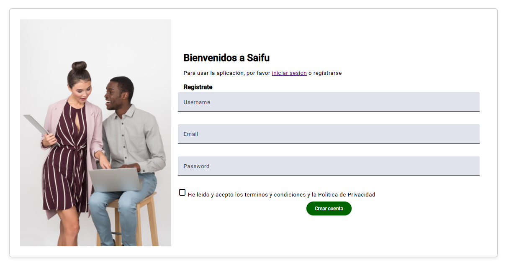

<h1 style="text-align: center;"> Informe del Trabajo Final </h1>
<h3 style="text-align: center;"> Universidad Peruana de Ciencias Aplicadas </h3>

 

<h5 style="text-align: center"> Ingeniería de Software </h5>

<h5 style="text-align: center"> Desarrollo de Aplicaciones Open Source - SW51 </h5>

<h5 style="text-align: center"> Docente: Hugo Allan Mori Paiva </h5>

<h5 style="text-align: center"> Startup: Upecinos-AI </h5>

<h5 style="text-align: center"> Producto: SAIFU </h5>
<h5 style="text-align: center"> Agosto - 2024 </h5>

## Team members:
| Nombre |Código|
|:-------:|:----------:|
|Comettant Rubiños, Jessica Elizabeth|U20211C009|
|Reyes Valenzuela, Renato German|U20221B471|
|Cisneros Salas,Luis Angel|U20211B198|
|Góngora Sánchez,Marco Antonio|U20211A085|
|Rojas Ccama, Carlos Andres|U202114657|

<h5 style="text-align: center"> Ciclo 2024-02 </h5>

## Registro de versiones del informe

|Versión|Fecha|Autor|Descripción de modificación|
|:-:|:-:|:-:|-|
|1.0|13/08/2024|Comettant|Creación del documento de trabajo en formato markdown|
|1.1|20/08/2024|Reyes|Redacción del startup profile y solution profile, delimitación de segmentos objetivo, redacción de preguntas para el diseño de entrevistas |
|1.2|23/08/2024|Cisneros|Elaboración y registro de entrevistas a segmentos objetivo, análisis de entrevistas|
|1.3|25/08/2024|Góngora|Elaboración de user personas, impact mapping, as-is y to-be|
|1.4|26/08/2024|Rojas|Elaboración de user stories, product backlog|
|1.5|28/08/2024|Reyes|Elaboración de prototipos de wireframes y mockups|
|1.6|31/08/2024|Góngora|Redacción de style guidelines e information architecture|
|1.7|03/09/2024|Rojas|Elaboración de diagrama de base de datos, diagrama de clases, diccionario de clases, diagramas de contenedores, diagramas de contexto, diagramas de componentes|
|1.8|03/09/2024|Comettant, Cisneros|Registro de evidencias y entrega del TB1|

## Project Report Collaboration Insights

Enlace de la organización para el reporte del proyecto: 

**TB1**

Para el desarrollo del informe correspondiente a la entrega TB1, se estableció la implementación de secciones de la siguiente manera para cada integrante del equipo:

|Integrante|Tareas Asignadas|
|-|-|
|Jessica Comettant|Diseño de mockups y wireframes,Lean UX Process, Capítulo V, Software Development Environment Configuration, Source Code Management, Style Guide & Conventions, General Style Guidelines, Landing Page Product Backlog|
|Renato Reyes|Capitulo I,Diseño de entrevistas. Diagrama de clases. Diagrama de contexto, componentes y contenedores, Information Architecture. User Stories. Diagrama de base de datos.|
|Jessica Cometant|Impact Mapping, registro y análisis de entrevistas. User Task Matrix. As-Is To-be Scenarios. Empathy Mapping. Technical User Stories. User Stories. Product Backlog. Bibliografía.|
|Marco Góngora y Andres Rojas|Antecedentes y problemática 5W y 2H, Segmentos Objetivos, Análisis de competidores, User Stories, Product Backlog, Conclusiones.|
|Luis Cisneros |Competidores,Análisis competitivo,Estrategias y tácticas frente a competidores,Entrevistas,Diseño de entrevistas.
|

El proceso de colaboración en el informe se realizó mediante commits constantes al repositorio de la organización.

**Github Collaboration Insights**

GitHub también proporciona una visualización detallada del historial de las ramas principales, destacando los procesos de merge realizados. Todas las ramas se crearon siguiendo la metodología GitFlow, que garantiza una organización estructurada y eficiente del código. GitFlow facilita la colaboración en proyectos al establecer un flujo de trabajo estandarizado para el desarrollo, con ramas específicas para nuevas funcionalidades, corrección de errores y preparación de lanzamientos, asegurando un control de versiones más ordenado y predecible.

Los integrantes son:

* Jessica Comettant (Mei0202)
* Renato German Reyes Valenzuela (Nato0211)
* Luis Angel Cisneros Salas (luics341)
* Marco Antonio Góngora Sanchez (m4rcous)
* Carlos Andres Rojas Ccama (andres2580)

Se explican las ramas más prominentes:

**main:** Representada por el color negro, es la rama principal del proyecto y se actualiza con cada entregable.

**develop:** Representada por el color azul, es la rama principal para el desarrollo continuo del proyecto.

Los siguientes gráficos representan analíticos de commits en el repositorio del informe. En los gráficos se incluye la cantidad de lineas de texto añadidas por cada integrante del equipo. 

**TB1**

## Contenido
1. [**Capítulo I: Introducción.**](#1.)  
1.1. [Startup Profile.](#1.1.)  
1.1.1. [Descripción del startup.](#1.1.1.) 
1.1.2.[Perfiles de los integrantes del equipo.](#1.1.2.) 
1.2. [Solution Profile.](#1.2.) 
1.2.1. [Antecedentes y Problemática.](#1.2.1.) 
1.2.2. [Lean UX Process.](#1.2.2.) 
1.2.3. [Lean UX Problem Statements.](#1.2.3.) 
1.2.4. [Lean UX Assumptions.](#1.2.4.) 
1.2.5. [Lean UX Hypothesis Statements.](#1.2.5.) 
1.2.6. [Lean UX Canvas.](#1.2.5.) 
1.3. [Segmentos objetivo.](#1.2.6.) 
2. [**Capítulo II: Requirements Elicitation & Analysis.**](#2.) 
2.1. [Competidores.](#2.1.) 
2.1.1. [Análisis competitivo.](#2.1.1.) 
2.1.2. [Estrategias y tácticas frente a competidores.](#2.1.2.) 
2.2. [Entrevistas.](#2.2.) 
2.2.1. [Diseño de entrevistas.](#2.2.1.) 
2.2.2. [Registro de entrevistas.](#2.2.2.) 
2.2.3. [Análisis de entrevistas.](#2.2.3.) 
2.3. [Needfinding.](#2.3.) 
2.3.1. [User Personas.](#2.3.1.) 
2.3.2. [User Task Matrix.](#2.3.2.) 
2.3.3. [User Journey Mapping.](#2.3.3.) 
2.3.4. [Empathy Mapping.](#2.3.4.) 
2.3.5. [As-is Scenario Mapping.](#2.3.5.) 
3. [**Capítulo III: Requirements Specification.**](#3.) 
4.1. [To-Be Scenario Mapping.](#3.1.) 
4.2. [User Stories.](#3.2.) 
4.3. [Impact Mapping.](#3.3.) 
4.4. [Product Backlog.](#3.4.) 
4. [**Capítulo IV: Product Design.**](#4.) 
4.1. [Style Guidelines.](#4.1.) 
4.1.1. [General Style Guidelines.](#4.1.1.) 
4.1.2. [Web Style Guidelines.](#4.1.2.) 
4.2. [Information Architecture.](#4.2.) 
4.2.1. [Organization Systems.](#4.2.1.) 
4.2.2. [Labeling Systems.](#4.2.2.) 
4.2.3. [SEO Tags and Meta Tags](#4.2.3.) 
4.2.4. [Searching Systems.](#4.2.4.) 
4.2.5. [Navigation Systems.](#4.2.5.) 
4.3. [Landing Page UI Design.](#4.3.) 
4.3.1. [Landing Page Wireframe.](#4.3.1.) 
4.3.2. [Landing Page Mock-up.](#4.3.2.) 
4.4. [Web Applications UX/UI Design.](#4.4.) 
4.4.1. [Web Applications Wireframes.](#4.4.1.) 
4.4.2. [Web Applications Wireflow Diagrams.](#4.4.2.) 
4.4.3. [Web Applications Mock-ups.](#4.4.3.) 
4.4.4. [Web Applications User Flow Diagrams.](#4.4.4.) 
4.5. [Web Applications Prototyping.](#4.5.) 
4.6. [Domain-Driven Software Architecture.](#4.6.) 
4.6.1. [Software Architecture Context Diagram.](#4.6.1.) 
4.6.2. [Software Architecture Container Diagrams.](#4.6.2.) 
4.6.3. [Software Architecture Components Diagrams.](#4.6.3.) 
4.7. [Software Object-Oriented Design.](#4.7.) 
4.7.1. [Class Diagrams.](#4.7.1.) 
4.7.2. [Class Dictionary.](#4.7.2.) 
4.8. [Database Design.](#4.8.) 
4.8.1. [Database Diagram.](#4.8.1.) 
5. [**Capítulo V: Product Implementation, Validation & Deployment.**](#5.) 
5.1. [Software Configuration Management.](#5.1.) 
5.1.1. [Software Development Environment Configuration.](#5.1.1.) 
5.1.2. [Source Code Management.](#5.1.2.) 
5.1.3. [Source Code Style Guide & Conventions.](#5.1.3.) 
5.1.4. [Software Deployment Configuration.](#5.1.4.) 
5.2. [Landing Page, Services & Applications Implementation.](#5.2.) 
5.2.1. [Sprint 1.](#5.2.1.) 
5.2.1.1. [Sprint Planning 1.](#5.2.1.1.) 
5.2.1.2. [Sprint Backlog 1.](#5.2.1.2.) 
5.2.1.3. [Development Evidence for Sprint Review.](#5.2.1.3.) 
5.2.1.4. [Testing Suite Evidence for Sprint Review.](#5.2.1.4.) 
5.2.1.5. [Execution Evidence for Sprint Review.](#5.2.1.5.) 
5.2.1.6. [Services Documentation Evidence for Sprint Review.](#5.2.1.6.) 
5.2.1.7. [Software Deployment Evidence for Sprint Review.](#5.2.1.7.) 
5.2.1.8. [Team Collaboration Insights during Sprint.](#5.2.1.8.) 
5.2.2. [Sprint 2.](#5.2.2.) 
5.2.2.1. [Sprint Planning 2.](#5.2.2.1.) 
5.2.2.2. [Sprint Backlog 2.](#5.2.2.2.) 
5.2.2.3. [Development Evidence for Sprint Review.](#5.2.2.3.) 
5.2.2.4. [Testing Suite Evidence for Sprint Review.](#5.2.2.4.) 
5.2.2.5. [Execution Evidence for Sprint Review.](#5.2.2.5.) 
5.2.2.6. [Services Documentation Evidence for Sprint Review.](#5.2.2.6.) 
5.2.2.7. [Software Deployment Evidence for Sprint Review.](#5.2.2.7.) 
5.2.2.8. [Team Collaboration Insights during Sprint.](#5.2.2.8.) 
5.2.3. [Sprint 3.](#5.2.3.) 
5.2.3.1. [Sprint Planning 3.](#5.2.3.1.) 
5.2.3.2. [Sprint Backlog 3.](#5.2.3.2.) 
5.2.3.3. [Development Evidence for Sprint Review.](#5.2.3.3.) 
5.2.3.4. [Testing Suite Evidence for Sprint Review.](#5.2.3.4.) 
5.2.3.5. [Execution Evidence for Sprint Review.](#5.2.3.5.) 
5.2.3.6. [Services Documentation Evidence for Sprint Review.](#5.2.3.6.) 
5.2.3.7. [Software Deployment Evidence for Sprint Review.](#5.2.3.7.) 
5.2.3.8. [Team Collaboration Insights during Sprint.](#5.2.3.8.) 
5.2.4. [Sprint 4.](#5.2.4.) 
5.2.4.1. [Sprint Planning 4.](#5.2.4.1.) 
5.2.4.2. [Sprint Backlog 4.](#5.2.4.2.) 
5.2.4.3. [Development Evidence for Sprint Review.](#5.2.4.3.) 
5.2.4.4. [Testing Suite Evidence for Sprint Review.](#5.2.4.4.) 
5.2.4.5. [Execution Evidence for Sprint Review.](#5.2.4.5.) 
5.2.4.6. [Services Documentation Evidence for Sprint Review.](#5.2.4.6.) 
5.2.4.7. [Software Deployment Evidence for Sprint Review.](#5.2.4.7.) 
5.2.4.8. [Team Collaboration Insights during Sprint.](#5.2.4.8.) 
5.3. [Validation Interviews.](#5.3.) 
5.3.1.[Diseño de Entrevistas.](#5.3.1.) 
5.3.2.[Registro de Entrevistas.](#5.3.2.) 
5.3.3.[Evaluaciones según Heurísticas.](#5.3.3.) 
5.4. [Video About-the-Product](#5.4.) 
6. [**Conclusiones.**](#6.) 
7. [**Bibliografía.**](#7.) 
8. [**Anexos.**](#8.) 

# Student Outcome

| Criterio Específico | AccionesRealizadas | Conclusiones |
|---------------------|--------------------|--------------|
|  Comunicación oralmente con efectividad a diferentes rangos de audiencia| Jessica Comettant **TB1**  : Diseño de mockups y wireframes, Lean UX Process, Capítulo V, Software Development Environment Configuration, Source Code Management, Style Guide & Conventions, General Style Guidelines, Landing Page Product Backlog.Impact Mapping, registro y análisis de entrevistas, User Task Matrix, As-Is To-be Scenarios, Empathy Mapping, Technical User Stories, User Stories, Product Backlog, Bibliografía. | **TB1**:Concluye que la correcta planificación y el diseño enfocado en el usuario permiten una experiencia fluida y eficiente en el desarrollo de productos digitales, mejorando la usabilidad.|
| Comunicación oralmente con efectividad a diferentes rangos de audiencia |Renato Reyes  **TB1** :Capítulo I, Diseño de entrevistas, Diagrama de clases, Diagrama de contexto, componentes y contenedores, Information Architecture, User Stories, Diagrama de base de datos. | **TB1** :Concluye que la arquitectura sólida y bien definida es fundamental para el éxito del proyecto, ya que facilita la escalabilidad y el mantenimiento de las aplicaciones.|
|  Comunicación oralmente con efectividad a diferentes rangos de audiencia| Marco Góngora **TB1** :Antecedentes y problemática 5W y 2H, Segmentos Objetivos, Análisis de competidores, User Stories, Product Backlog, Conclusiones. | **TB1**: Concluye que un buen análisis de competidores y una clara identificación de los segmentos objetivos permiten posicionar el producto de manera efectiva en el mercado.|
| Comunicación oralmente con efectividad a diferentes rangos de audiencia |Andres Rojas  **TB1**  :Antecedentes y problemática 5W y 2H, Segmentos Objetivos, Análisis de competidores, User Stories, Product Backlog, Conclusiones. **TP**  La implementacion del login y signup en la verificación cuando un usuario complete su registro y login | **TB1**:Concluye que identificar la problemática desde el inicio del proyecto es clave para definir estrategias y soluciones adecuadas a las necesidades del usuario final. **TP**  Pudimos Implementar la pantalla de login y registro donde los usuarios ingresan sus credenciales para acceder a la aplicación.|
|  Comunicación oralmente con efectividad a diferentes rangos de audiencia| Luis Cisneros **TB1** :Competidores, Análisis competitivo, Estrategias y tácticas frente a competidores, Entrevistas, Diseño de entrevistas. | **TB1**:Concluye que la recopilación de datos a través de entrevistas bien estructuradas proporciona información valiosa que ayuda a definir mejores estrategias frente a la competencia.|

<h2>Capítulo I: Introducción</h2>

<h3> 1.1 Startup Profile.</h3>

En esta sección se presenta la descripción del startup y los perfiles de los miembros del equipo.

<h4> 1.1.1. Descripción del startup.</h4>

 
Upecinos.AI somos un grupo de jóvenes quienes buscan impulsar la educación financiera en el Perú. Para ello, se confronta uno de los principales dilemas que se sugestiona como agravante de la pobreza en los estratos socioeconómicos bajos (niveles económicos A, B y C). Este problema es el analbetismo financiero y el desconocimiento del consumo responsable en los hogares peruanos. Upecinos.AI , busca cambiar el paradigma a través de la implementación de Saifu, cuya finalidad se centraliza en la planificación financiera y el hábito de ahorro en los jefes del hogar lo que evita el sobreendeudamiento y el déficit en las necesidades primarias que garantizan el concepto de buena calidad de vida. Para ello, se toma en cuenta la volatilidad económica y las proyecciones macroeconómicas nacionales, otorgadas por el Banco de la Nación.

**Misión:** 
La misión que tenemos como equipo al desarrollar Saifu es poder llegar a la mayor cantidad de personas posibles para lograr ser un soporte para el manejo económico del hogar, además de lograr una interacción amigable entre las familias y el uso de la aplicación para el planeamiento futuro de sus finanzas.

**Visión:** 
Como visión nos proyectamos a ver el resultado de la aplicación beneficiando el ahorro y premiando, indirectamente, la responsabilidad financiera; generando que familias que estén en la pobreza puedan salir de los problemas que les genere ese estado.

##### Logotipo de la Startup:

##### Logotipo del servicio

<h4> 1.1.2. Perfiles de los integrantes del equipo.</h4>

|Descripción del integrante|Perfil del integrante del equipo|
| :--------| :--------: |
| Mi nombre es **Jessica Elizabeth Comettant Rubiños** y tengo 20 años. Soy estudiante de la carrera de ingeniería de software de la UPC (Universidad Peruana de Ciencias Aplicadas). Estoy en el sexto ciclo de mi carrera. Gracias a las asignaturas correspondientes a la malla curricular de mi carrera, cuento con las habilidades intelectuales propicias para el desarrollo del proyecto. Asimismo, mi personalidad se encuentra basada en la autonomía. Por lo tanto, he sido capaz de extender mis conocimientos de programación con mayor material de estudio. Finalmente, destaco de mi personalidad la empatía, la responsabilidad, la amabilidad y la capacidad de trabajar en equipo.||
| Mi nombre es **Renato German Reyes Valenzuela** y tengo 23 años. Soy estudiante de la carrera de ingeniería de software de la UPC (Universidad Peruana de Ciencias Aplicadas). Estoy en el sexto ciclo de mi carrera. Gracias a los cursos que estuve llevando los últimos ciclos, más el aprendizaje extracurricular, cuento con la capacidad y conocimientos para desarrollarme correctamente con los avances y desarrollo de la propuesta de trabajo que ofrecemos. Por último, destaco mi capacidad de empatía y compañerismo para poder avancar de manera grupal los sprint correspondientes y apoyarme en lo necesario con mis compañeros.|
|Mi nombre es **Luis Angel Cisneros Salas** y tengo 20 años. Soy estudiante de la carrera de Ingeniería de Software en la UPC (Universidad Peruana de Ciencias Aplicadas), y actualmente estoy en el quinto ciclo. Gracias a los cursos que he llevado en los últimos ciclos, así como al aprendizaje extracurricular, he adquirido los conocimientos y habilidades necesarios para desarrollarme eficazmente en los proyectos y propuestas de trabajo que ofrecemos. Además, destaco por mi capacidad de empatía, compañerismo y mi rápida adaptación a los cambios, lo cual me permite avanzar de manera colaborativa en los sprints y apoyar a mis compañeros en lo que sea necesario.|
|Mi nombre es **Marco Antonio Góngora Sánchez** y tengo 20 años. Soy estudiante de la carrera de Ingeniería de Software en la UPC (Universidad Peruana de Ciencias Aplicadas), y actualmente estoy en sexto ciclo. Gracias a los cursos que he llevado en estos últimos ciclos, tengo conocimientos de lenguajes cómo C++, Python, SQL, HTML y CSS y conceptos básicos de C#. Además, puedo aportar mucho en temás de diseño y creatividad. Por último, destaco mi perspectiva frente a adversidades y mi compañerismo.|
|Mi nombre es Carlos Rojas, estudio la carrera de Ingeniería de Software. Mi carrera consiste en crear softwares inteligentes y sistemas informáticos usando un lenguaje de programación con lógica. Me considero una persona responsable y colaborativo como ayudar a las personas y dar ideas, especialmente en grupos. En este trabajo en equipo se requiere dar una buena comunicación, por ello, siempre daré mi opinión. | 

<h3> 1.2. Solution Profile.</h3>

<h4> 1.2.1. Antecedentes y Problemática.</h4>

###### What (Qué)
El problema que hemos detectado radica en la baja capacidad financiera de la población peruana, enfocado en cómo manejan sus gastos mensuales y la falta de proyección a futuro. Teniendo como evidencia que solos el 21% de los peruanos puede realizar un cálculo de interés simple o que solo el 42% pudo ahorrar en un plazo de 12 meses en el año 2022, según la "Encuesta Nacional de Capacidades Financieras 2022" del SBS.

###### When (Cuando)

El problema viene sucediendo durante los últimos años pero se evidenció más posterior a la pandemia del COVID-19. Aquello debido al impacto socio-económico que dejó la cuarentena de más de 1 año por el temor al contagio; generando el cierre de negocios y grandes pérdidas de empleo. Según Hellen Gibbons, “La caída inmediata de los valores de los activos (incluidas las pensiones, las viviendas y las acciones) socava todas las proyecciones de ingresos futuros, lo que hace que sea extremadamente difícil para las personas planificar el futuro”. En este escenario planteado es donde actuaría la nuestra aplicación, para apoyar a las personas y familias con la administración de su dinero y con la educación financiera.

###### Where (Dónde)
El cliente que usará nuestro producto se encontraría, principalmente, en las ciudades urbanas, con acceso a internet y a tecnologías móviles. El enfoque de la aplicación es dirigido a personas o familias que reciban ingresos mensuales, semanales o diarios y puedan así administrarlos.

###### Who (Quién)
Los principales clientes de la aplicación serían las cabezas de familia, padre y/o madre, y las personas independientes que cuenten con una fuente de ingresos. Esto debido a que se manejaría un patrón de ingresos y egresos

###### Why (Por qué)
La principal causa del problema financiero entre la población peruana radica en la falta de educación financiera en las escuelas o universidades, en especial cuando no se estudia una carrera relacionada a las finanzas o ingenieria; y es peor para las personas que no contaron con eduación superior o técnica.

##### ¿Cuáles son las 2H?
###### How (Cómo)
El producto se utilizaría de manera diaria o mensual para realizar el registro de gastos generales y gastos rutinarios, además de ello el usuario podrá acceder a un análisis y resumen de los datos ingresados; también podrá acceder a una plataforma educativa y de consultas financieras

###### How much (Cuánto)
Se estima que los beneficiados de nuestro producto se mida en función a la importancia que den los usuarios a las funcionalidades de Saifu, esto debido a que el objetivo de Saifu es trabajar en función a los datos que pueda brinar el usuario

<h4> 1.2.2. Lean UX Process.</h4>

<h5> 1.2.2.1. Lean UX Problem Statements.</h5>

###### **Problem Statement:** 

###### Descripción de la situación: (AUSENCIA DE EDUCACIÓN FINANCIERA)
Existe una preocupante falta de conocimiento financiero entre las familias de los niveles económicos D y E en Perú. La carencia de habilidades para administrar adecuadamente los recursos limita la capacidad de estas familias para ahorrar y consumir responsablemente. La ausencia de educación financiera contribuye a la perpetuación de ciclos de endeudamiento y dificultades económicas.
###### Descripción del problema:
Es así que, el analfabetismo financiero agrava los niveles de pobreza en el Perú lo que, a su vez, termina en afecciones para la salud mental principalmente del sector adulto. Un efecto predominante vendría a ser el estrés.
###### Propuesta de solución:
¿Cómo podemos incentivar la educación financiera y adquirir la capacidad de gestión responsable de finanzas dentro del sector adulto peruano? 

###### Descripción de la situación: (FALTA DE HERRAMIENTAS PARA LA ADMINISTRACIÓN)
La falta de un sistema especializado para la gestión del presupuesto familiar impide que los jefes del hogar en los niveles económicos D y E puedan planificar con precisión sus gastos. Al respecto, según una encuesta de CAF (2014), el 68% de adultos peruanos indica que el presupuesto previamente planificado no le fue basto para cubrir el mes. Esta frecuencia se dió, por lo menos una vez cada seis meses.
###### Descripción del problema:
La ausencia de un sistema que pueda anticipar y advertir sobre posibles escasez de alimentos, atención médica y otros elementos esenciales deja a estas familias vulnerables ante situaciones imprevistas y limita su capacidad de preparación.
###### Propuesta de solución:
¿Cómo podemos disminuir y/o erradicar el déficit de herramientas en gestión financiera dirigido a los jefes de hogar para así evitar que tomen decisiones sin previa información? 

 ###### Descripción de la situación:(INCERTIDUMBRE ECONÓMICA)
La volatilidad económica y las fluctuaciones en la inflación pueden causar incertidumbre en los hogares de bajos ingresos. La falta de información actualizada y precisa sobre las proyecciones macroeconómicas dificulta la capacidad de los jefes de hogar para anticipar y mitigar los impactos de posibles aumentos de precios en artículos esenciales como alimentos y servicios de salud.
###### Descripción del problema:
La ausencia de herramientas que consideren proyecciones macroeconómicas, como la inflación, dificulta la toma de decisiones informadas y puede llevar a una gestión financiera ineficiente. 
###### Propuesta de solución:
¿Cómo podríamos proporcionar alertas oportunas y recomendaciones personalizadas basadas en las proyecciones macroeconómicas a los jefes de hogar permitiéndoles anticipar y ajustar sus gastos según los cambios previstos en los precios de alimentos y servicios esenciales?

<h5> 1.2.2.2. Lean UX Assumptions.</h5>

###### **Business Assumptions:**
1.  **Creemos que nuestros usuarios necesitan** una aplicación que les permita acceder a la información financiera actualizada del Banco de la Nación.

2.  **Estas necesidades se pueden satisfacer** el desarrollo de una plataforma que permitirá el acceso oportuno y confiable a las proyecciones macroeconómicas proporcionadas por el Banco de la Nación, incluyendo datos sobre inflación y otros indicadores relevantes.
3.  **Nuestros clientes iniciales serán** los jóvenes adultos que inician su independencia y los jefes de hogar de los niveles económicos D y E.
4.  **El valor más importante que un cliente quiere de nuestros servicios es** aprender a planificar un presupuesto a partir de proyecciones macroeconómicas que rechacen cualquier incertidumbre económica.
5.  **El cliente también va a obtener** diversos beneficios adicionales como visualizar gráficos estadísticos dentro de la aplicación con datos actuales e históricos.
6.  **Vamos a obtener la mayoría de los clientes mediante** publicidad en línea y campañas de concientización sobre educación financiera en redes sociales.
7.  **Vamos a obtener ingresos mediante** la venta de espacios publicitarios dentro de la plataforma y la posibilidad de colaborar con instituciones financieras u organizaciones gubernamentales para facilitar la implementación y la promoción del sistema entre las familias de los niveles económicos D y E.
8.  **Nuestra competencia en el mercado serán** las plataformas propias de instituciones financieras que divulgan información financiera y ayudan en la planificación financiera.
9.  **Vamos a tener ventaja frente a nuestra competencia debido a** que la plataforma cuenta con la capacidad de anticipar necesidades básicas a través de datos macroeconómicos. En base a ello, planifica el presupuesto para el usuario y se evita pérdidas futuras. Otra funcionalidad es el foro en línea, dirigido a entablar conexión entre los usuarios.
10.  **El mayor riesgo del servicio es** que el segmento objetivo no se muestre dispuesto e interesado en aprender sobre educación financiera. Las razones vendrían a ser de un contexto interno social: problemas de adaptación, pensamiento estático y manejo de herramientas tecnológicas.
11.  **Lo resolveremos realizando** un diseño dinámico y llamativo de la plataforma. De igual forma, se realizará una revisión constante de la plataforma y actualizaciones en caso de inserción de funcionalidades adicionales o mejoras.
12.  **Otras suposiciones podrían**  incluir la aceptación de inteligencia artificial para la administración de recursos económicos, la disponibilidad de todos los recursos para la elaboración de la página y el acceso a servidores estables que proporcionan una buena experiencia a nuestros clientes. Finalmente, se asume que la aplicación cumplirá con altos estándares de privacidad y seguridad de datos para garantizar la confianza de los usuarios en la protección de su información financiera personal.

###### **User Assumptions:**
###### **¿Quién es el usuario?**
El usuario principal será los jóvenes adultos que están iniciando su independencia, rango de edad 18-25 años. Asimismo, la plataforma se muestra dirigida a los jefes de hogar de los niveles económicos D y E. Sin embargo, cualquier ciudadano del Perú con interés en aprender sobre educación financiera, puede hacer uso de la plataforma. 

###### **¿Qué problemas tiene nuestro producto? ¿Resolver?**
El problema trascendente de la plataforma sería la integración del API del Banco de la Nación para el uso de las proyecciones macroeconómicas. Por otra parte, se reconoce a la deficiencia en la identificación de necesidades del usuario acorde a sus ingresos y egresos trascendentales.

###### **¿Qué características son importantes?**
La plataforma se distingue por ofrecer acceso confiable y oportuno a proyecciones macroeconómicas del Banco de la Nación, registrar ingresos y egresos para facilitar la creación de presupuestos personalizados, y generar reportes detallados sobre el balance económico y la inflación. Además, incluye una sección dedicada a la educación financiera, brindando material educativo sobre planificación, métodos de ahorro y consejos personalizados basados en los gastos diarios registrados por cada usuario. También cuenta con un foro para fomentar la interacción entre los usuarios y herramientas para establecer y alcanzar metas de ahorro.

###### **¿Dónde encaja nuestro producto en su trabajo o vida?**
El servicio se integra en la vida de los usuarios como una herramienta esencial para gestionar sus finanzas domésticas, ayudándoles a evitar el sobreendeudamiento y el desbalance económico. Además, fomenta el hábito del ahorro entre los miembros más jóvenes, asegurando que, a largo plazo, la educación financiera esté firmemente establecida.

###### **¿Cuándo y cómo es nuestro producto? **
El servicio será utilizado por el segmento objetivo cuando surja la necesidad de planificar un presupuesto, considerando las proyecciones macroeconómicas futuras. De este modo, se evalúan los ingresos y egresos, así como los costos actuales y futuros de alimentos y servicios, para trazar un plan financiero integral que también promueva el ahorro.

###### **¿Cómo debe verse nuestro producto y cómo debe comportarse?**
El producto debe contar con una interfaz sencilla, inclusiva y dinámica, con un diseño atractivo que capte la atención del segmento objetivo y ofrezca una experiencia acogedora. Además, debe garantizar la privacidad y seguridad de los datos personales del usuario, al tiempo que presenta proyecciones macroeconómicas e información relevante del Banco de la Nación.

###### **Feature Assumptions:**

**Creemos que** ofrecer a nuestros usuarios una aplicación que les permita acceder a información financiera actualizada del Banco de la Nación será crucial para ayudarlos a planificar sus presupuestos de manera más precisa.

**Creemos que** desarrollar una plataforma que integre proyecciones macroeconómicas confiables, incluyendo datos sobre inflación y otros indicadores relevantes, permitirá a los usuarios planificar sus finanzas con mayor seguridad y reducir la incertidumbre económica.

**Creemos que** la aplicación debe de tener la capacidad de integrarse con los sistemas de entidades financieras, lo que facilitará la recopilación y análisis de datos en tiempo real.

**Creemos que** el programa debe de incluir herramientas de generación de informes y gráficos que permitirán a los usuarios visualizar fácilmente los datos referentes a la situación financiera y tomar decisiones basadas en información visualmente clara.

<h5> 1.2.2.3. Lean UX Hypothesis Statements.</h5>

* **Hypothesis Statement 01:**
    
    **Creemos que** si implementamos una funcionalidad para registrar ingresos y gastos, así como para analizar estos datos en periodos específicos, entonces los jefes de hogar y jóvenes adultos podrán planificar sus presupuestos con mayor precisión
    
    **Sabremos** que hemos tenido éxito.
    
    **Cuando**  la cantidad de usuarios registrados dentro de la plataforma supere o sea mayor a los 300 000.
  
* **Hypothesis Statement 02:**
    
    **Creemos que** si incorporamos una sección de educación financiera en la plataforma, que proporcione material educativo sobre planificación financiera, métodos de ahorro y consejos, entonces los usuarios mejorarán su comprensión y manejo de las finanzas.
    
    **Sabremos** que hemos tenido éxito.
    
    **Cuando** más del 75% de los usuarios informen una mejora en su habilidad para gestionar sus finanzas.

* **Hypothesis Statement 03:**
    
    **Creemos que**  si ofrecemos herramientas para generar reportes detallados sobre inflación, gastos, ingresos y balance económico, entonces los usuarios tendrán una visión clara y actualizada de su situación financiera. 
    
    **Sabremos** que hemos tenido éxito.
    
    **Cuando** el indicador de porcentaje de usuarios satisfechos sea mayor al 68%.

* **Hypothesis Statement 04:**
    
    **Creemos que** si implementamos una función para establecer metas y objetivos de ahorro de manera progresiva, entonces los usuarios podrán planificar y alcanzar sus metas financieras con eficiencia.
    
    **Sabremos** que hemos tenido éxito.
    
    **Cuando** se perciba una reducción del 25% en la necesidad de endeudamiento entre los usuarios activos.

<h5> 1.2.2.4. Lean UX Canvas.</h5>

El Lean UX Canvas es una herramienta utilizada en el campo del diseño centrado en el usuario (UX) y la metodología Lean para crear y desarrollar productos de manera más eficiente y efectiva. Su objetivo es proporcionar un marco estructurado para la colaboración entre equipos multidisciplinarios. A continuación se presenta el Lean UX Canvas trabajado por el equipo a través de la herramienta digital **Mural**:

Enlace para acceder al [Canvas]( https://app.mural.co/t/integradis6182/m/integradis6182/1724001723912/28c582d11c1709e77aa0c4304f2cb2268169fd6e?sender=ufdf66b413172c812625a4806 )

<h3> 1.3. Segmento objetivo.</h3>

La plataforma está direccionada a dos segmento objetivo: Los jefes de hogar pertenecientes a los niveles económicos D y E; y los jóvenes, de entre 18-25 años en inicios de independencia. A continuación, se describe a cada uno de ellos:

##### Jefes de hogar del nivel económico D y E:

En Perú solo 13 % de la población tiene un nivel de educación financiera adecuada y el 41% carece de capacidades financieras óptimas, según La Cámara (2023). Esto es considerado de índole resaltante, ya que el analfabetismo financiero es un factor predominante en el incremento de la pobreza. Si los estratos sociales comprendieran la relevancia del concepto de educación financiera, se tendría una mejor administración de los recursos financieros y, por lo tanto, no acontecería algún déficit en las necesidades primarias consideradas dentro del concepto de una adecuada calidad de vida. Por tal motivo, la plataforma busca hacer hincapié en este segmento y, de cierta forma, impactar en el desarrollo sostenible 

##### Jóvenes en inicios de independencia:

Según la SBS (2019), en el Perú, el 37% de los jóvenes de 18 a 24 años tiene una cuenta de ahorro. Este último vendría a ser el grupo con mayor conocimiento en educación financiera. Ello indica que este segmento de la población es un sector predispuesto a adquirir mayor conocimiento financiero. Por lo tanto, serán clientes clave del servicio dentro del mercado.

<h4> 1.3.1 Stakeholders.</h4>

* **Stakelholder Internos:** Equipo Upecinos-AI y resto de integrantes del equipo de desarrollo
* **Stakelholder Externos:** Jefes de hogar de los sectores económicos D y E, jóvenes de 18 a 24 años en inicios de independencia, estudiantes y/o profesionales en carreras involucradas con economía, finanzas o administración.

<h2> Capítulo II: Requirements Elicitation & Analysis.</h2>

<h3> 2.1. Competidores.</h3>

<h4> 2.1.1. Análisis competitivo.</h4>

El análisis competitivo es una herramienta esencial debido a su relevancia en la toma de decisiones estratégicas, la identificación de oportunidades y amenazas, y la creación de ventajas competitivas sostenibles en el mercado. Por tales motivos, ayuda a las empresas a mantenerse ágiles y a tomar decisiones informadas en un entorno empresarial de constante cambio. A continuación, se exhibe la incorporación de esta herramienta dentro del desarrollo del proyecto y la examinación de los competidores:

<html>
<head>
    <title>Tabla HTML</title>
    
</head>
<body>
    <table>
        <tr>
           <td colspan="6" class="sub">  <h1>Competitive Analysis Landscape</h1></td>
        </tr>
        <tr>
            <td colspan="2" rowspan="2" class="sub">¿Por qué llevar a cabo este análisis? </td>
            <td colspan="4" class="sub"><h3>Es necesario realizar este análisis, ya que de esta manera sabremos qué aplicaciones compiten con la nuestra, lo que nos permitirá tomar decisiones para que los usuarios elijan nuestra aplicación</h3></td>
        </tr>
        <tr>
            <td colspan="4">SAIFU |Monefy|Fintonic|Spendee</td>
        </tr>
        <tr>
            <td rowspan="3" class="sub">PERFIL</td>
            <td rowspan="2" class="sub">Overview</td>
            <td>SAIFU cuenta con información financiera y tiene una inteligencia artificial  que ayuda a los usuarios a poder administrar sus recursos económicos</td>
            <td>Aplicación sencilla para el control de gastos e ingresos</td>
            <td>Aplicación integral de gestión financiera personal con integración bancaria</td>
            <td>Aplicación de gestión financiera con herramientas de ahorro y gestión compartida</td> 
        </tr>
        <tr>
            <td>-</td>
            <td>-</td>
            <td>-</td>
            <td>-</td>      
        </tr>
        <tr>
            <td class="sub">Ventaja Competitiva ¿Qué valor ofrece a los clientes?</td>
            <td>Ofrece información financiera y una inteligencia artificial que ayuda a los clientes a gestionar sus recursos</td>
            <td>Facilidad de uso y diseño intuitivo</td>
            <td>Integración bancaria y alertas personalizadas</td>
            <td>Herramientas avanzadas de ahorro y gestión compartida</td>      
        </tr>
        <tr>
            <td rowspan="2" class="sub">PERFIL DEL MARKETING</td>
            <td class="sub">Mercado Objetivo</td>
            <td>Los jóvenes adultos independientes  y los jefes de hogar del sector económico D y E</td>
            <td>Usuarios que buscan simplicidad en la gestión de sus finanzas</td>
            <td>Usuarios con múltiples cuentas bancarias que desean un control completo</td>
            <td>Usuarios que buscan herramientas avanzadas para ahorrar y gestionar finanzas compartidas</td>
        </tr>
        <tr>
            <td class="sub">Estrategias de Marketing</td>
            <td>Se realizan campañas para que a las personas les interese en mayor medida tener una cultura financiera y publicidad en redes sociales</td>
            <td>Enfocarse en la simplicidad y facilidad de uso</td>
            <td>Promover la centralización de la información financiera</td>
            <td>Destacar las herramientas de ahorro y la capacidad de gestión compartida</td>
        </tr>
        <tr>
            <td rowspan="3" class="sub">PERFIL DEL PRODUCTO</td>
            <td class="sub">Productos & Servicios</td>
            <td>Información financiera de calidad y una inteligencia artificial que ayuda a administrar los recursos de los usuarios</td>
            <td>Control básico de finanzas personales</td>
            <td>Gestión financiera integral con recomendaciones y alertas</td>
            <td>Gestión avanzada del presupuesto y ahorro</td>
        </tr>
        <tr>
            <td class="sub">Precios & Costos</td>
            <td>La aplicación es gratuita. Sin embargo, tiene opciones que van a estar disponibles con una suscripción mensual de 15 soles, se llamará SAIFU unlimited. Los costos de la aplicación son los derechos de autor de la información incluida, el mantenimiento de la inteligencia artificial, mantenimiento de los servidores y la publicidad en redes sociales y campañas</td>
            <td>Aplicación gratuita con opciones de pago para funciones avanzadas</td>
            <td>Gratuita con opciones premium</td>
            <td>Gratuita con planes de pago para funciones avanzadas</td>
        </tr>
        <tr>
            <td class="sub">Canales de distribución (web/móvil)</td>
            <td>Será distribuido como página web y como aplicación móvil para google play</td>
            <td>Solo está distribuida en móvil, disponible en app store y google play</td>
            <td>Solo está distribuida en móvil, disponible en app store y google play</td>
            <td>Está disponible como página web y como aplicación móvil en app store y google play</td>        
        </tr>
        <tr>
            <td rowspan="4" class="sub">ANÁLISIS SWOT</td>
            <td class="sub">Fortalezas</td>
            <td>La aplicación tiene servicio a los clientes lo que nos ayuda a saber lo que quieren y los que les molesta de la aplicación. Además, tiene  una inteligencia artificial que ayuda a los usuarios a administrar sus recursos</td>
            <td>Interfaz simple y fácil de usar</td>
            <td>Amplia integración bancaria y recomendaciones</td>
            <td>Herramientas inteligentes de ahorro y gestión compartida</td>
        </tr>
        <tr>
            <td class="sub">Debilidades</td>
            <td>La inteligencia artificial a veces puede llegar a fallar si no está correctamente testeado</td>
            <td>Sin integración bancaria ni funciones avanzadas</td>
            <td>Puede ser complejo para usuarios que buscan simplicidad</td>
            <td>Interfaz menos intuitiva para algunos usuarios</td>  
        </tr>
        <tr>
            <td class="sub">Oportunidades</td>
            <td>Se puede mejorar la inteligencia artificial de la aplicación. También, se puede ir actualizando la información financiera</td>
            <td>Expansión a mercados que buscan simplicidad en la gestión financiera</td>
            <td>Expandir las capacidades de integración con más bancos y servicios financieros</td>
            <td>Mejorar la interfaz para mayor usabilidad</td> 
        </tr>
        <tr>
            <td class="sub">Amenazas</td>
            <td>Que algunos clientes de nuestros segmentos objetivos no están dispuestos a pagar una suscripción</td>
            <td>Competencia creciente con productos similares</td>
            <td>Cambios regulatorios en la banca digital</td>
            <td>Evolución tecnológica que cambia las expectativas de los usuarios</td>          
        </tr>
    </table>
</body>
</html>

<h4> 2.1.2. Estrategias y tácticas frente a competidores.</h4>

En base al análisis competitivo efectuado anticipadamente, se logró identificar con exactitud las fortalezas, oportunidades, debilidades y amenazas destacadas de los competidores. Dicha información resulta ser clave para trazar estrategias y tácticas  de superación hacia la competencia, cuando el servicio entre al mercado (lanzamiento rentable). A continuación, se brindará una serie de estrategias y tácticas trazadas para alcanzar esta meta:

**Afrontando las fortalezas de nuestros competidores:**

**Comprendemos que las fortalezas de nuestros competidores son:**

-Integración bancaria avanzada (Fintonic, Spendee).
-Herramientas inteligentes de ahorro (Spendee).
-Alertas y recomendaciones personalizadas (Fintonic).
**Estrategias**

-Diferenciar nuestro producto mediante la simplicidad y la facilidad de uso, evitando la complejidad innecesaria.

-Desarrollar una función de integración bancaria básica que se pueda expandir en el futuro.
**Tácticas**

-Ofrecer un tutorial interactivo al inicio que simplifique el uso de las funciones más avanzadas.

-Lanzar versiones beta de la integración bancaria, recopilando feedback directo de los usuarios para mejorarla continuamente.

**Afrontando las debilidades de nuestros competidores:**

**Comprendemos que la debilidades de nuestros competidores son:**

Complejidad para usuarios que buscan simplicidad (Fintonic).
Interfaz menos intuitiva para algunos usuarios (Spendee).
Falta de funciones avanzadas en la versión básica (Monefy).

**Estrategias**

-Enfocarnos en una experiencia de usuario excepcionalmente simple e intuitiva.

-Ofrecer una versión gratuita con suficientes funciones atractivas, pero con incentivos claros para suscribirse a una versión premium.

**Tácticas**

-Realizar pruebas de usabilidad con diferentes perfiles de usuarios para optimizar la interfaz.

-Implementar un sistema de recompensas para los usuarios que refieran a nuevos clientes, motivándolos a optar por versiones premium.

**Afrontando las oportunidades de nuestros competidores:**

**Comprendemos que las oportunidades de nuestros competidores son:**

-Expansión a nuevos mercados con alta demanda de gestión financiera personal.

-Mejora continua de la integración bancaria y servicios financieros adicionales.

-Crecimiento en la adopción de herramientas de ahorro.

**Estrategias**

-Identificar y penetrar nichos de mercado aún no explotados.

-Explorar nuevas funcionalidades centradas en el ahorro automatizado y personalizado.

**Tácticas**

-Realiza estudios de mercado para identificar segmentos desatendidos, como jóvenes profesionales o personas mayores.

-Desarrollar una función que sugiera acciones de ahorro automático basadas en los hábitos de gasto del usuario.

**Afrontando las amenazas de nuestros competidores:**

**Comprendemos que las amenazas de nuestros competidores son:**

-Competencia creciente con productos similares en el mercado.

-Cambios regulatorios en la banca digital que podrían afectar las integraciones bancarias.

-Evolución tecnológica que podría cambiar rápidamente las expectativas de los usuarios.

**Estrategias**

-Innovar continuamente para mantenernos competitivos y adelantarnos a los cambios del mercado.

-Establecer un equipo dedicado al cumplimiento normativo y adaptarse rápidamente a los cambios regulatorios.

**Tácticas**

-Fomentar una cultura de innovación interna, alentando la creación de nuevas características y mejoras.

-Colaborar con expertos en regulación para asegurar el cumplimiento y la rápida adaptación a nuevas leyes.

<h3> 2.2. Entrevistas.</h3>

La sección cubre el proceso de investigación de nuestros segmentos objetivo a través de la recopilación de información basada en entrevistas.

<h4> 2.2.1. Diseño de entrevistas.</h4>

_Preguntas dirigidas a los jefes de hogar de los sectores económicos D y E, y a estudiantes o personas naturales._
___
- Preguntas principales:
  1. ¿Cuál es tu nivel de conocimiento en relación a la economía doméstica?

  2. ¿Has enfrentado dificultades financieras en el pasado? ¿Podrías compartir alguna experiencia al respecto?
  3. A medida que la cantidad de miembros en tu hogar creció, ¿qué cambios implementaste en tu enfoque financiero?
  4. ¿Cómo controlas tus gastos en la actualidad?
   
- Preguntas complementarias:
  1. ¿Te sientes preparado para manejar imprevistos financieros que puedan surgir en cualquier momento?
  2. ¿En qué momentos del mes o año consideras que tu presupuesto se vuelve más ajustado?
  3. ¿Con qué frecuencia te has visto sorprendido por incrementos en los precios de productos?

_Preguntas dirigidas a los jóvenes de 18 a 24 años en inicios de independencia_
___
- Preguntas principales:
  1. ¿Cuál fue tu nivel de conocimiento sobre finanzas en el hogar al momento de comenzar tu independencia?
  2. En tu primer mes de independencia, ¿cómo organizaste y distribuiste tu presupuesto?
  3. Al dar inicio a tu vida independiente, ¿qué metas financieras te planteaste y cuál es tu plan para lograrlas?
  4. ¿Has notado alguna diferencia en tus hábitos de gasto desde que te independizaste? ¿Qué factores crees que han contribuido a estos cambios?
   
- Preguntas complementarias:
  1. ¿Qué métodos emplean actualmente para monitorear y controlar tus gastos?
  2. ¿Te sientes confiado en enfrentar situaciones financieras imprevistas que puedan surgir?
  3. ¿En qué momentos del mes o del año notas que tu presupuesto se vuelve más ajustado?

<h4> 2.2.2. Registro de entrevistas.</h4>

**Entrevista a jefes de hogar de los sectores económicos D y E **

|Entevistado 1|Jorge Reyes Vivas|
|-|-|
|Edad|55|
|Distrito|La Molina|
|Screenshot||
|Timing: 0:07-15:15 |URL: https://upcedupe-my.sharepoint.com/:v:/g/personal/u20221b471_upc_edu_pe/EZE0KFiBow5LoYDsSd5O9JQByCgdRjTXsBLPmrGmeryc-A?e=JcwNhp|

|Entevistado 2|Yenny Reyes Vivas|
|-|-|
|Edad|49|
|Distrito|La Molina|
|Screenshot||
|Timing: 0:07-15:15 |URL: https://upcedupe-my.sharepoint.com/:v:/g/personal/u20221b471_upc_edu_pe/EdxTSNPTLSxBuz991GFEnsQBMqI-r4VzA0jHUe3bfobKCA?e=eROese|

**Entrevista a jóvenes de 18 a 24 años en inicios de independencia**

|Entevistado 1|Paulo Paucar|
|-|-|
|Edad|19 años|
|Distrito|San miguel|
|Screenshot||
|Timing: 0:00-6:06 |URL: https://drive.google.com/file/d/1zNKLesPzfrVsRJ03IVC2Uu_OM287sfS1/view?usp=sharing
|Entevistado 2|Jose Carlos|
|-|-|
|Edad|23 años|
|Distrito|San Juan de Miraflores|
|Screenshot||
|Timing: 0:00-4:38 |URL:https://drive.google.com/file/d/1y22qqGlsQCkAOAjaprv_jddntPExWOcj/view?usp=sharing

##### Análisis del segmento jefes de hogar de los sectores económicos D y E

##### Análisis del segmento jóvenes de 18 a 24 años en inicios de independencia

<h3> 2.3. Needfinding.</h3>

<h4> 2.3.1. User Personas.</h4>

* User persona jefe de hogar del sector económico D o E

* User persona joven de 18 a 24 años en inicios de independencia
**(insertar imagen)**

<h4> 2.3.2. User Task Matrix.</h4>

Se presentan los User Task Matrix, diagramas que contienen las tareas realizadas por los segmentos objetivos: 

* **María Rodríguez (Jefe de Hogar del Sector Económico D o E):**

<table> <tr> <th></th> <td colspan="2"> Jefe de Hogar del sector ecómico D o E (María Rodríguez) </td> </tr> <tr> <td>TASK</td> <td>IMPORTANCE</td> <td>FREQUENCY</td> </tr> <td>Registrar gastos diarios</td> <td>Alta</td> <td>Siempre</td> </tr> <td>Planificar el presupuesto semanal/mensual</td> <td>Alta</td> <td>Mensual</td> </tr><td>Buscar ofertas y precios bajos</td> <td>Media</td> <td>Semanal</td> </tr> <td>Ahorrar para emergencias</td> <td>Alta</td> <td>Mensual</td> </tr> <td>Controlar el gasto en servicios básicos</td> <td>Media</td> <td>Mensual</td></tr></table>

* **Luis Gómez (Joven de 18 a 24 años en inicios de independencia):**

<table> <tr> <th></th> <td colspan="2"> Joven de 18 a 24 años en inicios de independencia (Luis Gómez) </td> </tr> <tr> <td>TASK</td> <td>IMPORTANCE</td> <td>FREQUENCY</td> </tr> <tr> <td>Crear un presupuesto mensual</td> <td>Alta</td> <td>Mensual</td> </tr> <td>Seguir su gasto en tiempo real</td> <td>Alta</td> <td>Siempre</td> </tr> <td>Ahorrar para proyectos personales</td> <td>Alta</td> <td>Mensual</td> </tr> <td>Buscar formas de reducir gastos</td> <td>Media</td> <td>Mensual</td> </tr> <td>Manejar gastos compartidos (con su compañero de cuarto)</td> <td>Media</td> <td>Mensual</td> </tr></table>
    

<h4> 2.3.3. User Journey Mapping.</h4>

Jefe de Hogar del sector ecómico D o E:

Joven de 18 a 24 años en inicios de independencia:

<h4> 2.3.4. Empathy Mapping.</h4>

Jefe de Hogar del sector ecómico D o E:

Joven de 18 a 24 años en inicios de independencia:

<h4> 2.3.5. As-is Scenario Mapping.</h4>

As-is del segmento Jefes de hogar del nivel económico D y E

Preparación de la actividad

Diseñamos el cuadro y la dividimos en secciones: Phases, Doing, Thinking y Feeling para el As - Is Scenario Mapping

Brainstorming

Luego de realizar las entrevistas al segmento objetivo, realizamos una lluvia de ideas

Identificación de Fases

Por último, organizamos las ideas realizadas anteriormente y los colocamos en sus fases correspondientes

As-is del segmento Jóvenes en inicios de independencia

Diseñamos el cuadro y la dividimos en secciones: Phases, Doing, Thinking y Feeling.

Brainstorming

Luego de realizar las entrevistas al segmento objetivo, realizamos una lluvia de ideas

Identificación de Fases

Por último, organizamos las ideas realizadas anteriormente y los colocamos en sus fases correspondientes

**2.4 Ubiquitous Language**

- Presupuesto Familiar: Plan financiero que detalla los ingresos y gastos esperados de una familia.  El presupuesto familiar es personalizado con base en los datos financieros ingresados 

- Consumo Responsable: Gastar dinero de manera consciente y equilibrada, teniendo en cuenta las proyecciones económicas y el presupuesto personal para evitar gastos innecesarios y promover el ahorro.

- Consejo Financiero: Conjunto de conocimientos y habilidades que permiten a las usuarios tomar decisiones informadas sobre su dinero, incluyendo la gestión de presupuestos, ahorro, y planificación financiera.

- Alertas y Recomendaciones: Notificaciones enviadas por la aplicación "Saifu" que informan a los usuarios sobre cambios en las proyecciones macroeconómicas y ofrecen consejos para ajustar su presupuesto y mejorar su gestión financiera.

- Transacciones de Compra: Registros detallados de las compras realizadas por los usuarios, que se utilizan para analizar el gasto y proporcionar recomendaciones financieras.

- Seguridad y Privacidad: Medidas implementadas en "Saifu" para proteger los datos personales y financieros de los usuarios, garantizando que la información esté segura y que el uso de la misma cumpla con las normativas de privacidad.

- Registro de Gastos: Función de "Saifu" que permite a los usuarios ingresar y categorizar sus gastos diarios para facilitar el seguimiento y la gestión de su presupuesto.

- Recomendaciones Personalizadas: Sugerencias específicas generadas por "Saifu" basadas en el análisis de los datos de gastos y las proyecciones económicas, con el objetivo de ayudar a los usuarios a optimizar su gestión financiera.

- Interfaz de Usuario: Diseño y disposición de elementos visuales en la aplicación "Saifu" que permiten a los usuarios interactuar de manera intuitiva con el sistema, tanto en la versión web como en la móvil.

<h2> Capítulo III: Requirements Specification.</h2>

<h3> 3.1. To-Be Scenario Mapping.</h3>

To-be del segmento Jefes de hogar del nivel económico D y E

Preparación de la actividad

Diseñamos el cuadro y la dividimos en secciones: Phases, Doing, Thinking y Feeling para el To-Be Scenario Mapping

Brainstorming

Luego de realizar las entrevistas al segmento objetivo, realizamos una lluvia de ideas 

Identificación de Fases

Por último, Por último, organizamos las ideas realizadas anteriormente y los colocamos en sus fases correspondientes para nuestro proyecto

To-be del segmento Jóvenes en inicios de independencia-----

Preparación de la actividad

Diseñamos el cuadro y la dividimos en secciones: Phases, Doing, Thinking y Feeling para el To-Be Scenario Mapping

Brainstorming

Luego de realizar las entrevistas al segmento objetivo, realizamos una lluvia de ideas 

Identificación de Fases
Por último, Por último, organizamos las ideas realizadas anteriormente y los colocamos en sus fases correspondientes para nuestro proyecto

<h3> 3.2. User Stories.</h3>

Las user stories son una forma de convertir el lenguaje informal de los clientes del producto a un requisito de software que debe ser considerado en el desarrollo del sistema. Una user story construida adecuadamente explica al desarrollador la naturaleza de la funcionalidad que construyen, su razón de ser, y el valor que esta genera para el usuario. Para el producto Saifu, Upecinos-AI presenta un conjunto de user stories para el desarrollo de la Landing Page, la aplicación web y user stories técnicas.

| Epic/User Story ID | Título | Descripción | Criterios de aceptación | Relacionado con (Epic ID) |
|--------------------|--------|-------------|-------------------------|---------------------------|
| EP-001 | Registro de Usuario | Como usuario, quiero registrarme en la aplicación para acceder a las funcionalidades y mejorar la gestión de mis finanzas. | **Dado** que el usuario está en el landing page, **Cuando** selecciona la opción de registro, **Entonces** debe ver un formulario para crear su perfil.  **Dado** que el usuario completa el formulario correctamente, **Cuando** selecciona "Registrar", **Entonces** sus datos deben sincronizarse con la base de datos. | N/A |
| EP-002 | Iniciar Sesión y Acceso | Como usuario, quiero iniciar sesión para acceder a mi información financiera desde cualquier dispositivo. | **Dado** que el usuario está en la pantalla de inicio, **Cuando** selecciona la opción "Iniciar sesión", **Entonces** debe ver la pantalla de ingreso de credenciales.  **Dado** que el usuario olvidó su contraseña, **Cuando** selecciona "Olvidé mi contraseña", **Entonces** debe recibir instrucciones para recuperarla por correo. | N/A |
| EP-003 | Landing Page (Promoción e Información) | Como usuario, quiero ver información clara en el landing page para entender las ventajas y funcionalidades de Saifu antes de registrarme. | **Dado** que el usuario potencial está en el landing page, **Cuando** navega por las secciones, **Entonces** debe ver ventajas clave sobre control financiero, ahorro y simplicidad.  **Dado** que el usuario está explorando el landing page, **Cuando** busca ejemplos de ahorro, **Entonces** debe encontrar ejemplos específicos de cómo Saifu le ayudará a ahorrar. | N/A |
| EP-004 | Balance Económico | Como usuario, quiero registrar mis ingresos y egresos mensuales para obtener una visión clara de mi balance económico. | **Dado** que el usuario selecciona "Ingresos y Egresos", **Cuando** accede a esta opción, **Entonces** debe ver un formulario para registrar transacciones.  **Dado** que el usuario ha ingresado todas sus transacciones, **Cuando** revisa la sección de resumen, **Entonces** debe ver el balance mensual detallado. | N/A |
| EP-005 | Gastos Diarios | Como usuario, quiero registrar mis gastos diarios para tener un control detallado sobre mi consumo. | **Dado** que el usuario está en el panel de control, **Cuando** selecciona "Gastos Diarios", **Entonces** debe ver un resumen detallado de los gastos del día.  **Dado** que el usuario detecta un área de gasto elevado, **Cuando** la marca, **Entonces** debe recibir recomendaciones personalizadas para reducir ese gasto. | N/A |
| EP-006 | Educación Financiera | Como usuario, quiero acceder a material educativo y consejos personalizados para mejorar la gestión de mis finanzas. | **Dado** que el usuario accede a la sección de "Consejos", **Cuando** ha registrado sus gastos, **Entonces** debe ver recomendaciones personalizadas según sus hábitos de consumo.  **Dado** que el usuario ha aplicado los consejos, **Cuando** revisa su presupuesto al final del mes, **Entonces** debería ver una mejora en comparación con meses anteriores. | N/A |
| EP-007 | Generador de Reportes | Como usuario, quiero generar reportes de mis ingresos y egresos para analizar mis patrones de consumo. | **Dado** que el usuario está en la sección de resumen anual, **Cuando** selecciona "Generar Reporte", **Entonces** debe crearse un reporte detallado con gráficos y estadísticas.  **Dado** que el usuario quiere exportar el reporte, **Cuando** selecciona la opción de exportar, **Entonces** debe poder descargarlo en PDF o Excel. | N/A |
| EP-008 | Metas y Objetivos de Ahorro | Como usuario, quiero configurar metas de ahorro y recibir recordatorios para cumplirlas. | **Dado** que el usuario está en la sección de metas de ahorro, **Cuando** configura una nueva meta, **Entonces** debe poder establecer un monto y fecha límite.  **Dado** que la meta está activa, **Cuando** se acerca el plazo, **Entonces** debe recibir recordatorios sobre cuánto debe ahorrar para cumplirla. | N/A |
| US-001 | Registro de Usuario desde Landing Page | Como usuario, quiero poder registrarme desde el landing page para recibir información y acceder a la aplicación de Saifu. | Escenario 1: Acceso al formulario de creación de perfil. Dado que el jefe de hogar se encuentra en la landing page, cuando presiona el botón de "Crear perfil", se debe mostrar un formulario donde puede ingresar sus datos personales, como nombre, correo electrónico, y contraseña. Escenario 2: Sincronización automática de datos. Dado que el jefe de hogar ha completado el formulario y los datos han sido validados, cuando presiona "Guardar", los datos se sincronizan automáticamente con la base de datos de la aplicación, y se muestra una confirmación de perfil creado exitosamente. | EP-001 |
| US-002 | Registro de Joven Independiente | Como joven independiente, quiero registrarme en la aplicación para acceder a las funcionalidades de control de mis finanzas. | Escenario 1: Acceso al formulario de registro. Dado que el joven independiente ingresa a la aplicación, cuando presiona "Registrar", se le muestra un formulario de registro con campos básicos como nombre, correo y contraseña. Escenario 2: Validación y acceso. Al presionar "Guardar", los datos se validan y se crea la cuenta, mostrando una confirmación de éxito. | EP-001 |
| US-003 | Sincronización de Perfil desde el Landing Page | Como jefe de hogar, quiero crear un perfil en la aplicación desde el landing page, para que mis datos se sincronicen automáticamente. | Escenario 1: Completar el formulario. Dado que el jefe de hogar completa el formulario en el landing, cuando lo envía, los datos se sincronizan automáticamente con la aplicación. Escenario 2: Confirmación. Después de la sincronización exitosa, se muestra un mensaje de confirmación. | EP-001 |
| US-004 | Inicio de Sesión en Múltiples Dispositivos | Como usuario, quiero poder iniciar sesión desde la aplicación en cualquier dispositivo para acceder a mi información financiera personal. | Escenario 1: Inicio de sesión. Dado que el usuario ha registrado una cuenta, cuando accede a la aplicación en otro dispositivo e ingresa sus credenciales, se autentica y puede ver su información personal de manera segura. | EP-001 |
| US-005 | Información y Ventajas Clave en Landing Page | Como usuario potencial, quiero ver información clara en el landing page sobre las ventajas de usar Saifu para mejorar mi gestión financiera. | Escenario 1: Ventajas Clave. Dado que soy un usuario potencial, cuando entro al landing page de Saifu, entonces debo ver las ventajas clave que ofrece Saifu en términos de control financiero, ahorro de tiempo, y simplificación de procesos. Escenario 2: Explicación de Funcionalidades. Cuando estoy en el landing page, entonces debería encontrar una explicación detallada de cómo las funcionalidades de Saifu me ayudarán a mejorar mi gestión financiera. Escenario 3: Call to Action. Cuando navego por el landing page, debería ver un call to action claro y atractivo que me guíe a registrarme o probar la herramienta, resaltando cómo esto mejorará mi gestión financiera. | EP-002 |
| US-006 | Ejemplos de Ahorro y Gestión de Ingresos | Como usuario, quiero ver ejemplos de cómo la aplicación puede ayudarme a ahorrar y gestionar mis ingresos antes de registrarme. | Escenario 1: Ejemplos de Ahorro. Dado que soy un usuario potencial, cuando visito el landing page, entonces debería ver ejemplos detallados de cómo la aplicación me puede ayudar a identificar y recortar gastos innecesarios para aumentar mis ahorros mensuales. Escenario 2: Gestión de Ingresos. Cuando reviso el landing page de Saifu, debería encontrar ejemplos prácticos de cómo la aplicación categoriza mis ingresos y gastos, permitiéndome tener un mejor control de mis finanzas. | EP-002 |
| US-007 | Testimonios de Usuarios | Como usuario potencial, quiero leer testimonios de otros usuarios en el landing page para sentirme seguro al usar Saifu. | Escenario 1: Testimonios Destacados. Dado que soy un usuario potencial, cuando entro al landing page, entonces debería encontrar testimonios de otros usuarios que describan cómo Saifu les ha ayudado a mejorar su gestión financiera y alcanzar sus objetivos de ahorro. Escenario 2: Testimonios de Usuarios Reales. Cuando leo los testimonios en el landing page, entonces debería ver evidencia de que los testimonios provienen de usuarios reales, como nombres, fotos (con permiso), o enlaces a perfiles sociales. | EP-002 |
| US-008 | Interfaz Simple y Atractiva | Como usuario potencial, quiero una interfaz simple y atractiva en el landing page que explique las funcionalidades de Saifu, para entender mejor cómo me puede ayudar. | Escenario 1: Interfaz Intuitiva y Clara. Dado que soy un usuario potencial, cuando ingreso al landing page, entonces debería encontrar una interfaz simple y clara que me guíe fácilmente a través de las diferentes secciones, permitiéndome entender rápidamente las funcionalidades principales de la aplicación. Escenario 2: Diseño Atractivo y Moderno. Cuando navego por el landing page, debería encontrar un diseño moderno y atractivo que no solo sea agradable a la vista, sino que también me facilite la comprensión de las funcionalidades y beneficios de Saifu. | EP-002 |
| US-009 | Opción de Registro Rápido | Como usuario potencial, quiero tener acceso rápido a una opción de registro desde el landing page, para comenzar a usar la aplicación de manera fácil. | Escenario 1: Botón de Registro Visible. Dado que soy un usuario potencial, cuando entro al landing page, entonces debería ver un botón de registro claramente visible en la parte superior de la página. Escenario 2: Acceso Rápido tras la Exploración Inicial. Cuando llego al final del landing page, debería encontrar una opción clara y destacada para registrarme, facilitando mi transición de explorar la página a comenzar a usar la aplicación. | EP-002 |
| US-010 | Registro de Ingresos y Egresos | Como jefe de hogar, quiero registrar mis ingresos y egresos mensuales en la aplicación para obtener una visión clara de la economía de mi familia. | Escenario 1: Acceso al apartado de registro de ingresos y egresos. Dado que el jefe de hogar se encuentra en el menú principal, cuando selecciona la opción de "Ingresos y Egresos", se debe mostrar una pantalla con formularios para registrar los ingresos y egresos mensuales. Escenario 2: Visualización del balance mensual. Dado que el jefe de hogar ha registrado todas sus transacciones mensuales, cuando revisa la sección de resumen mensual, se debe mostrar un balance claro que muestre los ingresos totales, egresos totales, y el balance final del mes en curso. | EP-003 |
| US-011 | Balance Económico Actualizado | Como joven independiente, quiero ver mi balance económico actualizado en la aplicación para ajustar mis gastos de manera responsable. | Escenario 1: Visualización del balance. Dado que el joven independiente ingresa a la aplicación, cuando selecciona "Ver Balance", se muestra el balance actualizado. Escenario 2: Ajuste de gastos. Cuando el balance muestra que los gastos han superado los ingresos, la aplicación debe sugerir ajustes. | EP-003 |
| US-012 | Visualización de Balance por Período | Como usuario, quiero poder elegir entre ver un balance diario, mensual o anual en la aplicación, para evaluar mi situación financiera en diferentes periodos. | Escenario 1: Selección de periodo. Dado que el usuario navega a la sección de balances, cuando selecciona "Diario", "Mensual", o "Anual", entonces debe poder visualizar el balance para el periodo elegido. Escenario 2: Comparación entre periodos. Dado que el usuario elige diferentes periodos, la aplicación debe ofrecer una opción de comparar balances entre periodos seleccionados. | EP-003 |
| US-013 | Alertas de Exceso de Egresos | Como usuario, quiero recibir alertas en la aplicación cuando mis egresos superen mis ingresos, para poder ajustar mi presupuesto. | Escenario 1: Configuración de alertas. Dado que el usuario ha configurado alertas en la aplicación, cuando sus egresos superen los ingresos, se debe mostrar una alerta visible. Escenario 2: Propuesta de ajuste. Cuando se activa una alerta, la aplicación debe mostrar sugerencias para ajustar el presupuesto. | EP-003 |
| US-014 | Registro de Gastos Diarios | Como usuario, quiero registrar mis gastos diarios en la aplicación desde cualquier dispositivo para tener un control preciso de mi consumo. | Escenario 1: Acceso rápido al registro. Dado que el usuario desea registrar un gasto diario, cuando selecciona "Registrar Gasto" desde cualquier dispositivo, se debe mostrar un formulario para ingresar los detalles del gasto. Escenario 2: Actualización en tiempo real. Dado que el usuario ha registrado un gasto, la aplicación debe actualizar automáticamente el balance diario. | EP-004 |
| US-015 | Categorización de Gastos Diarios | Como joven independiente, quiero poder categorizar mis gastos diarios en la aplicación para ver en qué áreas estoy gastando más dinero. | Escenario 1: Categorizar gasto. Dado que el joven independiente ingresa un gasto, cuando selecciona una categoría, el gasto debe asignarse correctamente a dicha categoría. Escenario 2: Resumen por categoría. Dado que el usuario revisa su balance, la aplicación debe mostrar un desglose de los gastos por categoría. | EP-004 |
| US-016 | Resumen de Gastos Diarios Familiares | Como jefe de hogar, quiero ver un resumen en la aplicación de los gastos diarios de mi familia para identificar áreas donde podamos reducir el consumo. | Escenario 1: Acceso al resumen de gastos diarios. Dado que el jefe de hogar se encuentra en el panel de control, cuando selecciona la opción de "Gastos Diarios", entonces se debe mostrar un resumen detallado de todos los gastos del día actual. Escenario 2: Identificación de áreas de ahorro. Dado que el jefe de hogar revisa los gastos diarios, cuando detecta un área de consumo elevado, debe poder marcar dicha área y recibir recomendaciones personalizadas sobre cómo reducir ese gasto. | EP-004 |
| US-017 | Acceso a Material Educativo | Como usuario, quiero acceder a material educativo sobre planificación financiera en la aplicación, para mejorar mi capacidad de ahorro. | Escenario 1: Acceso a la sección de educación financiera. Dado que el usuario accede al menú principal, cuando selecciona "Educación Financiera", entonces debe ver contenido educativo sobre planificación financiera. Escenario 2: Material interactivo. Dado que el usuario explora la sección, debe encontrar guías y videos interactivos sobre ahorro y presupuesto. | EP-005 |
| US-018 | Consejos Personalizados para el Presupuesto | Como jefe de hogar, quiero recibir consejos personalizados basados en los gastos registrados, que se muestren en la aplicación, para mejorar mi presupuesto familiar. | Escenario 1: Acceso a los consejos personalizados. Dado que el jefe de hogar ha registrado sus gastos mensuales, cuando accede a la sección de "Consejos", entonces se deben mostrar recomendaciones personalizadas basadas en los patrones de gasto registrados. Escenario 2: Mejora del presupuesto familiar. Dado que el jefe de hogar ha seguido los consejos proporcionados, cuando revisa su presupuesto al final del mes, debería observar una mejora en la gestión de los recursos financieros comparada con meses anteriores. | EP-005 |
| US-019 | Generación de Reportes Mensuales | Como usuario, quiero generar un reporte de mis gastos mensuales desde la aplicación para entender mis patrones de consumo. | Escenario 1: Acceso a la generación de reportes. Dado que el usuario está en el menú de reportes, cuando selecciona "Generar Reporte Mensual", entonces debe ver un reporte con gráficos que muestre sus patrones de gasto. Escenario 2: Exportación del reporte. Dado que el usuario ha generado el reporte, debe poder exportarlo en formato PDF o Excel. | EP-006 |
| US-020 | Generación de Reporte Anual | Como jefe de hogar, quiero generar un reporte anual de ingresos y egresos en la aplicación para planificar las finanzas del próximo año. | Escenario 1: Acceso al resumen anual. Dado que el jefe de hogar está en la pantalla de resumen anual, cuando presiona el botón de "Generar Reporte", entonces se debe crear un reporte detallado de todos los ingresos y egresos del año, mostrando gráficos y estadísticas clave. Escenario 2: Exportación del reporte. Dado que el jefe de hogar ha revisado el reporte anual, cuando decide exportar el reporte, debe poder descargarlo en formatos como PDF o Excel. | EP-006 |
| US-021 | Reporte de Inflación Anual | Como joven independiente, quiero ver un reporte de inflación anual en la aplicación, para entender cómo afecta mi capacidad de ahorro. | Escenario 1: Acceso al reporte de inflación. Dado que el joven independiente navega a la sección de reportes, cuando selecciona "Reporte de Inflación", debe visualizar un gráfico del impacto de la inflación en su poder adquisitivo. Escenario 2: Comparación con años anteriores. Dado que el joven revisa el reporte, debe poder comparar la inflación actual con la de años anteriores. | EP-006 |
| US-022 | Meta de Ahorro | Como usuario, quiero configurar una meta de ahorro en la aplicación y recibir recordatorios periódicos sobre cuánto debo ahorrar para cumplirla. | Escenario 1: Configuración de meta de ahorro. Dado que el usuario accede a la sección de metas, cuando selecciona "Configurar Meta", debe poder definir una meta de ahorro específica y ver un plan de ahorro sugerido. Escenario 2: Recordatorios periódicos. Dado que el usuario ha configurado una meta, debe recibir recordatorios periódicos en la aplicación sobre cuánto ha ahorrado y cuánto le falta para cumplir la meta. | EP-007 |
| US-023 | Edición de Perfil | Como usuario, quiero poder editar mi propio perfil dentro de la página para no preocuparme al ingresar mis datos erróneamente. | Escenario 1: Acceso a la sección de edición del perfil. Dado que el usuario está autenticado en la aplicación, cuando accede a su perfil, debe ver una opción para editar su información. Escenario 2: Edición y guardado de datos del perfil. Dado que el usuario está en la sección de edición del perfil, cuando modifica campos como nombre, dirección o número de teléfono y guarda los cambios, estos deben reflejarse inmediatamente. Escenario 3: Validación de datos ingresados. Dado que el usuario está editando su perfil, cuando ingresa datos inválidos, debe recibir un mensaje de error. | EP-008 |
| US-024 | Inicio de Sesión | Como usuario, quiero poder iniciar sesión con mi cuenta creada en la aplicación para acceder a mi cuenta y gestionar mis datos y configuraciones. | Escenario 1: Acceso a la pantalla de inicio de sesión. Dado que el usuario abre la aplicación, cuando selecciona la opción "Iniciar sesión", debe ser dirigido a la pantalla de login. Escenario 2: Inicio de sesión exitoso. Dado que el usuario ingresa sus credenciales correctas, debe ser autenticado y redirigido a su panel principal. Escenario 3: Recuperación de contraseña. Dado que el usuario ha olvidado su contraseña, debe poder seguir el proceso de recuperación y recibir un correo con las instrucciones. | EP-008 |
| US-025 | Verificación de Cuenta | Como usuario, quiero recibir un correo de confirmación después de registrarme para verificar que mi cuenta ha sido creada correctamente. | Escenario 1: Envío de correo de confirmación. Dado que el usuario ha completado el registro, cuando el proceso haya sido exitoso, debe recibir un correo con un enlace de verificación. Escenario 2: Verificación del enlace. Dado que el usuario selecciona el enlace en el correo, su cuenta debe ser confirmada y debería poder iniciar sesión. | EP-008 |
| US-026 | Comunicación con Asesor | Como usuario, quiero poder comunicarme con un asesor desde la landing page para consultar dudas sobre la aplicación y sus funcionalidades. | Escenario 1: Acceso a la opción de contacto. Dado que el usuario está en el landing page, cuando selecciona la opción "Contactar a un asesor", debe ser dirigido a un formulario o recibir los detalles del asesor. Escenario 2: Envío de consulta. Dado que el usuario está utilizando el formulario de contacto, cuando envía su consulta, debe recibir una confirmación de recepción. | EP-009 |
| US-027 | Perfil del Usuario | Como usuario, quiero poder editar mi perfil en la aplicación para actualizar mi información personal. | **Dado** que el usuario está autenticado, **Cuando** accede a la sección de perfil, **Entonces** debe ver la opción de editar su información.  **Dado** que el usuario actualiza su perfil, **Cuando** guarda los cambios, **Entonces** debe recibir una notificación de confirmación.  **Dado** que el usuario ingresa datos inválidos, **Cuando** intenta guardar, **Entonces** debe ver un mensaje de error hasta que corrija los datos. | EP-001 |
| US-028 | Comparación de Planes de Suscripción | Como usuario, quiero ver y comparar planes de suscripción para elegir el más conveniente. | **Dado** que el usuario navega a la sección de suscripción, **Cuando** revisa los planes, **Entonces** debe ver una lista detallada con precios y características.  **Dado** que el usuario compara planes, **Cuando** selecciona "Comparar", **Entonces** debe ver una tabla comparativa con todos los beneficios. | EP-003 |
| US-029 | Contacto con Asesor | Como usuario, quiero contactar a un asesor desde el landing page para aclarar mis dudas sobre la aplicación. | **Dado** que el usuario está en el landing page, **Cuando** selecciona "Contactar a un asesor", **Entonces** debe ser redirigido a un formulario de contacto o chat.  **Dado** que el usuario envía una consulta, **Cuando** el formulario es enviado, **Entonces** debe recibir una confirmación de que su consulta ha sido recibida. | EP-003 |
| US-030 | Notificaciones de Gastos Elevados | Como usuario, quiero recibir notificaciones cuando mis egresos superen un umbral predefinido para ajustar mi presupuesto. | **Dado** que los egresos del usuario superan el umbral configurado, **Cuando** esto sucede, **Entonces** el usuario debe recibir una notificación que sugiera ajustes en su presupuesto. | EP-005 |
| TS-001 | Creación de Usuario (API RESTful) | Como Developer, quiero implementar un endpoint POST para la creación de usuarios para que los nuevos usuarios puedan registrarse en la plataforma. | **Dado** que el cliente envía una solicitud POST a `/api/v1/users`, **Cuando** el payload contiene campos válidos (nombre, correo, contraseña), **Entonces** se debe crear el usuario y retornar un status 201 con los datos del usuario creado. **Dado** que el payload contiene campos inválidos, **Cuando** se envía la solicitud POST, **Entonces** debe retornar un error 400 con los detalles de los errores de validación. | EP-001 (Registro de Usuarios) |
| TS-002 | Autenticación de Usuarios (API RESTful) | Como Developer, quiero implementar un endpoint POST para la autenticación de usuarios con JWT para que los usuarios puedan iniciar sesión y obtener un token. | **Dado** que el cliente envía una solicitud POST a `/api/v1/auth/login`, **Cuando** las credenciales son correctas (correo y contraseña), **Entonces** se debe devolver un token JWT válido con un status 200. **Dado** que las credenciales son incorrectas, **Cuando** se envía la solicitud, **Entonces** debe devolver un error 401 con un mensaje de "Credenciales inválidas". | EP-002 (Autenticación y Seguridad) |
| TS-003 | Recuperación de Contraseña (API RESTful) | Como Developer, quiero implementar un endpoint POST para la recuperación de contraseñas para que los usuarios puedan restablecer su contraseña en caso de olvidarla. | **Dado** que el cliente envía una solicitud POST a `/api/v1/auth/forgot-password`, **Cuando** el correo existe en la base de datos, **Entonces** se debe enviar un enlace de restablecimiento al correo del usuario con un status 200. **Dado** que el correo no existe en la base de datos, **Cuando** se envía la solicitud, **Entonces** debe devolver un error 404 indicando que el correo no fue encontrado. | EP-002 (Autenticación y Seguridad) |
| TS-004 | Registro de Ingresos y Egresos (API RESTful) | Como Developer, quiero implementar un endpoint POST para registrar los ingresos y egresos de los usuarios, para que puedan mantener un control financiero actualizado. | **Dado** que el cliente envía una solicitud POST a `/api/v1/transactions`, **Cuando** los datos son válidos (tipo de transacción, monto, categoría, fecha), **Entonces** se debe crear la transacción con un status 201 y retornar la información registrada. **Dado** que los datos son inválidos, **Cuando** se envía la solicitud, **Entonces** debe retornar un error 400 con los detalles de los errores. | EP-003 (Gestión Financiera) |
| TS-005 | Visualización de Balance Económico (API RESTful) | Como Developer, quiero implementar un endpoint GET para obtener el balance económico de un usuario, para que puedan visualizar sus ingresos y egresos totales. | **Dado** que el cliente envía una solicitud GET a `/api/v1/balance`, **Cuando** el token JWT es válido, **Entonces** debe devolver un status 200 con el balance total del usuario (ingresos - egresos). **Dado** que el token es inválido o está ausente, **Cuando** se envía la solicitud, **Entonces** debe devolver un error 401 con un mensaje de "No autorizado". | EP-003 (Gestión Financiera) |
| TS-006 | Generación de Reportes (API RESTful) | Como Developer, quiero implementar un endpoint GET para generar reportes en formato PDF o Excel de las transacciones del usuario para que pueda descargar sus reportes financieros. | **Dado** que el cliente envía una solicitud GET a `/api/v1/reports`, **Cuando** los parámetros son correctos (formato PDF o Excel), **Entonces** se debe generar el reporte en el formato seleccionado y retornar un status 200 con el archivo. **Dado** que los parámetros son incorrectos o faltan, **Cuando** se envía la solicitud, **Entonces** debe devolver un error 400 indicando qué parámetros son inválidos. | EP-004 (Generación de Reportes) |
| TS-007 | Configuración de Metas de Ahorro (API RESTful) | Como Developer, quiero implementar un endpoint POST para que los usuarios puedan configurar sus metas de ahorro en la plataforma, de manera que puedan recibir recordatorios y hacer un seguimiento de sus objetivos financieros. | **Dado** que el cliente envía una solicitud POST a `/api/v1/savings-goals`, **Cuando** los datos son válidos (meta, monto, fecha límite), **Entonces** se debe crear la meta con un status 201 y retornar la información registrada. **Dado** que los datos son inválidos, **Cuando** se envía la solicitud, **Entonces** debe devolver un error 400 con los detalles de los errores. | EP-005 (Metas de Ahorro) |
| TS-008 | Edición del Perfil de Usuario (API RESTful) | Como Developer, quiero implementar un endpoint PUT para que los usuarios puedan editar su perfil, de manera que puedan actualizar su información personal en la plataforma. | **Dado** que el cliente envía una solicitud PUT a `/api/v1/users/{id}`, **Cuando** los datos son válidos (nombre, dirección, número de teléfono), **Entonces** se debe actualizar el perfil del usuario y retornar un status 200 con los cambios guardados. **Dado** que los datos son inválidos o faltan, **Cuando** se envía la solicitud, **Entonces** debe devolver un error 400 con los detalles de los errores. | EP-006 (Gestión del Perfil) |

<h3> 3.3. Impact Mapping.</h3>

**Jefes de hogar de los sectores económicos D y E**

**Jóvenes adultos recién independientes**

<h3> 3.4. Product Backlog.</h3>

| # Orden | User Story ID | Título | Descripción| Story Points |
|:-:|:-:|-|:-|:-:|
|1|US05|Información y Ventajas Clave en Landing Page | Como usuario potencial, quiero ver información clara en el landing page sobre las ventajas de usar Saifu para mejorar mi gestión financiera.|3|
|2|US06|Ejemplos de Ahorro y Gestión de Ingresos | Como usuario, quiero ver ejemplos de cómo la aplicación puede ayudarme a ahorrar y gestionar mis ingresos antes de registrarme.|2|
|3|US07|Testimonios de Usuarios | Como usuario potencial, quiero leer testimonios de otros usuarios en el landing page para sentirme seguro al usar Saifu.|3|
|4|US08|Interfaz Simple y Atractiva | Como usuario potencial, quiero una interfaz simple y atractiva en el landing page que explique las funcionalidades de Saifu, para entender mejor cómo me puede ayudar.|5|
|5|US09|Opción de Registro Rápido | Como usuario potencial, quiero tener acceso rápido a una opción de registro desde el landing page, para comenzar a usar la aplicación de manera fácil.|2|
|6|US10|Registro de Ingresos y Egresos | Como jefe de hogar, quiero registrar mis ingresos y egresos mensuales en la aplicación para obtener una visión clara de la economía de mi familia.|2|
|7|US11|Balance Económico Actualizado | Como joven independiente, quiero ver mi balance económico actualizado en la aplicación para ajustar mis gastos de manera responsable. |2|
|8|US12|Visualización de Balance por Período | Como usuario, quiero poder elegir entre ver un balance diario, mensual o anual en la aplicación, para evaluar mi situación financiera en diferentes periodos.|3|
|9|US13|Alertas de Exceso de Egresos | Como usuario, quiero recibir alertas en la aplicación cuando mis egresos superen mis ingresos, para poder ajustar mi presupuesto. |2|
|10|US14|Registro de Gastos Diarios | Como usuario, quiero registrar mis gastos diarios en la aplicación desde cualquier dispositivo para tener un control preciso de mi consumo.|5|
|11|US15|Categorización de Gastos Diarios | Como joven independiente, quiero poder categorizar mis gastos diarios en la aplicación para ver en qué áreas estoy gastando más dinero.|3|
|12|US16|Resumen de Gastos Diarios Familiares | Como jefe de hogar, quiero ver un resumen en la aplicación de los gastos diarios de mi familia para identificar áreas donde podamos reducir el consumo. |4|
|13|US17|Acceso a Material Educativo | Como usuario, quiero acceder a material educativo sobre planificación financiera en la aplicación, para mejorar mi capacidad de ahorro. |4|
|14|US18|Consejos Personalizados para el Presupuesto | Como jefe de hogar, quiero recibir consejos personalizados basados en los gastos registrados, que se muestren en la aplicación, para mejorar mi presupuesto familiar.|4|
|15|US19|Generación de Reportes Mensuales | Como usuario, quiero generar un reporte de mis gastos mensuales desde la aplicación para entender mis patrones de consumo.|3|
|16|US20|Generación de Reporte Anual | Como jefe de hogar, quiero generar un reporte anual de ingresos y egresos en la aplicación para planificar las finanzas del próximo año.|5|
|17|US21|Reporte de Inflación Anual | Como joven independiente, quiero ver un reporte de inflación anual en la aplicación, para entender cómo afecta mi capacidad de ahorro. |3|
|18|US22|Meta de Ahorro | Como usuario, quiero configurar una meta de ahorro en la aplicación y recibir recordatorios periódicos sobre cuánto debo ahorrar para cumplirla.|4|
|19|US23|Edición de Perfil | Como usuario, quiero poder editar mi propio perfil dentro de la página para no preocuparme al ingresar mis datos erróneamente.|3|
|20|US24|Inicio de Sesión | Como usuario, quiero poder iniciar sesión con mi cuenta creada en la aplicación para acceder a mi cuenta y gestionar mis datos y configuraciones. |4|
|21|US01|Registro de Usuario desde Landing Page | Como usuario, quiero poder registrarme desde el landing page para recibir información y acceder a la aplicación de Saifu. |4|
|22|US02|Registro de Joven Independiente | Como joven independiente, quiero registrarme en la aplicación para acceder a las funcionalidades de control de mis finanzas.|5|
|23|US03|Sincronización de Perfil desde el Landing Page | Como jefe de hogar, quiero crear un perfil en la aplicación desde el landing page, para que mis datos se sincronicen automáticamente. |3|
|24|US04|Inicio de Sesión en Múltiples Dispositivos | Como usuario, quiero poder iniciar sesión desde la aplicación en cualquier dispositivo para acceder a mi información financiera personal.|4|
|25|US27|Perfil del Usuario | Como usuario, quiero poder editar mi perfil en la aplicación para actualizar mi información personal.|3|
|26|US28|Comparación de Planes de Suscripción | Como usuario, quiero ver y comparar planes de suscripción para elegir el más conveniente.|2|
|27|US25|Verificación de Cuenta | Como usuario, quiero recibir un correo de confirmación después de registrarme para verificar que mi cuenta ha sido creada correctamente.|3|
|28|US26|Comunicación con Asesor | Como usuario, quiero poder comunicarme con un asesor desde la landing page para consultar dudas sobre la aplicación y sus funcionalidades.|2|
|29|US29|Contacto con Asesor | Como usuario, quiero contactar a un asesor desde el landing page para aclarar mis dudas sobre la aplicación.|3|
|30|US30|Notificaciones de Gastos Elevados | Como usuario, quiero recibir notificaciones cuando mis egresos superen un umbral predefinido para ajustar mi presupuesto.|2|

<h2> Capítulo IV: Product Design.</h2>

<h3> 4.1. Style Guidelines.</h3>

<h4> 4.1.1. General Style Guidelines.</h4>

Un "style guideline" o guía de estilo es un conjunto de reglas y pautas que establecen la forma en que se deben escribir, diseñar o presentar documentos, contenido web, software, o cualquier otro tipo de trabajo creativo. A continuación, se otorga especificación a los parámetros implementados en la estructura del proyecto:

**Colores:**
El color primario escogido para el diseño del producto y para el logotipo es una serie de matices cercanos al verde olivo. Este tono de verde olivo evoca sentimientos de serenidad, solidez, conexión con la naturaleza y autenticidad. Su conexión con la naturaleza también sugiere una gestión financiera sostenible y equilibrada. Estas características hacen que la interfaz transmita seguridad y profesionalismo en el ámbito financiero, donde el fondo se integra sutilmente, dando mayor relevancia al contenido relacionado con las finanzas.

**Tipografía:**
El equipo ha elegido la fuente Nunito, un tipo de letra contemporáneo y de fácil lectura. Esta fuente se presenta en diversos estilos, incluyendo Normal, y se ha definido una serie de características específicas para su uso en los prototipos. Las especificaciones clave abarcan tamaños de fuente que varían desde 14 px hasta 24 px, con interlineados que oscilan entre 19 px y 33 px, adaptándose a diferentes propósitos textuales. Estos parámetros aseguran legibilidad y coherencia en la presentación del contenido.

**Iconografía**
El ícono distintivo de "Saifu" es un cerdo, símbolo universal de ahorro, con la particularidad de que tiene una moneda ingresando en él. Ello respresenta la acción de guardar y proteger los recursos financieros. La imagen encapsula la esencia de la aplicación: ser una herramienta confiable y educativa en el ámbito financiero.

<h4> 4.1.2. Web Style Guidelines.</h4>

El enfoque de "Saifu" para la aplicación web es de elegancia, sencillez y eficiencia para realizar los procesos. Las etapas del proceso y los formularios que deben llenarse están representados en formularios y secciones que abarcan la mayoría de la pantalla. 
##### Tarjetas:
Se hace uso del componente "mat-card" de la colección de Angular Material para representar los avisos y las notificaciones importantes de la aplicación. Los avisos deberán de ser acompañados de una imagen representativa, la cual será asignada por defecto en el caso que el emisor decida no seleccionar una imagen. Las tarjetas incluyen un título, un subtítulo, un párrafo descriptivo y representarán un hipervínculo para la obtención de más información.
##### Imágenes:

En el diseño web se incluirán imágenes descriptivas y con un objetivo puntual. En primer lugar, la imagen de perfil del usuario y de la empresa en la cual está registrado dentro de la aplicación se encontrarán en todo momento en la parte superior izquierda, esto con el objetivo de ayudar al usuario a identicar la sesión en la que se encuentra y ayudarlo a navegar rápidamente a sus datos personales. 

Adicionalmente, se contará con imágenes representativas para cada una de las cuatro secciones que representan el núcleo principal de nuestra aplicación. Dado que las aplicaciones de escritorio se muestran en una alta resolución de pantalla, resulta de suma importancia que el usuario cuente con guías visuales fácilmente identificables para acceder a las secciones con el flujo funcional de la aplicación. Por esta misma razón no se hace uso de imágenes de fondo en la aplicación con excepción del log-in, la startup cree que el estilo del diseño web y móvil debe atenerse a la sobriedad en el entorno empresarial del segmento objetivo.

Finalmente, como se explicó anteriormente, se hace uso de una imagen de fondo para la pantalla de inicio de la aplicación web. Debería transmitirse, desde la primera pantalla de la interfaz de la app, que el usuario se encuentra en el sitio web de Greenhouse. Esta imagen, además, tiene la posibilidad de ser cambiada en el caso de eventos y promociones cuyo objetivo sea promocionar al negocio.

##### Botones:
Se utilizan los botones según lo especificado en el apartado de General Style Guidelines. En la aplicación web, se suelen encontrar en la parte inferior de la sección principal de la pantalla. Estos botones permiten al usuario realizar acciones que añadan, eliminen y modifiquen los registros que se muestran en la vista del usuario en la parte superior. Por otro lado, se deben mostrar botones de confirmación para las acciones que creen nuevos procesos y que involucren al funcionamiento de toda la fábrica. Todos los botones cuentan con un estilo distintivo y un alto contraste con los colores del resto de la aplicación. Se utiliza la teoría del color en los botones de color rojo para representar acciones que eliminen procesos o los den por finalizados.

##### Tablas:
Las tablas cuentan con los colores distintivos de la aplicación, verde y blanco, y cada fila representa una instancia de registro. Las tablas de registros son el elemento principal para mostrar los datos de la aplicación, por lo tanto, se utilizan como componente central y suelen ser el foco de las vistas en las cuales aparecen.

##### Pantallas Emergentes:
Las pantallas emergentes tienen el objetivo de confirmar acciones clave para el funcionamiento del negocio y con gran repercusión en el mismo. Los _pop-ups_ cuentan con colores con un valor de matiz mayor que sus contrapartes pasteles del resto de la aplicación web. Además, su aparición oscurece el resto de la pantalla para generar un efecto de contraste. Este efecto busca transmitir la importancia de la resolución del asunto de la pantalla emergente antes de que el usuario continúe con la navegación en la app.

<h3> 4.2. Information Architecture.</h3>

Al ser Greenhouse un software que optimiza un flujo funcional que es en gran medida núcleo del negocio, es importante que en todo momento el usuario esté consciente del proceso que está realizando y el lugar dónde se encuentra dentro de la aplicación. La información de las fases o los procesos que forman un todo se encuentra categorizada y ubicada de forma secuencial. El usuario sigue a una unidad que representa el proceso general, un cultivo, y progresivamente registra las fases que sigue el cultivo hasta su finalización vía diferentes pantallas de la solución web.
Mediante la vista de "Panel de Control", se muestra una interfaz más generalizada de las funcionalidades de la aplicación que se involucran a un nivel superior con el desarrollo de los procesos. De esta manera, se logra una distinción notable entre el registro de procesos y el análisis que se realiza a partir de estos.

<h4> 4.2.1. Organization Systems.</h4>

La organización visual de contenido se realizará de tres formas diferentes en las varias vistas de la aplicación. La **organización de forma jerárquica** presenta al usuario con un orden de importancia para los elementos que se muestran en pantalla. Se utilizó este orden para las pantallas de log-in y los perfiles de los jefes de hogar y los jóvenes estudiantes. Los títulos de los datos acaparan mayor parte de la pantalla en comparación a los datos ingresados o que deben ingresarse. Adicionalmente, las opciones de modificación de información para los perfiles se encuentran en un color azul  que armoniza con el color blanco de la aplicación y no causa una impresión fuerte, por lo que se espera que el usuario vea las opciones de modificación después de leer sus datos personales.

Para el panel de control, es necesario ofrecer al cliente una vista general de la aplicación mediante una **organización matricial**. El panel de control se concentra en una vista general del uso de la aplicación Saifu por parte de la empresa. En esta vista, se mostrarán imágenes que lleven al usuario al historial de reportes, información de la empresa, educación financiera y metas y ahorro. Esta pantalla sigue una categorización de contenido **por tópicos**, dado que las tarjetas y los hipervínculos cuentan con diferentes tópicos debidamente representados visualmente.

Por último, la pantalla de inicio de la aplicación sigue una **categorización por audiencia**, se entiende que cada uno de los segmentos objetivos tiene un propósito diferente al momento de acceder a la aplicación por primera vez en el día. 

<h4> 4.2.2. Labeling Systems.</h4>

Los encabezados se encuentran presentes en las pantallas que no forman parte del proceso principal de la aplicación. Cada uno resume de forma adecuada al usuario todo el contenido de la vista actual.
Además de imágenes, las secciones del panel de control están asociadas con labels que informan al usuario del contenido que puede visualizar si accede a estas secciones. Es por esta razón, además, que todas las tarjetas presentadas en esta vista cuentan con sus respectivos títulos.
En la barra de navegación se evidencian en todo momento las etiquetas textuales para las vistas principales, panel de control y registro de transacciones.

<h4> 4.2.3. SEO Tags and Meta Tags.</h4>

Las metas etiquetas nos ayudan a indicar información codificada y especificar los metadatos. Estas no son visualizadas en los sitios web, estos son leídos por los navegadores o rastreadores web. Estas metas etiquetas facilitan el análisis de archivos HTML. y facilita el mantenimiento del contenido del archivo. Además, estas etiquetas nos ayudan en el posicionamiento de nuestra página web en los buscadores.

Las metas etiquetas que usaremos:

**Título:**

Esta etiqueta es una de las más importantes y por lo general se pone antes que cualquier otra metaetiqueta. Esta etiqueta es utilizada o leida por todos los motores de búsqueda como encabezado en las páginas de resultados de los motores de búsqueda (SERP).

    <title>Register your processes with Saifu</title>
    
**Codificación de carácteres:**

Esta etiqueta ayudará a que muestre correctamente los caracteres especiales en la página.

    <meta charset="utf-8">

**Descripción:**

Esta meta etiqueta nos sirve para proporcionar un resumen del contenido de la página web. Aquí debemos dar una breve información de lo que se puede visualizar en la página.

    <meta name="description" content="Saifu is a web application focused on financial education"/>

**Palabras clave:**

En esta etiqueta se pone las palabras claves relacionadas con el tema o contenido de la página web.

    <meta name="keywords" content="process, management, transaction, education, money, finantial"/>

**Autor y Derechos de Autor:**

Se utiliza para registrar la información del autor de la página web y la propiedad y derechos de autor.

    <meta name="author" content="Saifu"/>

    <meta name="copyright" content="Copyright UpecinosAI team" />

<h4> 4.2.4. Searching Systems.</h4>

Es importante que los jefes de hogar tengan la posibilidad de distinguir y filtrar la información de los registros almacenados en la aplicación web. Uno de los objetivos del sistema es representar de forma adecuada, fácil y rápida la gran cantidad de información que va a ser añadida por los usuarios. Es así que los segmentos objetivos podrán buscar las transacciones registradas por su fecha de registro y monto realizado. Asimismo, podrán filtrar en base a fecha y autor del registro en el histórico general.

<h4> 4.2.5. Navigation Systems.</h4>

Los sistemas de navegación principales de la Landing Page son los menús de navegación superior e inferior. El sistema de labeling desplaza a los usuarios a las secciones que desean visualizar dentro de la página. En el caso no se haga uso de estos enlaces, el usuario verá la página de forma descendente.
En la aplicación, los usuarios podrán saltar de una fase a otra o seguir un camino secuencial. Los botones, de igual manera, representan la apertura, confirmación o finalización de un registro y permiten el seguimiento del proceso en una nueva pantalla.

<h4> 4.3. Landing Page UI Design.</h4>

<h5> 4.3.1. Landing Page Wireframe.</h5>

##### Landing Page para Desktop Web Browser

En primer lugar, se presenta la landing page vista desde el desktop web browser. Esta incluye secciones de relevancia para el usuario, las cuales presentan información relacionada con los beneficios que obtendrá mediante el producto, los planes de pago disponibles, los perfiles de los integrantes del equipo y la misión, visión y valores de la startup. Adicionalmente, en esta sección podrá encontrar un apartado que responde las preguntas frecuentes de los usuarios, y un formulario a través del cual los usuarios tendrán la posibilidad de contactarse con los developers de la aplicación a través de un mensaje por correo electrónico.

##### Homepage:

##### HelpCenter:

##### Contact us:

##### FAQs:

##### Pricing Plan:

##### Features:

##### About Us:

<h5> 4.3.2. Landing Page Mock-up.</h5>

El wireframe de la vista desktop web browser de la landing page resultó de utilidad para diagramar la organización de los elementos. A partir del esquema definido, se procedió a elaborar la landing page mock-up, la cual cuenta con los mismos contenidos explicados anteriormente. En la siguiente imagen se evidencia cómo se aplicó la paleta de colores primarios y secundarios, al igual que la tipografía definida anteriormente. 

##### About Us:

##### Contact us:

##### FAQs:

##### Features:

##### HelpCenter:

##### Homepage:

##### Pricing Plan:

<h3> 4.4. Web Applications UX/UI Design.</h3>

<h4> 4.4.1. Web Applications Wireframes</h4>

Enlace para acceder al [Figma](https://www.figma.com/design/wS34ooS1MsNrCMC5vRUnpa/WIREFRAMES%7CMOCKUPS----SAIFU?node-id=1-2&t=q6KwYYAAh63asgnC-1)

##### Web Application para Desktop Web Browser

Crear Cuenta:

Eliminar perfil:

Iniciar sesión:

Pasarela de pagos:

Planes de Suscripción:

Edición de Perfil:

Mi Perfil:

Página principal:

Información de la Aplicación:

Recomendar aplicación:

Invitar amigos:

Servicio al cliente:

Notificaciones:

Búsqueda de temas financieros:

Desafíos Financieros:

Elección de un tema financiero:

Agregar transacción:

Educación Financiera:

Registro de Datos:

Registro de Transacciones:

##### Web Application para Mobile Web Browser

<h4> 4.4.2. Web Applications Wireframes Diagrams.</h4>

<h4> 4.4.3.  Web Applications Mock-ups.</h4>

Enlace para acceder al [Figma](https://www.figma.com/design/wS34ooS1MsNrCMC5vRUnpa/WIREFRAMES%7CMOCKUPS----SAIFU?node-id=1-2&t=q6KwYYAAh63asgnC-1) 

Crear Cuenta:

 

Eliminar perfil:

 

Iniciar sesión:

 

Pasarela de pagos:

 

 

Planes de Suscripción:

 

Edición de Perfil:

 

Mi Perfil:

 

Página principal: 

 

 

Información de la Aplicación:

 

Recomendar aplicación:

 

Invitar amigos:

 

Servicio al cliente:

 

Notificaciones:

 

Búsqueda de temas financieros:

 

Desafíos Financieros:

 

Elección de un tema financiero:

 

Agregar transacción:

 

Educación Financiera:

 

Registro de Datos:

 

Registro de Transacciones:

 

##### Web Application para Mobile Web Browser

<h4> 4.4.4. Web Applications User Flow Diagrams.</h4>

<h4> 4.5. Web Applications Prototyping.</h4>

<h4> 4.6. Domain-Driven Software Architecture</h4>

- Es un enfoque para el diseño de software que se centra en comprender y modelar el núcleo del dominio de una aplicación. 

<h4> 4.6.1. Software Architecture Context Diagram</h4>

<h4> 4.6.2. Software Architecture Container Diagrams</h4>

<h4> 4.6.3. Software Architecture Components Diagrams.</h4>

<h4> 4.7 Software Object-Oriented Design.</h4>

<h4> 4.7.1 Class Diagrams.</h4>

<h4> 4.7.2 Class Dictionary.</h4>

1. Usuario
Atributos:

•	username: Nombre de usuario para acceso al sistema.

•	password: Contraseña para la seguridad del acceso.

•	nombres: Nombres del usuario.

•	apellidos: Apellidos del usuario.

•	edad: Edad del usuario.

•	grupoFamiliar: Identificador del grupo familiar al que pertenece el usuario.

Métodos:

•	registrar(): Registra un nuevo usuario en el sistema.

•	agregarCodFamilia(): Asocia un usuario a un código de familia específico.

3. ControlUsuario
   
Atributos:

•	username: Nombre de usuario.

•	password: Contraseña del usuario.

•	codigoFamiliar: Código que identifica al grupo familiar.

Métodos:

•	determinarAcceso(): Verifica las credenciales para determinar si el usuario tiene acceso al sistema.

5. RedirigirAcceso

Métodos:

•	redireccion(): Redirige al usuario a diferentes partes del sistema basado en su rol y permisos.

6. Saifu
   
Atributos:

•	seleccionOp: Opción seleccionada por el usuario.

•	presentacion: Datos que se presentarán al usuario.

•	username: Nombre de usuario.

•	codigoFamiliar: Código de familia del usuario.

Métodos:

•	imprimirPresentacion(): Muestra información relevante al usuario basada en la opción seleccionada.

•	ejecutarSeleccion(): Ejecuta la función seleccionada por el usuario.

7. SignUp

Herencia: Hereda de Usuario.

Métodos:

•	registrar(): Método específico para registrar usuarios nuevos desde la interfaz de inscripción.

8. Login

Atributos:

•	username: Nombre de usuario.

•	password: Contraseña.

Métodos:

•	loggeo(): Método para autenticar usuarios.

9. BalanceEconomico

Atributos:

•	ingresos: Total de ingresos registrados.

•	egresos: Total de egresos registrados.

Métodos:

•	registrarIngresos(): Registra ingresos en el balance.

•	registrarEgresos(): Registra egresos en el balance.

•	mostrarBalance(): Muestra el balance económico actual.

10. EducacionFinanciera

Atributos:

•	topico: Tópico de la educación financiera.

•	duracion: Duración del contenido educativo.

Métodos:

•	mostrarTexto(): Muestra contenido educativo.

•	ejecutarOperacion(): Ejecuta operaciones financieras educativas.

11. PlanificacionFinanciera

Atributos:

•	textoPlan: Descripción del plan financiero.

Métodos:

•	mostrarTexto(): Muestra el plan financiero a seguir.

12. ConsejosPresupuestos
    
Atributos:

•	textoConsejo: Consejos para manejar el presupuesto.

Métodos:

•	mostrarTexto(): Muestra consejos presupuestarios.

13. MetodosAhorro

Atributos:

•	textoAhorro: Texto con métodos de ahorro.

Métodos:

•	mostrarTexto(): Muestra métodos de ahorro.

14. Servidor
    
Atributos:

•	idServidor: Identificador del servidor.

Métodos:

•	realizarTripConsulta(): Realiza una consulta tripartita.

•	registrarDatos(): Registra datos en el sistema.

•	obtenerDatos(): Obtiene datos almacenados.

<h4> 4.8 Database Design.</h4>

<h4> 4.8.1 Database Diagram.</h4>

.

<h2> Capítulo V: Product Implementation, Validation & Deployment.</h2>

<h3> 5.1. Software Configuration Management.</h3>

<h4> 5.1.1. Software Development Environment Configuration.</h4>

**Requirements Management**
1. Trello: Es una herramienta utilizada para gestionar el flujo de trabajo de proyectos principalmente basados en marcos de trabajos ágiles. Será empleado para visualizar y actualizar el estado actual de las tareas e historias de usuario pertenecientes al sprint a desarrollar. Ruta de referencia [https://trello.com/es](https://trello.com/es)

**Product UX/UI Design**
1. Figma: Plataforma de elaboración de prototipos y edición gráfica, principalmente utilizado para el diseño digital. En el caso del proyecto, será utilizado para el prototipado de la aplicación y sus versiones de Desktop y Mobile Web Browser. Ruta de referencia [https://www.figma.com/login](https://www.figma.com/login)
2. Lucidchart: Aplicación para diagramar flujos. Será empleado para el diseño de wireflows, user-flows y el diagrama de clases asociado a la aplicación. Ruta de referencia [https://www.lucidchart.com/](https://www.lucidchart.com/)

**Software Testing**
1. Gherkin: Es un sistema de etiquetado utilizado para describir los criterios de aceptación de estructura de una user story. Ruta de referencia [https://cucumber.io/docs/gherkin/](https://cucumber.io/docs/gherkin/)

**Software Development**
1. Visual Studio Code: Entorno de desarrollo integrado elegido para la elaboración y compilación del código por motivos de dominio por parte de los integrantes del equipo de trabajo. Utilizar este IDE supone de valor para el desarrollo del proyecto puesto que incluye la posibilidad de agregar extensiones de utilidad, soporte de edición de texto en múltiples lenguajes de programación, disponibilidade en múltiples sistemas operativos, entre otros beneficios. Ruta de referencia [https://code.visualstudio.com/](https://code.visualstudio.com/)
2. HTML5: HyperText Markup Language, o por sus siglas HTML, es un lenguaje de etiquetado para páginas web. Será empleado en el desarrollo del proyecto para la presentación del contenido en la aplicación. Ruta de referencia [https://www.w3schools.com/html/html5_syntax.asp](https://www.w3schools.com/html/html5_syntax.asp)
3. CSS: Cascading Style Sheets es un lenguaje que maneja el diseño y presentación de las páginas web, el cual va de la mano con HTML. Ruta de referencia [https://google.github.io/styleguide/htmlcssguide.html](https://google.github.io/styleguide/htmlcssguide.html)
4. JavaScript: Es un lenguaje de programación interpretado y orientado a objetos. Se utilizará para elaborar la interfaz de usuario dentro de la aplicación. Ruta de referencia [https://developer.mozilla.org/es/docs/Web/JavaScript](https://developer.mozilla.org/es/docs/Web/JavaScript)

**Software Deployment**
1. Git: Herramienta de control de versiones que permite registrar y gestionar las diferentes versiones del programa. Se utilizará para mantener un historial de cambios y simplificar la corrección de errores. Los miembros del equipo accederán a través de la línea de comandos en sus sistemas locales. Ruta de referencia [https://git-scm.com/](https://git-scm.com/)

**Software Documentation and Project Management**
1. Github: Plataforma basada en la nube que alojará los repositorios de código del proyecto. Facilitará la colaboración en tiempo real y la revisión de contribuciones de cada miembro del equipo. Los miembros del equipo accederán a través de sus navegadores web. Ruta de referencia [https://github.com/](https://github.com/)

<h4> 5.1.2. Source Code Management.</h4>

El proyecto seguirá las convenciones de flujo de trabajo establecidas por el modelo GitFlow para el control de versiones, utilizando GitHub como plataforma y sistema de control de versiones. A continuación, se detallará cómo se implementará GitFlow como Workflow de control de versiones, además de proporcionar los URL de los repositorios de GitHub para cada producto: Landing Page, Web Services y Frontend Web Applications.

**Repositorio de GitHub:**
Enlace para acceder a la [organización en GitHub](https://github.com/Upecinos-AI-OpenSource)
Enlace para acceder al repositorio de la [Landing Page](https://github.com/Upecinos-AI-OpenSource/Saifu-LandingPage)

**Flujo de trabajo GitFlow:**
El flujo de trabajo a utilizar para el desarrollo del proyecto fue el planteado por Vincent Driessen en "A successful Git branching model".

**Estructura de branches (Ramas):**
1. **Master branch (Rama principal):** Esta rama será considerada como la principal para la aplicación, y contendrá versiones estables y finales del desarrollo. Solo se permitirán cambios que hayan sido previamente probados y verificados en otras ramas de prueba.

2. **Develop branch (Rama de desarrollo):** El propósito de esta rama es llevar a cabo los avances del proyecto en equipo y de mantener los archivos centrales del desarrollo continuo.

3. **Feature branches (Ramas de funcionalidad):** Cada funcionalidad desarrollada por el equipo o separada del enfoque actual del desarrollo tendrá su propia rama. Una vez que una funcionalidad esté completamente trabajada, se fusionará con la rama de desarrollo del proyecto. Las convenciones para nombrar las ramas de funcionalidad seguirán un patrón descriptivo y único, por ejemplo, "feature/nombre-de-la-funcionalidad".

4. **Release branches (Ramas de lanzamiento):** Estas ramas se utilizarán para mantener una instancia de la rama develop que esté próxima a ser incluida en la rama principal. Se seguirá el sistema de versionamiento semántico (Semantic Versioning) para nombrar las Releases.

5. **Hotfix branches (Ramas de corrección):** Se crearán para abordar de manera puntual y eficiente la corrección de errores identificados en la rama principal que afecten significativamente la experiencia de los usuarios.

**Versionamiento Semántico:**
Para nombrar las Releases, se aplicará el sistema de versionamiento semántico (Semantic Versioning 2.0.0).

**Convenciones de Commits:**
Para los mensajes de los commits realizados, se utilizará la especificación Conventional Commits. La estructura a seguir será la siguiente:

 `git commit -m "<type>[optional scope]:<title>" -m"<description">`

<h4> 5.1.3. Source Code Style Guide & Conventions.</h4>

**HTML:** Algunas de las prácticas que deben de seguirse para alcanzar un código coherente, sostenible y ordenado son las siguientes:

1. Cerrar todos los elementos HTML: Por ejemplo, `
Esto es un párrafo.
`
2. A pesar de que HTML permite combinar mayúsculas y minúsculas en los nombrs de los elementos y atributos, se limitará al uso de minúsculas para mantener el orden y garantizar la legibilidad.
3. Utilizar comillas en caso de que los atributos contengan espacios entre sí.
4. Procurar especificar el texto alt y las dimensiones width y height de las imágenes, ya que de esta manera se facilitará la disponibilidad del contenido. Por ejemplo: ``

**CSS:** Entre las prácticas empleadas se mencionan:

1. Los nombres de las clases deben de ser breves y autodescriptivos.
2. Separar los nombres de las clases y ID con un guión, por ejemplo: `#video-id` y `.hero-shadow{}`
3. Evitar especificar la unidad de medida luego de usar el valor 0.
4. Separar las declaraciones y selectores en nuevas líneas para agilizar la legibilidad.

**Gherkin:** Es un lenguaje de dominio específico, el cual busca solucionar un problema concreto, la comunicación entre los negocios y la parte técnica al trabajar con Behavior Driven Development, abreviado por sus siglas en ingles como BBD. En busca de una buena práctica, se ocuparon los saltos de línea para mejorar el orden de los diversos tipos de escenarios y diferenciarlos de forma más óptima. Adicionalmente, se utilizaron las palabras clave "Given", "When", "Then" y "And" para estructurar los escenarios.

<h4> 5.1.4. Software Deployment Configuration.</h4>

**Landing page deployment:**

Para poder desplegar la landing page resulta necesario contar con una serie de requisitos, entre ellos, es necesario contar con una cuenta personal, una organización y un repositorio al cual cargar los documentos. A partir de lo anterior, es posible comenzar el despliegue de la landing page. A continuación se enuncian los pasos a seguir:

1. Crear una carpeta llamada "docs" para alojar el Landing Page.
2. Asegurarse de que los archivos sigan las nomenclaturas "index.html", para la landing page; "style.css" para los estilos y una carpeta llamada "img" que contenga las imágenes.
3. Cargar los archivos al repositorio mediante un commit.
4. Dirigirse a Settings > Pages y seleccionar la branch correspondiente dentro de la cual se encuentra el proyecto, generalmente se trata de "main" o "master".
5. Especificar la carpeta "docs" como la fuente de la página.
6. Esperar a que GitHub realice las comprobaciones necesarias. Una vez culminado el proceso, se obtendrá un enlace que llevará al Landing Page desplegado.

Enlace para acceder a la [landing page](https://upecinos-ai-opensource.github.io/Saifu-LandingPage/)

|Sprint #|Date|Time|Location|Prepared By|Attendees|
|-|-|-|-|-|-|
|1|30/08/2023|09:00 AM|Reunión virtual mediante la aplicación Google Meet|Renato Reyes|Renato Reyes, Jessica Comettant, Luis Cisneros, Marco Góngora, Andrés Rojas|

|Sprint 1 Goal|Sprint 1 Velocity|Sum of Story Points|
|-|-|-|
|Elaborar y diseñar una landing page atractiva e informativa para la aplicación Saifu|19|19|

## 5.2 Landing Page, Services & Applications Implementation

<h4> 5.2.1. Sprint 1</h4>

<table>
        <tr>
            <th>Sprint #</th>
            <th colspan="7">Sprint 1</th>
        </tr>
        <tr>
            <th colspan="2">User Story</th>
            <th colspan="6">WorkItem / Task</th>
        </tr>
        <tr>
            <th>Id</th>
            <th>Title</th>
            <th>Id</th>
            <th>Title</th>
            <th>Description</th>
            <th>Estimation(Hours)</th>
            <th>Assigned To</th>
            <th>Status(To-do/In-Process/To-Review/Done)</th>
        </tr>
        <tr>
            <td>US05</td>
            <td>Información y Ventajas Clave en Landing Page</td>
            <td>UT01</td>
            <td>Editar cajas de texto</td>
            <td>Permitir al usuario interactuar con las cajas de texto</td>
            <td>1</td>
            <td>Luis Cisneros</td>
            <td>Done</td>
        </tr>
        <tr>
            <td>US06</td>
            <td>Ejemplos de Ahorro y Gestión de Ingresos </td>
            <td>UT02</td>
            <td>Agregar información sobre finanzas</td>
            <td>Añadir las funcionalidades principales de Saifu</td>
            <td>1</td>
            <td>Renato Reyes</td>
            <td>To-do</td>
        </tr>
        <tr>
            <td>US07</td>
            <td>Testimonios de Usuarios</td>
            <td>UT03</td>
            <td>Insertar comentarios positivos sobre la aplicación</td>
            <td>Añadir la funcionalidad de desplegar y contraer para las opciones de pregunta</td>
            <td>2</td>
            <td>Marco Congora</td>
            <td>Done</td>
        </tr>
        <tr>
            <td>US08</td>
            <td>Interfaz Simple y Atractiva</td>
            <td>UT04</td>
            <td>Desarrollo de header y footer de la aplicación</td>
            <td>Diseñar la aplicación</td>
            <td>Implementación de about-us y homepage</td>
            <td>1</td>
            <td>Jessica Comettant</td>
            <td>Done</td>
        </tr>
    </table>

<h5> 5.2.1.1. Sprint Planning 1.</h5>

Se llevó a cabo una reunión mediante google meet con el objetivo de asignarle a cada uno de los miembros del grupo una tarea que debía cumplirla hasta cierta fecha para mayor organización

<table>
  
  <tr>
    <th colspan="2" style="text-align: center;">Sprint Planning</th>
  </tr>
  <tr>
    <td style="text-align: center;">Date</td>
    <td>22/8/2024</td>
  </tr>
  <tr>
    <td style="text-align: center;">Time</td>
    <td>05:00 P.M</td>
  </tr>
  <tr>
    <td style="text-align: center;">Point</td>
    <td>Reunión por Google Meet</td>
  </tr>
  <tr>
    <td style="text-align: center;">Prepared By</td>
    <td>Renato German Reyes Valenzuela,</td>
  </tr>
  <tr>
    <td style="text-align: center;">Assistants</td>
    <td>
      <ul>
        <li>Comettant Rubiños, Jessica Elizabeth</li>
        <li>Reyes Valenzuela, Renato German</li>
        <li>Cisneros Salas,Luis Angel</li>
        <li>Góngora Sánchez,Marco Antonio</li>
        <li>Rojas Ccama, Carlos Andres</li>
      </ul>
    </td>
  </tr>
  <tr>
    <th colspan="2" style="text-align: center;">Sprint Goal</th>
  </tr>
  <tr>
    <td colspan="2" style="text-align: center;">Implementar una landing page sobre Saifu a su vez completando el informe de acuerdo a lo que se nos solicita</td>
  </tr>
  <tr>
    <td style="text-align: center;">Sprint n Velocity</td>
    <td>10 días</td>
  </tr>
</table>

<h5> 5.2.1.2. Sprint Backlog 1.</h5>

En el primer sprint backlog, el equipo tuvo la intención de comenzar y completar la landing page. La herramienta utilizada para organizar y gestionar a los miembros del equipo fue Trello. Esta herramienta permitió que se pueda dividir todas las user stories en tareas manejables y asignarlas a los diferentes miembtros segun sus diferentes habilidades. el objetivo principal del sprint era construir en su totalidad la landing page, logrando que sea atractiva y funcional. Sin embargo, por temas de tiempo y bugs se retrasó el proceso de creación llevándolo a tener en su mayoria el aspecto visual de la landing page.

<table>
        <thead>
            <tr>
                <th>US ID</th>
                <th>US Title</th>
                <th>Description</th>
                <th>Estimation (Hours)</th>
                <th>Assigned To</th>
                <th>Status</th>
            </tr>
        </thead>
        <tbody>
            <tr>
                <td> 01 </td>
                <td>Diseñar layout de la landing page</td>
                <td>Crear un diseño inicial para la página de inicio del sitio web de alquiler de autos</td>
                <td>4</td>
                <td>Reyes Valenzuela, Renato German </td>
                <td>To-Do</td>
            </tr>
            <tr>
                <td> 02 </td>
                <td>Crear sección de navegación</td>
                <td>Implementar una barra de navegación para facilitar la exploración de la landing page</td>
                <td>3</td>
                <td>Comettant Rubiños, Jessica Elizabeth </td>
                <td>To-Do</td>
            </tr>
            <tr>
                <td> 03 </td>
                <td>Agregar imágenes y contenido</td>
                <td>Incluir imágenes y texto relevante para mejorar la apariencia de la landing page</td>
                <td>5</td>
                <td>Cisneros Salas,Luis Angel </td>
                <td>To-Do</td>
            </tr>
            <tr>
                <td> 04 </td>
                <td>Implementar llamada a la acción</td>
                <td>Agregar un botón o enlace que invite a los usuarios a realizar una acción específica como redirigir al usuario a la aplicación web</td>
                <td>2</td>
                <td>Góngora Sánchez,Marco Antonio </td>
              <td>To-Do</td>
          </tr>
          <tr>
                <td> 04 </td>
                <td>Implementacion de participantes</td>
                <td>Agregar una seccion de los participantes en el landing</td>
                <td>2</td>
                <td>Rojas Ccama, Carlos Andres </td>
              <td>To-Do</td>
          </tr>
      </tbody>
  </table>

Link del Trello: https://trello.com/invite/b/66db1e3982afd3f358db5117/ATTI1911fa5f5853d1403d644d087bb9b44f079EC395/upecinos-ai-open

<h5> 5.2.1.3. Development Evidence for Sprint Review.</h5>

|Repository|Branch| Commit ID |
|----|----|----|
|https://github.com/Upecinos-AI-OpenSource/Saifu-project-report | 0dc928745858b4e0a5c06575b075d499817c3598 | Update Development Evidence for Sprint Review |
|https://github.com/Upecinos-AI-OpenSource/Saifu-project-report | 0b912d22277b657e55782a3291d3ae21fad4abf8 | Update Sprint Planning 1 |
|https://github.com/Upecinos-AI-OpenSource/Saifu-project-report | fa57166af02dfd923e453902ddd55f53173d3a73 | Add Sprint Backlog 1 |
|https://github.com/Upecinos-AI-OpenSource/Saifu-project-report | 0f12e60759ad08ff27faa11303219daf64e75573 | Update Spring Planning 1 |
|https://github.com/Upecinos-AI-OpenSource/Saifu-project-report | ade5da8678b864b888d18920f5bcec49d6fe09b7 | Add Sprint Planning 1 |
|https://github.com/Upecinos-AI-OpenSource/Saifu-project-report | 01462f7ebc8d772902899fe68fcfd1453323aba9 | Update Project Report.md |
|https://github.com/Upecinos-AI-OpenSource/Saifu-project-report | 57c74ad8872cffeca02c5c84a83660b264332d6e | Update README.md |
|https://github.com/Upecinos-AI-OpenSource/Saifu-project-report | 06db01d225cee7b35f40fa9f1ba914d06aa4fa3d | Update Project Report.md |
|https://github.com/Upecinos-AI-OpenSource/Saifu-project-report | 05ed8f34bb96d60407520ba644cfd2c23f2e22f0 | Add Architecture Component Diagram |
|https://github.com/Upecinos-AI-OpenSource/Saifu-project-report | 935f937eca37489893bb8728e842bdd1be8b0843 | Add files via upload |
|https://github.com/Upecinos-AI-OpenSource/Saifu-project-report | 9976d27f0e882082994c99a5fe44a904e4bc1265 | Update Domain Driven Software Architecture |
|https://github.com/Upecinos-AI-OpenSource/Saifu-project-report | dd854ac9f68067adb16904fcbe1d205c8fbe4422 | Update Content Diagrams |
|https://github.com/Upecinos-AI-OpenSource/Saifu-project-report | 1fdc819e3d64f9c5cc2986e06b699f19bf052886 | Merge branch 'main' of https://github.com/Upecinos-AI-OpenSource/Saifu-project-report |
|https://github.com/Upecinos-AI-OpenSource/Saifu-project-report | 1aa470c5709a52b7b2a6291dce88a203b39fdc40 | Merge pull request #2 from AppWeb-Grupo3/patch-1 |

<h5> 5.2.1.4. Testing Suite Evidence for Sprint Review.</h5>

Para la entrega del Sprint 1 se intentó alcanzar el desarrollo completo, implementación y despliegue del Landing Page. Es por ello que la sección de "Testing" se centro en la implementación de los archivos feature que contiene nuestro landing page. Dichos features se basan en los User Stories especificados en el sprint backlog y detallando cada uno de los escenarios que planeamos desarrollar.

<h5> 5.2.1.5. Execution Evidence for Sprint Review.</h5>

En el sprint 1 se alcanzo un desarrollo parcial en la implementación del despliegue del landing page. La cual muestra diferentes secciones sobre información de la aplicación para los usuarios
1. Sección Beneficios

    En la sección planes, el usuario puede visualizar e interactuar con los diferentes planes que ofrecemos.

2. Sección Saber más

    En la sección contacto el usuario puede introducir su información para que la empresa se ponga en contacto con ellos, o en su defecto, ingresar a los medio de comunicación de la empresa.

3. Sección planes

    En la sección FAQ los usuarios pueden visualizar una serie de preguntas usuales y la respuesta de la misma. 

3. Sección Ayuda

4. Sección Contactanos

5. Sección FAQs

<h5> 5.2.1.6. Services Documentation Evidence for Sprint Review.</h5>

Webstorm: Se optó por utilizar Webstorm como el Entorno Integrado de Desarrollo (IDE) principal para el desarrollo del landing page. Webstorm ofrece una amplia gama de características y funcionalidades que facilitan la escritura de código, la depuración y la gestión de proyectos.

JavaScript:Se hizo uso de JavaScript, concretamente TypeScript, para dotar de interactividad y lógica a los diversos componentes del landing page.

GitHub:Se decidió alojar el repositorio del landing page en GitHub, una plataforma de desarrollo colaborativo basada en Git. GitHub ofrece una serie de ventajas significativas, como la capacidad de colaborar de manera efectiva en equipo.

# Documentación de Endpoints

## Roles
| **Endpoint**         | **Acción HTTP** | **Descripción**                       |
|-----------------------|-----------------|---------------------------------------|
| `/ap/v1/roles`       | GET             | Recuperar todos los roles disponibles.|

## Personas
| **Endpoint**                  | **Acción HTTP** | **Descripción**                          |
|-------------------------------|-----------------|------------------------------------------|
| `/api/v1/persons`             | GET             | Obtener todas las personas.              |
| `/api/v1/persons`             | POST            | Crear una nueva persona.                 |
| `/api/v1/persons/{personId}`  | GET             | Obtener los datos de una persona específica.|

## Autenticación
| **Endpoint**                      | **Acción HTTP** | **Descripción**                     |
|-----------------------------------|-----------------|-------------------------------------|
| `/api/v1/authentication/sign-up` | POST            | Registro de nuevos usuarios.        |
| `/api/v1/authentication/sign-in` | POST            | Inicio de sesión.                   |

## Consultas de Usuarios
| **Endpoint**                                    | **Acción HTTP** | **Descripción**                         |
|------------------------------------------------|-----------------|-----------------------------------------|
| `/api/v1/user_consults`                        | GET             | Lista todas las consultas de usuarios.  |
| `/api/v1/user_consults`                        | POST            | Crear una nueva consulta.               |
| `/api/v1/user_consults/{userId}/{consultId}`   | GET             | Obtener una consulta específica.        |
| `/api/v1/user_consults/{userId}/{consultId}`   | DELETE          | Eliminar una consulta específica.       |

## Usuarios
| **Endpoint**              | **Acción HTTP** | **Descripción**              |
|---------------------------|-----------------|------------------------------|
| `/api/v1/users`           | GET             | Obtener todos los usuarios.  |
| `/api/v1/users/{userId}`  | GET             | Obtener un usuario por su ID.|

## Reportes de Inflación
| **Endpoint**             | **Acción HTTP** | **Descripción**                    |
|--------------------------|-----------------|------------------------------------|
| `/api/reports/{id}`      | GET             | Obtener un reporte por ID.         |
| `/api/reports/{id}`      | PUT             | Actualizar un reporte por ID.      |
| `/api/reports/{id}`      | DELETE          | Eliminar un reporte por ID.        |
| `/api/reports`           | GET             | Obtener todos los reportes.        |
| `/api/reports`           | POST            | Crear un nuevo reporte.            |

## Educación Financiera
| **Endpoint**                        | **Acción HTTP** | **Descripción**                    |
|-------------------------------------|-----------------|------------------------------------|
| `/api/finantial-education/{id}`     | GET             | Obtener un recurso por ID.         |
| `/api/finantial-education/{id}`     | PUT             | Actualizar un recurso por ID.      |
| `/api/finantial-education/{id}`     | DELETE          | Eliminar un recurso por ID.        |
| `/api/finantial-education`          | GET             | Obtener todos los recursos.        |
| `/api/finantial-education`          | POST            | Crear un nuevo recurso.            |

## Datos Financieros
| **Endpoint**                 | **Acción HTTP** | **Descripción**                    |
|------------------------------|-----------------|------------------------------------|
| `/api/finantial-data/{id}`   | GET             | Obtener datos por ID.              |
| `/api/finantial-data/{id}`   | PUT             | Actualizar datos por ID.           |
| `/api/finantial-data/{id}`   | DELETE          | Eliminar datos por ID.             |
| `/api/finantial-data`        | GET             | Obtener todos los datos.           |
| `/api/finantial-data`        | POST            | Crear nuevos datos.                |

## Transacciones de Usuarios
| **Endpoint**                                  | **Acción HTTP** | **Descripción**                         |
|-----------------------------------------------|-----------------|-----------------------------------------|
| `/api/v1/user-transactions`                   | POST            | Crear una nueva transacción.            |
| `/api/v1/user-transactions/{userId}`          | GET             | Obtener transacciones por ID de usuario.|

## Relación Usuario-Reporte de Inflación
| **Endpoint**                                    | **Acción HTTP** | **Descripción**                         |
|-------------------------------------------------|-----------------|-----------------------------------------|
| `/api/users/{userId}/reports/{reportId}`       | POST            | Relacionar un usuario con un reporte.   |
| `/api/users/{userId}/reports/{reportId}`       | DELETE          | Eliminar relación usuario-reporte.      |

## Consultas y Asesorías
| **Endpoint**                  | **Acción HTTP** | **Descripción**                     |
|-------------------------------|-----------------|-------------------------------------|
| `/api/v1/consultas-asesoria`  | GET             | Obtener todas las consultas.        |
| `/api/v1/consultas-asesoria/{id}` | GET         | Obtener una consulta específica.    |

<h5> 5.2.1.7. Software Deployment Evidence for Sprint Review.</h5>

Para la entrega del Sprint número 1, se desplego el landing page parcialmente completa. Teniendo ciertos errores y bugs que seran solucionados en posteriores entregas.

Enlace para acceder a la landing page: https://upecinos-ai-opensource.github.io/Saifu-LandingPage/features.html

<h5> 5.2.1.8. Team Collaboration Insights during Sprint.</h5>

|Alumno|Actividad|
|-|-|
|Góngora Sánchez,Marco Antonio|Implementación de la sección footer y Plans|
|Cisneros Salas,Luis Angel|Implementación de la sección FAQ|
|Seminario Garvín, Andres Rojas|Implementación de la sección contact-us|
|Reyes Valenzuela, Renato German|Implementación de la sección features|
|Comettant Rubiños, Jessica Elizabeth|Implementación de la sección header,about-us y homepage|

## 5.2 Landing Page, Services & Applications Implementation

<h4> 5.2.1. Sprint 1</h4>

<table>
        <tr>
            <th>Sprint #</th>
            <th colspan="7">Sprint 1</th>
        </tr>
        <tr>
            <th colspan="2">User Story</th>
            <th colspan="6">WorkItem / Task</th>
        </tr>
        <tr>
            <th>Id</th>
            <th>Title</th>
            <th>Id</th>
            <th>Title</th>
            <th>Description</th>
            <th>Estimation(Hours)</th>
            <th>Assigned To</th>
            <th>Status(To-do/In-Process/To-Review/Done)</th>
        </tr>
        <tr>
            <td>US05</td>
            <td>Información y Ventajas Clave en Landing Page</td>
            <td>UT01</td>
            <td>Editar cajas de texto</td>
            <td>Permitir al usuario interactuar con las cajas de texto</td>
            <td>1</td>
            <td>Luis Cisneros</td>
            <td>Done</td>
        </tr>
        <tr>
            <td>US06</td>
            <td>Ejemplos de Ahorro y Gestión de Ingresos </td>
            <td>UT02</td>
            <td>Agregar información sobre finanzas</td>
            <td>Añadir las funcionalidades principales de Saifu</td>
            <td>1</td>
            <td>Renato Reyes</td>
            <td>To-do</td>
        </tr>
        <tr>
            <td>US07</td>
            <td>Testimonios de Usuarios</td>
            <td>UT03</td>
            <td>Insertar comentarios positivos sobre la aplicación</td>
            <td>Añadir la funcionalidad de desplegar y contraer para las opciones de pregunta</td>
            <td>2</td>
            <td>Marco Congora</td>
            <td>Done</td>
        </tr>
        <tr>
            <td>US08</td>
            <td>Interfaz Simple y Atractiva</td>
            <td>UT04</td>
            <td>Desarrollo de header y footer de la aplicación</td>
            <td>Diseñar la aplicación</td>
            <td>Implementación de about-us y homepage</td>
            <td>1</td>
            <td>Jessica Comettant</td>
            <td>Done</td>
        </tr>
    </table>

<h5> 5.2.1.1. Sprint Planning 1.</h5>

Se llevó a cabo una reunión mediante google meet con el objetivo de asignarle a cada uno de los miembros del grupo una tarea que debía cumplirla hasta cierta fecha para mayor organización

<table>
  
  <tr>
    <th colspan="2" style="text-align: center;">Sprint Planning</th>
  </tr>
  <tr>
    <td style="text-align: center;">Date</td>
    <td>22/8/2024</td>
  </tr>
  <tr>
    <td style="text-align: center;">Time</td>
    <td>05:00 P.M</td>
  </tr>
  <tr>
    <td style="text-align: center;">Point</td>
    <td>Reunión por Google Meet</td>
  </tr>
  <tr>
    <td style="text-align: center;">Prepared By</td>
    <td>Renato German Reyes Valenzuela,</td>
  </tr>
  <tr>
    <td style="text-align: center;">Assistants</td>
    <td>
      <ul>
        <li>Comettant Rubiños, Jessica Elizabeth</li>
        <li>Reyes Valenzuela, Renato German</li>
        <li>Cisneros Salas,Luis Angel</li>
        <li>Góngora Sánchez,Marco Antonio</li>
        <li>Rojas Ccama, Carlos Andres</li>
      </ul>
    </td>
  </tr>
  <tr>
    <th colspan="2" style="text-align: center;">Sprint Goal</th>
  </tr>
  <tr>
    <td colspan="2" style="text-align: center;">Implementar una landing page sobre Saifu a su vez completando el informe de acuerdo a lo que se nos solicita</td>
  </tr>
  <tr>
    <td style="text-align: center;">Sprint n Velocity</td>
    <td>10 días</td>
  </tr>
</table>

<h5> 5.2.1.2. Sprint Backlog 1.</h5>

En el primer sprint backlog, el equipo tuvo la intención de comenzar y completar la landing page. La herramienta utilizada para organizar y gestionar a los miembros del equipo fue Trello. Esta herramienta permitió que se pueda dividir todas las user stories en tareas manejables y asignarlas a los diferentes miembtros segun sus diferentes habilidades. el objetivo principal del sprint era construir en su totalidad la landing page, logrando que sea atractiva y funcional. Sin embargo, por temas de tiempo y bugs se retrasó el proceso de creación llevándolo a tener en su mayoria el aspecto visual de la landing page.

<table>
        <thead>
            <tr>
                <th>US ID</th>
                <th>US Title</th>
                <th>Description</th>
                <th>Estimation (Hours)</th>
                <th>Assigned To</th>
                <th>Status</th>
            </tr>
        </thead>
        <tbody>
            <tr>
                <td> 01 </td>
                <td>Diseñar layout de la landing page</td>
                <td>Crear un diseño inicial para la página de inicio del sitio web de alquiler de autos</td>
                <td>4</td>
                <td>Reyes Valenzuela, Renato German </td>
                <td>To-Do</td>
            </tr>
            <tr>
                <td> 02 </td>
                <td>Crear sección de navegación</td>
                <td>Implementar una barra de navegación para facilitar la exploración de la landing page</td>
                <td>3</td>
                <td>Comettant Rubiños, Jessica Elizabeth </td>
                <td>To-Do</td>
            </tr>
            <tr>
                <td> 03 </td>
                <td>Agregar imágenes y contenido</td>
                <td>Incluir imágenes y texto relevante para mejorar la apariencia de la landing page</td>
                <td>5</td>
                <td>Cisneros Salas,Luis Angel </td>
                <td>To-Do</td>
            </tr>
            <tr>
                <td> 04 </td>
                <td>Implementar llamada a la acción</td>
                <td>Agregar un botón o enlace que invite a los usuarios a realizar una acción específica como redirigir al usuario a la aplicación web</td>
                <td>2</td>
                <td>Góngora Sánchez,Marco Antonio </td>
              <td>To-Do</td>
          </tr>
          <tr>
                <td> 04 </td>
                <td>Implementacion de participantes</td>
                <td>Agregar una seccion de los participantes en el landing</td>
                <td>2</td>
                <td>Rojas Ccama, Carlos Andres </td>
              <td>To-Do</td>
          </tr>
      </tbody>
  </table>
  
### Evidencia Deployment:

Link del Trello: https://trello.com/invite/b/66db1e3982afd3f358db5117/ATTI1911fa5f5853d1403d644d087bb9b44f079EC395/upecinos-ai-open

<h5> 5.2.1.3. Development Evidence for Sprint Review.</h5>

|Repository|Branch| Commit ID |
|----|----|----|
|https://github.com/Upecinos-AI-OpenSource/Saifu-project-report | 0dc928745858b4e0a5c06575b075d499817c3598 | Update Development Evidence for Sprint Review |
|https://github.com/Upecinos-AI-OpenSource/Saifu-project-report | 0b912d22277b657e55782a3291d3ae21fad4abf8 | Update Sprint Planning 1 |
|https://github.com/Upecinos-AI-OpenSource/Saifu-project-report | fa57166af02dfd923e453902ddd55f53173d3a73 | Add Sprint Backlog 1 |
|https://github.com/Upecinos-AI-OpenSource/Saifu-project-report | 0f12e60759ad08ff27faa11303219daf64e75573 | Update Spring Planning 1 |
|https://github.com/Upecinos-AI-OpenSource/Saifu-project-report | ade5da8678b864b888d18920f5bcec49d6fe09b7 | Add Sprint Planning 1 |
|https://github.com/Upecinos-AI-OpenSource/Saifu-project-report | 01462f7ebc8d772902899fe68fcfd1453323aba9 | Update Project Report.md |
|https://github.com/Upecinos-AI-OpenSource/Saifu-project-report | 57c74ad8872cffeca02c5c84a83660b264332d6e | Update README.md |
|https://github.com/Upecinos-AI-OpenSource/Saifu-project-report | 06db01d225cee7b35f40fa9f1ba914d06aa4fa3d | Update Project Report.md |
|https://github.com/Upecinos-AI-OpenSource/Saifu-project-report | 05ed8f34bb96d60407520ba644cfd2c23f2e22f0 | Add Architecture Component Diagram |
|https://github.com/Upecinos-AI-OpenSource/Saifu-project-report | 935f937eca37489893bb8728e842bdd1be8b0843 | Add files via upload |
|https://github.com/Upecinos-AI-OpenSource/Saifu-project-report | 9976d27f0e882082994c99a5fe44a904e4bc1265 | Update Domain Driven Software Architecture |
|https://github.com/Upecinos-AI-OpenSource/Saifu-project-report | dd854ac9f68067adb16904fcbe1d205c8fbe4422 | Update Content Diagrams |
|https://github.com/Upecinos-AI-OpenSource/Saifu-project-report | 1fdc819e3d64f9c5cc2986e06b699f19bf052886 | Merge branch 'main' of https://github.com/Upecinos-AI-OpenSource/Saifu-project-report |
|https://github.com/Upecinos-AI-OpenSource/Saifu-project-report | 1aa470c5709a52b7b2a6291dce88a203b39fdc40 | Merge pull request #2 from AppWeb-Grupo3/patch-1 |

<h5> 5.2.1.4. Testing Suite Evidence for Sprint Review.</h5>

Para la entrega del Sprint 1 se intentó alcanzar el desarrollo completo, implementación y despliegue del Landing Page. Es por ello que la sección de "Testing" se centro en la implementación de los archivos feature que contiene nuestro landing page. Dichos features se basan en los User Stories especificados en el sprint backlog y detallando cada uno de los escenarios que planeamos desarrollar.

<h5> 5.2.1.5. Execution Evidence for Sprint Review.</h5>

En el sprint 1 se alcanzo un desarrollo parcial en la implementación del despliegue del landing page. La cual muestra diferentes secciones sobre información de la aplicación para los usuarios
1. Sección Beneficios

    En la sección planes, el usuario puede visualizar e interactuar con los diferentes planes que ofrecemos.

2. Sección Saber más

    En la sección contacto el usuario puede introducir su información para que la empresa se ponga en contacto con ellos, o en su defecto, ingresar a los medio de comunicación de la empresa.

3. Sección planes

    En la sección FAQ los usuarios pueden visualizar una serie de preguntas usuales y la respuesta de la misma. 

3. Sección Ayuda

4. Sección Contactanos

5. Sección FAQs

<h5> 5.2.1.6. Services Documentation Evidence for Sprint Review.</h5>

Webstorm: Se optó por utilizar Webstorm como el Entorno Integrado de Desarrollo (IDE) principal para el desarrollo del landing page. Webstorm ofrece una amplia gama de características y funcionalidades que facilitan la escritura de código, la depuración y la gestión de proyectos.

JavaScript:Se hizo uso de JavaScript, concretamente TypeScript, para dotar de interactividad y lógica a los diversos componentes del landing page.

GitHub:Se decidió alojar el repositorio del landing page en GitHub, una plataforma de desarrollo colaborativo basada en Git. GitHub ofrece una serie de ventajas significativas, como la capacidad de colaborar de manera efectiva en equipo.

<h5> 5.2.1.7. Software Deployment Evidence for Sprint Review.</h5>

Para la entrega del Sprint número 1, se desplego el landing page parcialmente completa. Teniendo ciertos errores y bugs que seran solucionados en posteriores entregas.

Enlace para acceder a la landing page: https://upecinos-ai-opensource.github.io/Saifu-LandingPage/features.html

<h5> 5.2.1.8. Team Collaboration Insights during Sprint.</h5>

|Alumno|Actividad|
|-|-|
|Góngora Sánchez,Marco Antonio|Implementación de la sección footer y Plans|
|Cisneros Salas,Luis Angel|Implementación de la sección FAQ|
|Seminario Garvín, Andres Rojas|Implementación de la sección contact-us|
|Reyes Valenzuela, Renato German|Implementación de la sección features|
|Comettant Rubiños, Jessica Elizabeth|Implementación de la sección header,about-us y homepage|

<h4> 5.2.2. Sprint 2</h4>

- A continuacion se presenta el sprint 2 para la implementacion del frontend

<h5> 5.2.2.1. Sprint Planning 2.</h5>

Se realizó una reunión en Discord con todos los integrantes del grupo presentes para poder asignar tareas a cada uno de estos. Asimismo, se creó un chat grupal en WhatsApp para poder resolver las dudas que tengamos y notificarnos de actualizaciones.

<table>
  <tr>
    <td align="center"><strong>Sprint #</strong></td>
    <td align="center"><strong>2</strong></td>
  </tr>
  <tr>
  <td colspan="2" align="center"><strong>Sprint Planning Background</strong></td>
  </tr>
  <tr>
    <td align="center">Date</td>
    <td align="center">2024-04-20</td>
  </tr>
  <tr>
    <td align="center">Time</td>
    <td align="center">11:30 PM</td>
  </tr>
  <tr>
    <td align="center">Location</td>
    <td align="center">Reunión virtual por meet</td>
  </tr>
  <tr>
    <td align="center">Prepared By</td>
    <td align="center">Renato German Reyes Valenzuela,</td>
  </tr>
  <tr>
    <td align="center">Attendees (to planning meeting)</td>
    <td align="center">Comettant Rubiños, Jessica Elizabeth Reyes Valenzuela, Renato German Cisneros Salas,Luis Angel Góngora Sánchez,Marco Antonio Rojas Ccama, Carlos Andres</td>
  </tr>
  <tr>
    <td align="center">Sprint 2 – 1 Review Summary</td>
    <td align="center">Se desplegó la Landing Page y se empezó la planificación del Front-End de la aplicación.</td>
  </tr>
  <tr>
    <td align="center">Sprint 2 – 1 Retrospective Summary</td>
    <td align="center">Se implemento la Landing Page y se Inició el proceso de la creación del Front-End de Saifu. Priorizamos la creación de los componentes que definen a la aplicación</td>
  </tr>
  <tr>
    <td colspan="2" align="center"><strong>Sprint Goal & User Stories</strong></td>
  </tr>
  <tr>
    <td align="center">Sprint 2 Goal</td>
    <td align="center">Se debe completar las vistas del Frontend en Webstorm y completar el Sprint 2</td>
  </tr>
  <tr>
    <td align="center">Sprint n Velocity</td>
    <td align="center">15 días</td>
  </tr>
  <tr>
    <td align="center">Sum of Story Points</td>
    <td align="center">15 días</td>
  </tr>
</table>

<h5> 5.2.2.2. Sprint Backlog 2.</h5>

  <table>
  <tr>
      <td align="center"><strong>Sprint</strong></td>
      <td colspan="7" align="center"><strong>2</strong></td>
    </tr>
    <tr>
      <td colspan="2" align="center"><strong>User Story</strong></td>
      <td colspan="6" align="center"><strong>Work-Item / Task</strong></td>
    </tr>
    <tr>
      <td align="center"><strong>ID</strong></td>
      <td align="center"><strong>Title</strong></td>
      <td align="center"><strong>ID</strong></td>
      <td align="center"><strong>Title</strong></td>
      <td align="center"><strong>Description</strong></td>
      <td align="center"><strong>Estimation (Hours)</strong></td>
      <td align="center"><strong>Assigned To</strong></td>
      <td align="center"><strong>Status (To-do / In-Process / To-Review / Done)</strong></td>
    </tr>
    <tr>
      <td align="center">US-001</td>
      <td align="center">Login User</td>
      <td align="center">WI01</td>
      <td align="center">Login (Jefes de hogar del nivel económico D y E) y Jóvenes en inicios de independencia</td>
      <td align="center">Crear un login para los Jefes de hogar del nivel económico D y E y Jóvenes en inicios de independencia</td>
      <td align="center">6</td>
      <td align="center">Carlos Andres Rojas Ccama</td>
      <td align="center">Done</td>
    </tr>
    <tr>
      <td align="center">US-002</td>
      <td align="center">RegisterUser</td>
      <td align="center">WI02</td>
      <td align="center">Signup (Jefes de hogar del nivel económico D y E)</td>
      <td align="center">Crear un registro para los Jefes de hogar del nivel económico D y E y Jóvenes en inicios de independencia</td>
      <td align="center">4</td>
      <td align="center">Carlos Andres Rojas Ccama</td>
      <td align="center">Done</td>
    </tr>
    <tr>
      <td align="center">US-010</td>
      <td align="center">Gestion de Ingresos</td>
      <td align="center">TS-007</td>
      <td align="center">Mostrar Ejemplos de Gestión de Ingresos</td>
      <td align="center">Agregar ejemplos prácticos de cómo la aplicación categoriza los ingresos y gastos del usuario para facilitar la gestión financiera.</td>
      <td align="center">4</td>
      <td align="center">Developer 4</td>
      <td align="center">In-Process</td>
    </tr>
    <tr>
      <td align="center">US-010</td>
      <td align="center">Registro de Ingresos y Egresos</td>
      <td align="center">TS-009</td>
      <td align="center">Registro de Ingresos y Egresos</td>
      <td align="center">Crear la pantalla dentro de la aplicación para que los usuarios registren sus ingresos y egresos mensuales.</td>
      <td align="center">6</td>
      <td align="center">Developer 3</td>
      <td align="center">In-Process</td>
    </tr>
    <tr>
      <td align="center">US12</td>
      <td align="center">Visualización del Balance Mensual</td>
      <td align="center">TS-010</td>
      <td align="center">Visualización del Balance Mensual</td>
      <td align="center">Implementar una sección que muestre el balance mensual con un resumen de ingresos, egresos y balance final.</td>
      <td align="center">5</td>
      <td align="center">Developer 3</td>
      <td align="center">To-do</td>
    </tr>
    <tr>
      <td align="center">US-011</td>
      <td align="center">Balance Económico Actualizado</td>
      <td align="center">TS-011</td>
      <td align="center">Visualización del Balance Actualizado</td>
      <td align="center">Crear una pantalla que muestre el balance económico actualizado de forma gráfica, incluyendo alertas si los gastos superan los ingresos.</td>
      <td align="center">5</td>
      <td align="center">Developer 2</td>
      <td align="center">To-do</td>
    </tr>
    <tr>
      <td align="center">US-013</td>
      <td align="center">Alertas de Exceso de Egresos</td>
      <td align="center">TS-012</td>
      <td align="center">Configuración de Alertas de Exceso de Egresos</td>
      <td align="center">Permitir que el usuario configure alertas para cuando sus egresos superen sus ingresos. Mostrará sugerencias de ajuste presupuestario al superar el umbral.</td>
      <td align="center">4</td>
      <td align="center">Developer 4</td>
      <td align="center">To-do</td>
    </tr>
    <tr>
      <td align="center">US-023</td>
      <td align="center">Edición de Perfil</td>
      <td align="center">TS-013</td>
      <td align="center">Edición del Perfil de Usuario (API RESTful)</td>
      <td align="center">Implementar endpoint PUT para editar el perfil del usuario, actualizando datos como nombre, dirección y teléfono. Devuelve status 200 o error 400.</td>
      <td align="center">6</td>
      <td align="center">Developer 1</td>
      <td align="center">In-Process</td>
    </tr>
   <tr>
    <td align="center">US00</td>
    <td align="center">TS-00</td>
    <td align="center">WI09</td>
    <td align="center">Actualización del Informe</td>
    <td align="center">Actualización del Informe</td>
    <td align="center">5</td>
    <td align="center">Todo el grupo</td>
    <td align="center">Done</td>
  </tr>
</table>

<h5> 5.2.2.3. Development Evidence for Sprint Review.</h5>

<table>
  <tr>
    <td align="center"><strong>Repository</strong></td>
    <td align="center"><strong>Branch</strong></td>
    <td align="center"><strong>Commit ID</strong></td>
    <td align="center"><strong>Commit Message</strong></td>
    <td align="center"><strong>Commit Message Body</strong></td>
    <td align="center"><strong>Commited on (Date)</strong></td>
  </tr>
  <tr>
    <td align="center">https://github.com/Upecinos-AI-OpenSource/Saifu-FrontEnd.git</td>
    <td align="center">feature/main</td>
    <td align="center"></td>
    <td align="center"></td>
    <td align="center"></td>
    <td align="center">24/04/2024</td>
  </tr>
  <tr>
    <td align="center">https://github.com/Upecinos-AI-OpenSource/Saifu-FrontEnd.git</td>
    <td align="center">feature/main</td>
    <td align="center"></td>
    <td align="center">Creación página de perfil</td>
    <td align="center">Creado el componente profile-owner & profile-tenants</td>
    <td align="center">22/04/2024</td>
  </tr>
  <tr>
    <td align="center">https://github.com/Upecinos-AI-OpenSource/Saifu-FrontEnd.git</td>
    <td align="center">feature/main</td>
    <td align="center"></td>
    <td align="center">Inclusión de toolbars</td>
    <td align="center"></td>
    <td align="center">22/04/2024</td>
  </tr>
  <tr>
    <td align="center">https://github.com/Upecinos-AI-OpenSource/Saifu-FrontEnd.git</td>
    <td align="center">feature/main</td>
    <td align="center"></td>
    <td align="center">Merge pull request</td>
    <td align="center">Merge pull request
</td>
    <td align="center">20/04/2024</td>
  </tr>
  <tr>
    <td align="center">https://github.com/Upecinos-AI-OpenSource/Saifu-FrontEnd.git</td>
    <td align="center">feature/main</td>
    <td align="center"></td>
    <td align="center">Merge remote-tracking branch</td>
    <td align="center"></td>
  <td align="center">22/04/2024</td>
  <tr>
    <td align="center">https://github.com/Upecinos-AI-OpenSource/Saifu-FrontEnd.git</td>
    <td align="center">feature/iam</td>
    <td align="center"></td>
    <td align="center">Add Login component & signup</td>
    <td align="center">Add Login component & signup</td>
  <td align="center">21/04/2024</td>
  <tr>
    <td align="center">https://github.com/Upecinos-AI-OpenSource/Saifu-FrontEnd.git</td>
    <td align="center">feature/main</td>
    <td align="center"></td>
    <td align="center">Merge pull request #15</td>
    <td align="center">Merge pull request #15</td>
  <td align="center">20/04/2024</td>
</table>

<h5> 5.2.2.4. Testing Suite Evidence for Sprint Review.</h5>

En esta parte del trabajo aún no se desarrolla el backend, debido a eso no se pueden realizar Unit Test. Además, no se han agreagado nuevas user stories a las que realizarles Acepptan's Test's.

<h5> 5.2.2.5. Execution Evidence for Sprint Review.</h5>

- Ejecucion del frontend

<h5> 5.2.2.6. Services Documentation Evidence for Sprint Review.</h5>

Para la creación de la plataforma,en esta caso para el desarrollo del Fronted se utilizo lo siguiente.

*Webstorm (IDE DE DESARROLLO):* Hemos utilizado Webstorm como IDE para el desarrollo de nuestro Frontend.

*Angular (Frameworks):* Utilizamos angular como Framework de trabajo.

*JavaScript:* Typescript se ha implementado para agregar interactividad y logica a los componentes de la plataforma.

*GitHub:* Hemos alojado nuestro repositorio del Frontend en GitHub para colaborar y realizar un seguimiento más efectivo de los cambios en el código.

<h5> 5.2.2.7. Software Deployment Evidence for Sprint Review.</h5>

Para estra entrega se logró desplegar el front end de la aplicación en firebase. Para lograrlo este fue el proceso:

Primero creamos un proyecto en firebase y le asignamos un nombre.

Una vez creado el proyecto nos dirigimos al apartado de hosting.

Seguimos las instrucciones de firebase para desplegar la aplicación.

Ahora nos autenticamos con nuestra cuenta de google e inicializamos el proyecto

Finalmente lo implementamos con el comando "firebase deploy"

Esta es la prueba en la consola del proyecto:

Ahora ya podemos ver desplegada nuestra aplicacion web en línea en el siguiente enlace: 

<h5> 5.2.2.8. Team Collaboration Insights during Sprint.</h5>

<h4> 5.2.3. Sprint 3</h4>

En el Sprint 3, que se llevó a cabo el 11 de octubre de 2024 a las 10:00 PM en una reunión virtual por Meet, se desplegó la Landing Page y se comenzó la planificación del front-end de la aplicación. Durante la retrospectiva, se propuso agregar la opción de cambiar de idioma en la Landing Page y realizar ajustes menores en el front-end. Además, se inició el desarrollo del back-end en Java, priorizando los elementos centrales del producto.

El objetivo del Sprint es realizar correcciones en el front-end para facilitar la implementación del back-end. También se iniciará el desarrollo del back-end y se asegurará que los endpoints funcionen y sean visibles en Swagger. La velocidad del Sprint se estima en una semana, con un total de 20 puntos de historia.

<h5>5.2.3.1. Sprint Planning 3</h5>

<table>
  <tr>
    <td align="center"><strong>Sprint #</strong></td>
    <td align="center"><strong>3</strong></td>
  </tr>
  <tr>
  <td colspan="2" align="center"><strong>Sprint Planning Background</strong></td>
  </tr>
  <tr>
    <td align="center">Date</td>
    <td align="center">2024-10-11</td>
  </tr>
  <tr>
    <td align="center">Time</td>
    <td align="center">10:00 PM</td>
  </tr>
  <tr>
    <td align="center">Location</td>
    <td align="center">Reunión virtual por Meet</td>
  </tr>
  <tr>
    <td align="center">Prepared By</td>
    <td align="center">Reyes Valenzuela, Renato German
  </tr>
  <tr>
    <td align="center">Attendees (to planning meeting)</td>
    <td align="center">Comettant Rubiños, Jessica Elizabeth Reyes Valenzuela, Renato German Cisneros Salas,Luis Angel Góngora Sánchez,Marco Antonio Rojas Ccama, Carlos Andres</td>
  </tr>
  <tr>
    <td align="center">Sprint 3 - 2 – 1 Review Summary</td>
    <td align="center">Se desplegó la Landing Page y se empezó la planificación del Front-End de la aplicación.</td>
  </tr>
  <tr>
    <td align="center">Sprint 3 -2 – 1 Retrospective Summary</td>
    <td align="center">Se propuso incorporar la opción de cambiar de idioma en la Landing Page y realizar ajustes menores en el front-end. Además, se inició el desarrollo del back-end de la aplicación en Java, priorizando los aspectos centrales del producto</td>
  </tr>
  <tr>
    <td colspan="2" align="center"><strong>Sprint Goal & User Stories</strong></td>
  </tr>
  <tr>
    <td align="center">Sprint 3 Goal</td>
    <td align="center">Se debe realizar correcciones para el front-end para facilitar la implementación del back-end. Además, se debe iniciar el desarrollo del back-end y asegurar que los endpoints correspondientes funcionen y sean visibles en Swagger.</td>
  </tr>
  <tr>
    <td align="center">Sprint n Velocity</td>
    <td align="center">1 semana</td>
  </tr>
  <tr>
    <td align="center">Sum of Story Points</td>
    <td align="center">20</td>
  </tr>
</table> 

<h5>5.2.3.2. Sprint Backlog 3</h5>

<table>
  <tr>
    <td align="center"><strong>Sprint</td>
    <td colspan="7" align="center"><strong>3</strong></td>
  </tr>
  <tr>
    <td colspan="2" align="center"><strong>User Story</strong></td>
    <td colspan="6" align="center"><strong>Work-Item / Task</strong></td>
  </tr>
  <tr>
    <td align="center"><strong>ID</strong></td>
    <td align="center"><strong>Title</strong></td>
    <td align="center"><strong>ID</strong></td>
    <td align="center"><strong>Title</strong></td>
    <td align="center"><strong>Description</strong></td>
    <td align="center"><strong>Estimation (Hours)</strong></td>
    <td align="center"><strong>Assigned To</strong></td>
    <td align="center"><strong>Status (To-do / In-Process / To-Review / Done)</strong></td>
  </tr>
  <tr>
    <td align="center">TS01</td>
    <td align="center">Añadir un perfil con el uso del RESTful API</td>
    <td align="center">WI01</td>
    <td align="center">Crear endpoint para la creacion de un perfil</td>
    <td align="center">Implementación de un método POST para el ingreso de datos</td>
    <td align="center">5</td>
    <td align="center">-</td>
    <td align="center">In process</td>
  </tr>
  <tr>
    <td align="center">TS02</td>
    <td align="center">Visualizar un perfil con el uso del RESTful API</td>
    <td align="center">WI02</td>
    <td align="center">Crear endpoint para la vizualizacion de un perfil</td>
    <td align="center">Implementación de un método GET para la obtencion de datos</td>
    <td align="center">4</td>
    <td align="center">-</td>
    <td align="center">In process</td>
  </tr>
  <tr>
    <td align="center">TS03</td>
    <td align="center">Añadir un ... con el uso del RESTful API</td>
    <td align="center">WI03</td>
    <td align="center">Crear endpoint para la creacion de un ....</td>
    <td align="center">Implementación de un método POST para el ingreso de datos</td>
    <td align="center">4</td>
    <td align="center">-</td>
    <td align="center">In process</td>
  </tr>
  <tr>
    <td align="center">TS04</td>
    <td align="center">Editar un ... con el uso del RESTful API</td>
    <td align="center">WI04</td>
    <td align="center">Crear endpoint para la edicion de un ...</td>
    <td align="center">Implementación de un método PUT para el ingreso de datos</td>
    <td align="center">4</td>
    <td align="center">-</td>
    <td align="center">In process</td>
  </tr>
  <tr>
    <td align="center">TS05</td>
    <td align="center">Eliminar un ... con el uso del RESTful API</td>
    <td align="center">WI05</td>
    <td align="center">Crear endpoint para la eliminacion de un ... </td>
    <td align="center">Implementación de un método DELETE para el ingreso de datos</td>
    <td align="center">4</td>
    <td align="center">-</td>
    <td align="center">In process</td>
  </tr>
  <tr>
    <td align="center">TS06</td>
    <td align="center">Añadir person con el uso del RESTful API</td>
    <td align="center">WI01</td>
    <td align="center">Crear endpoint para la creacion de un person</td>
    <td align="center">Implementación de un método POST para el ingreso de datos</td>
    <td align="center">5</td>
    <td align="center">Carlos Rojas</td>
    <td align="center">In process</td>
  </tr>
  <tr>
    <td align="center">TS07</td>
    <td align="center">Visualizar el endpoint person con el uso del RESTful API</td>
    <td align="center">WI02</td>
    <td align="center">Crear endpoint para la vizualizacion de un persona</td>
    <td align="center">Implementación de un método GET para la obtencion de datos</td>
    <td align="center">4</td>
    <td align="center">Carlos Rojas</td>
    <td align="center">In process</td>
  </tr>
  <tr>
    <td align="center">TS05</td>
    <td align="center">Eliminar una persona con el uso del RESTful API</td>
    <td align="center">WI05</td>
    <td align="center">Crear endpoint para la eliminacion de un persona </td>
    <td align="center">Implementación de un método DELETE para el ingreso de datos</td>
    <td align="center">4</td>
    <td align="center">Carlos Rojas</td>
    <td align="center">In process</td>
  </tr>
  <tr>
    <td align="center">TS05</td>
    <td align="center">Eliminar una persona con el uso del RESTful API</td>
    <td align="center">WI05</td>
    <td align="center">Crear endpoint para la eliminacion de un persona </td>
    <td align="center">Implementación de un método DELETE para el ingreso de datos</td>
    <td align="center">4</td>
    <td align="center">Carlos Rojas</td>
    <td align="center">In process</td>
  </tr>
  <tr>
    <td align="center">TS02</td>
    <td align="center">Eliminacion de una persona con el uso del RESTful API con el id</td>
    <td align="center">WI02</td>
    <td align="center">Eliminar endpoint para la vizualizacion de una persona</td>
    <td align="center">Implementación de un método GET para la obtencion de datos</td>
    <td align="center">4</td>
    <td align="center">Carlos Rojas</td>
    <td align="center">In process</td>
  </tr>
</table>
     

<h5>5.2.3.3. Development Evidence for Sprint Review</h5>

<table>
  <tr>
    <td align="center"><strong>Repository</strong></td>
    <td align="center"><strong>Branch</strong></td>
    <td align="center"><strong>Commit ID</strong></td>
    <td align="center"><strong>Commit Message</strong></td>
    <td align="center"><strong>Commit Message Body</strong></td>
    <td align="center"><strong>Commited on (Date)</strong></td>
  </tr>
  <tr>
    <td align="center">https://github.com/Upecinos-AI-OpenSource/Saifu-BackEnd.git</td>
    <td align="center">feature/userContext</td>
    <td align="center">8e3d170c49f229132cf1e73436a724e9255a6721</td>
    <td align="center">feat(userContext): add bounded userContext</td>
    <td align="center">add bounded userContext</td>
  <td align="center">27/10/2024</td>
  <tr>
    <td align="center">https://github.com/Upecinos-AI-OpenSource/Saifu-BackEnd.git</td>
    <td align="center">feature/main</td>
    <td align="center">-</td>
    <td align="center">-</td>
    <td align="center">-</td>
    <td align="center">2/10/2024</td>
  </tr>
  <tr>
    <td align="center">https://github.com/Upecinos-AI-OpenSource/Saifu-BackEnd.git</td>
    <td align="center">feature/main</td>
    <td align="center">-</td>
    <td align="center">-</td>
    <td align="center">-</td>
    <td align="center">30/10/2024</td>
  </tr>
  <tr>
    <td align="center">https://github.com/Upecinos-AI-OpenSource/Saifu-BackEnd.git</td>
    <td align="center">feature/main</td>
    <td align="center">-</td>
    <td align="center">-</td>
    <td align="center">-</td>
    <td align="center">31/10/2024</td>
</td>
  </tr>
  <tr>
    <td align="center">https://github.com/Upecinos-AI-OpenSource/Saifu-BackEnd.git</td>
    <td align="center">feature/main</td>
    <td align="center">-</td>
    <td align="center">-</td>
    <td align="center">-</td>
    <td align="center">05/10/2024</td>
  </tr>

</table>

<h5>5.2.3.4. Testing Suite Evidence for Sprint Review</h5>

Para este sprint se contempló la realización funcionalidades referente al testing de los endpoints de nuestra API, por lo que se mostrarra todos los endpoints

Sin embargo, la comprobación de los endpoints se realizó mediante la herramienta de Swagger:

<h5>5.2.3.5. Execution Evidence for Sprint Review</h5>

Para esta entrega se ha logrado implementar y desplegar la segunda version del Landing Page, se implemento el metodo el cambio de ingles a español y primera version del backend.

- Landing Page

- Backend

<h5>5.2.3.6. Services Documentation Evidence for Sprint Review</h5>

En esta sección se presentan los endpoints desarrollados durante el sprint y se adjuntan capturas de la UI de swagger con OpenApi. En el alcance de este sprint se han desarrollado los bounded context. Se adjunta el enlace al repositorio correspondiente: https://github.com/Upecinos-AI-OpenSource/Saifu-BackEnd.git
Se adjunta el enlace del back end desplegado: 

||||
| :- | :- | :- |
|Entity|EndPoint URL|Swagger|
|Person|/api/v1/Person|!|
|User Consult|//api/v1/user_consults||

<h5>5.2.3.7. Software Deployment Evidence for Sprint Review</h5>

<h5>5.2.3.8. Team Collaboration Insights during Sprint</h5>

<h5>5.2.4. Sprint 4</h5>

<h5>5.2.4.1. Sprint Planning 4</h5>

<table>
  <tr>
    <td align="center"><strong>Sprint #</strong></td>
    <td align="center"><strong>4</strong></td>
  </tr>
  <tr>
  <td colspan="2" align="center"><strong>Sprint Planning Background</strong></td>
  </tr>
  <tr>
    <td align="center">Date</td>
    <td align="center">2024-00-00</td>
  </tr>
  <tr>
    <td align="center">Time</td>
    <td align="center">00:00 PM</td>
  </tr>
  <tr>
    <td align="center">Location</td>
    <td align="center">Reunión virtual por Meet</td>
  </tr>
  <tr>
    <td align="center">Prepared By</td>
    <td align="center">Reyes Valenzuela, Renato German
  </tr>
  <tr>
    <td align="center">Attendees (to planning meeting)</td>
    <td align="center">Comettant Rubiños, Jessica Elizabeth Reyes Valenzuela, Renato German Cisneros Salas,Luis Angel Góngora Sánchez,Marco Antonio Rojas Ccama, Carlos Andres</td>
  </tr>
  <tr>
    <td align="center">Sprint 4 - 3 - 2 – 1 Review Summary</td>
    <td align="center">Aunque el desarrollo avanzó según lo esperado, algunos endpoints de autenticación tuvieron pequeños retrasos</td>
  </tr>
  <tr>
    <td align="center">Sprint 4 - 3 - 2 – 1 Retrospective Summary</td>
    <td align="center">Mejorar la documentación de las APIs antes de cada sprint y establecer criterios más claros para las pruebas de validación de datos</td>
  </tr>
  <tr>
    <td colspan="2" align="center"><strong>Sprint Goal & User Stories</strong></td>
  </tr>
  <tr>
    <td align="center">Sprint 4 Goal</td>
    <td align="center">Se debe realizar correcciones Backend, conectar el backend con el Fronted, implementar temas de seguridad y testeos.</td>
  </tr>
  <tr>
    <td align="center">Sprint n Velocity</td>
    <td align="center">2 semanas</td>
  </tr>
  <tr>
    <td align="center">Sum of Story Points</td>
    <td align="center">5</td>
  </tr>
</table> 

#### Sprint Backlog 4

<table>
  <tr>
    <td align="center"><strong>Sprint</td>
    <td colspan="7" align="center"><strong>4</strong></td>
  </tr>
  <tr>
    <td colspan="2" align="center"><strong>User Story</strong></td>
    <td colspan="6" align="center"><strong>Work-Item / Task</strong></td>
  </tr>
  <tr>
    <td align="center"><strong>ID</strong></td>
    <td align="center"><strong>Title</strong></td>
    <td align="center"><strong>ID</strong></td>
    <td align="center"><strong>Title</strong></td>
    <td align="center"><strong>Description</strong></td>
    <td align="center"><strong>Estimation (Hours)</strong></td>
    <td align="center"><strong>Assigned To</strong></td>
    <td align="center"><strong>Status (To-do / In-Process / To-Review / Done)</strong></td>
  </tr>
  <tr>
    <td align="center">WI01</td>
    <td align="center">TS01</td>
    <td align="center">WI01</td>
    <td align="center">Conectar el Frontend con el Backend</td>
    <td align="center">	Conectar el Frontend con el Backend</td>
    <td align="center">6</td>
    <td align="center">Jessica Comettant, Renato German Reyes Valenzuela,Luis Angel Cisneros Salas, Marco Antonio Góngora Sanchez, Carlos Andres Rojas Ccama</td>
    <td align="center">Done</td>
  </tr>
  <tr>
    <td align="center">WI02</td>
    <td align="center">TS02</td>
    <td align="center">WI02</td>
    <td align="center">Relizar los testeos</td>
    <td align="center">Relizar el conjunto de testing a nuestro proyecto para asegurar la calidad del software</td>
    <td align="center">3</td>
    <td align="center">Jessica Comettant, Renato German Reyes Valenzuela,Luis Angel Cisneros Salas, Marco Antonio Góngora Sanchez, Carlos Andres Rojas Ccama</td>
    <td align="center">Done</td>
  </tr>
  <tr>
    <td align="center">WI03</td>
    <td align="center">TS03</td>
    <td align="center">WI03</td>
    <td align="center">Correcciones al Backend</td>
    <td align="center">Correcciones al Backend</td>
    <td align="center">3</td>
    <td align="center">Jessica Comettant, Renato German Reyes Valenzuela,Luis Angel Cisneros Salas, Marco Antonio Góngora Sanchez, Carlos Andres Rojas Ccama</td>
    <td align="center">Done</td>
  </tr>
  <tr>
    <td align="center">WI04</td>
    <td align="center">TS04</td>
    <td align="center">WI04</td>
    <td align="center">Controllers principales terminados</td>
    <td align="center">Controllers principales terminados</td>
    <td align="center">4</td>
    <td align="center">Jessica Comettant, Renato German Reyes Valenzuela,Luis Angel Cisneros Salas, Marco Antonio Góngora Sanchez, Carlos Andres Rojas Ccama</td>
    <td align="center">Done</td>
  </tr>
  <tr>
    <td align="center">WI05</td>
    <td align="center">TS05</td>
    <td align="center">WI05</td>
    <td align="center">Security</td>
    <td align="center">Security</td>
    <td align="center">4</td>
    <td align="center">Jessica Comettant, Renato German Reyes Valenzuela,Luis Angel Cisneros Salas, Marco Antonio Góngora Sanchez, Carlos Andres Rojas Ccama</td>
    <td align="center">Done</td>
  </tr>
</table>

#### Development Evidence for Sprint 4 Review

<table>
  <tr>
    <td align="center"><strong>Repository</strong></td>
    <td align="center"><strong>Branch</strong></td>
    <td align="center"><strong>Commit ID</strong></td>
    <td align="center"><strong>Commit Message</strong></td>
    <td align="center"><strong>Commit Message Body</strong></td>
    <td align="center"><strong>Commited on (Date)</strong></td>
  </tr>
  <tr>
    <td align="center">https://github.com/Upecinos-AI-OpenSource/Saifu-BackEnd</td>
    <td align="center">feature/finantialData</td>
    <td align="center">e0087d3f8ee5c49500706b2f8879a89c8165b9eb</td>
    <td align="center">feat: added description in data</td>
    <td align="center">feat: added description in data</td>
    <td align="center">30/11/2024</td>
  </tr>
  <tr>
    <td align="center">https://github.com/Upecinos-AI-OpenSource/Saifu-BackEnd</td>
    <td align="center">feature/finantialEducation  </td>
    <td align="center">520177f55b86249cd28f65997fc2a82c71b7b8e6</td>
    <td align="center">feat: added finantial education</td>
    <td align="center">feat: added finantial education</td>
  <td align="center">02/11/2024</td>
  <tr>
    <td align="center">https://github.com/Upecinos-AI-OpenSource/Saifu-BackEnd</td>
    <td align="center">feature/iam</td>
    <td align="center">77668ab7cecba8cfa78e07be38a584901001105f</td>
    <td align="center">feat: added bounded context iam</td>
    <td align="center">feat: added bounded context iam</td>
  <td align="center">19/11/2024</td>
  <tr>
    <td align="center">https://github.com/Upecinos-AI-OpenSource/Saifu-BackEnd</td>
    <td align="center">feature/inflationReport</td>
    <td align="center">96125430a0c7f54aa16d4a31a4f75c5b79f7c87d</td>
    <td align="center">feat:add InflationReport</td>
    <td align="center">feat:add InflationReport</td>
    <td align="center">08/11/2024</td>
  </tr>
  <tr>
    <td align="center">https://github.com/Upecinos-AI-OpenSource/Saifu-BackEnd</td>
    <td align="center">feature/profile  </td>
    <td align="center">a72f1b0a0d012c7c2c4643f2cdd479f6d2bcbbc5</td>
    <td align="center">feat(profile): add bounded profile</td>
    <td align="center">feat(profile): add bounded profile</td>
  <td align="center">02/11/2024</td>
  <tr>
    <td align="center">https://github.com/Upecinos-AI-OpenSource/Saifu-BackEnd</td>
    <td align="center">feature/userContext</td>
    <td align="center">deee47d0bf55a0dcb29726c9d57a920e752a8cda</td>
    <td align="center">feat:added bounded context user Context</td>
    <td align="center">feat:added bounded context user Context</td>
  <td align="center">05/11/2024</td>
  <tr>
    <td align="center">https://github.com/Upecinos-AI-OpenSource/Saifu-BackEnd</td>
    <td align="center">feature/userInflation</td>
    <td align="center">4e821a76ee72245de325817b644998c5657b5cf2</td>
    <td align="center">feat:added bounded context user inflation</td>
    <td align="center">feat:added bounded context user inflation</td>
  <td align="center">09/11/2024</td>
  
</table>

<h5>5.2.4.4. Testing Suite Evidence for Sprint Review</h5>

- A continuación, se presenta una breve descripción de los endpoints que forman parte de la plataforma financiera, que permiten a los usuarios gestionar sus datos, acceder a reportes y realizar configuraciones relacionadas con su economía personal y familiar.

**Acceptance Tests - Test en el gherkin del backend**

|Endpoints|Test Gherkin del Backend|
| :- | :- |
|

||
|||
|||
|||
|||
|||
|||
|||

<h5>5.2.4.5. Execution Evidence for Sprint Review</h5>

- Durante el Sprint Review, se evalúan las evidencias de ejecución para verificar que todas las funcionalidades planificadas y las tareas del sprint se hayan completado conforme a los criterios establecidos. En este caso, tanto el frontend como el backend han sido desplegados, con sus correspondientes endpoints y funcionalidades listos para su uso. Por lo tanto, se registrarán como Execution Evidence.

Execution Evidence Backend

||||
| :- | :- | :- |
|Entity|EndPoint URL|Swagger|
|Person|/api/v1/Person|!|
|User Consult|/api/v1/user_consults||
|Users|/api/v1/users||
|Families|/api/v1/families||
|Plans|/api/v1/plans||
|Inflation Report|/api/reports||
|Finantial Education|/api/finantial-education||
|Finantial Data|/api/finantial-data||
|User Inflation|/api/users/{userId}/reports/{reportId}||
|Consulta Asesoria|/api/v1/consultas-asesoria||
|Roles|/api/v1/roles||
|Authentication|/api/v1/authentication/sign-up  /api/v1/authentication/sign-in||

Execution Evidence Frontend
Login

Registro

Registro  de datos

Registro de transacciones

Servicio al cliente 

Suscripcion

Notificaciones

Perfiles

<h5>5.2.4.6. Services Documentation Evidence for Sprint Review</h5>

<h5>5.2.4.7. Software Deployment Evidence for Sprint Review</h5>

- Despliegue exitoso del backend del proyecto

Esta es la primera versión presentada durante el Sprint Review, donde se ha validado el funcionamiento de las funcionalidades implementadas hasta la fecha.

Primera version del sprint review del backend desplegado, Link del backend: http://172.211.129.172:8080/swagger-ui/index.html#/ 

<h5>5.2.4.8. Team Collaboration Insights during Sprint</h5>

- Para este sprint se mejoraron las vistas en todas las pestañas del front-end, backe-end y el informe. A continuación se presentará los insights del grupo.

Enlace del repositorio: https://github.com/Upecinos-AI-OpenSource/Saifu-project-report

Enlace del repositorio: https://github.com/Upecinos-AI-OpenSource/Saifu-BackEnd

Enlace del repositorio: https://github.com/ConstruTech-UPC/BuildSphere-front-end 

<h5>5.3. Validation Interviews</h5>

Para englobar distintas áreas, mientras se esté proyectando o el mismo usuario esté probando la aplicación, se harán tanto generales, sobre navegación y user flow y experiencia.

<h5>5.3.1. Diseño de Entrevistas</h5>

<strong>Primera Impresión:</strong>
<ul>
 <li>¿Cuál es tu primera impresión al ver esta landing page?</li>
 <li>¿Qué sientes que es el propósito de esta página/aplicación?</li>
 <li>¿Hay algo en la página que te llame especialmente la atención o te parezca fuera de lugar?</li>
</ul>
<strong>Preguntas sobre Navegación y User Flow:</strong>
<ul>
 <li><strong>(Cuando el usuario intenta realizar una acción específica)</strong></li> 
 <li>¿Cómo fue tu experiencia al realizar esa tarea?</li>
 <li>¿Fue fácil o hubo algo que te complicó?</li>
 <li>¿Hubo algún momento en el que te sintieras perdido o no supieras qué hacer?</li>
</ul>
<strong>Preguntas sobre Claridad y Comprensión:</strong>
<ul>
 <li>¿La información en la página te parece clara y fácil de entender?</li>
 <li>¿Hay algo que no entendiste o que consideras que debería explicarse mejor?</li>
</ul>
<strong>Interacción y Experiencia de Usuario:</strong>
<ul>
 <li><strong>(Cuando el usuario intenta realizar una acción específica con algún elemento de la página)</strong></li> 
 <li>Cuando interactuaste con este elemento, ¿la respuesta de la aplicación fue la que esperabas?</li>
</ul>
<strong>Evaluación General:</strong>
<ul>
 <li>Del 1 al 10, ¿cómo calificarías tu experiencia usando la landing page y la aplicación?</li>
 <li>¿Qué es lo que más te gustó y lo que menos te gustó de la aplicación?</li>
 <li>¿Hay algo que cambiarías o agregarías para que tu experiencia fuera mejor?</li>
</ul>

<h5>5.3.2. Registro de Entrevistas</h5>

<h5> 5.3.3. Evaluaciones según heurísticas.</h5>

##
## **SITE o APP A EVALUAR:**
## *GreenHouse* 

Meta: El propósito general de la evaluación es encontrar problemas existentes en la aplicación web Saifu.

Cómo: Los hallazgos del sitio web se llevarán a cabo utilizando la Lista Heurística de Nielsen, inicialmente investigada y creada por Jakob Nielsen.

## **TAREAS A EVALUAR:**
1. Desktop landing page
   * Información y descripción de la aplicación y sus funcionalidades
   * Visualización de planes de pago y precio de la aplicación
   * Header y footer apropiado para la landing page
   * Interacción del landing page con la aplicación
1. Web Application
   * Inicio de sesión con usuario existente
   * Indicadores claros de progreso o estado del proceso 
   * Iconografía comprensible y consistente con el mundo real
   * Mensajes de error que reflejen el registro de datos incorrectos
   * Acciones de retroceso dentro de la aplicación
   * Opciones de cancelar o salir del registro de procesos para redireccionarse al dashboard
   * Evaluar existencia de patrones de diseño o navegación 
   * Elementos de la interfaz de usuario consistentes
   * Pestañas de navegación dentro de la aplicación
   * Botones interactivos y de uso intuitivo
   * Búsqueda de datos financieros con registro previo
   * Navegación y orientación dentro de la aplicación
   * Apertura y visualización de ingresos registrados
   * Visualización de perfil de usuario
   * Mensajes que orienten al usuario sobre el estado del sistema
   * Cambio de idioma de la aplicación
   * Estética general de la interfaz atractiva y agradable visualmente.

No están incluidas en esta versión de la evaluación las siguientes tareas:

1. Desktop landing page
   * Redes sociales asociadas al startup
   * Política de privacidad y condiciones de uso
1. Web Application
   * Registro de nuevo usuario
   * Modificación y eliminación de datos registrados
   * Notificaciones de la aplicación respecto a los cambios efectuados por cualquier empleado de la empresa
   * Documentación y exportación de información registrada
   * Flexibilidad de uso a través de atajos por teclado 
   * Acceso a recursos de ayuda dentro de la aplicación
   * Política de privacidad y condiciones de uso

## **ESCALA DE SEVERIDAD:**
Los errores serán puntuados tomando en cuenta la siguiente escala de severidad

|Nivel|Descripción|
| :-: | :-: |
|1|Problema superficial: puede ser fácilmente superado por el usuario o ocurre con muy poca frecuencia. No necesita ser arreglado a no ser que exista disponibilidad de tiempo.|
|2|Problema menor: puede ocurrir un poco más frecuentemente o es un poco más difícil de superar para el usuario. Se le debería asignar una prioridad baja resolverlo de cara al siguiente reléase|
|3|Problema mayor: ocurre frecuentemente o los usuarios no son capaces de resolverlos. Es importante que sean corregidos y se les debe asignar una prioridad alta.|
|4|Problema muy grave: un error de gran impacto que impide al usuario continuar con el uso de la herramienta. Es imperativo que sea corregido antes del lanzamiento.|

**TABLA RESUMEN:**

**Desktop landing page**

|**#**|**Problema**|**Escala de severidad**|**Heurística/Principio violada(o)**|
| :-: | :-: | :-: | :-: |
|1|La sección de “About the Team”, aparte de no integrar información pertinente, está ubicada por encima del producto.|2|Usability: Coincidencia entre el sistema y el mundo real|
|2|Al seleccionar el plan de suscripción, el usuario es redireccionado al dashboard de la aplicación y no a la pasarela de pago.|4|Usability: Control y libertad del usuario|
|3|Al seleccionar los botones interactivos “Start” del landing, el usuario no es direccionado al formulario de registro o inicio de sesión|3|Usability: Coincidencia entre el sistema y el mundo real|
|4|La iconografía empleada en la sección “Benefits” resalta más que el contenido informativo.|2|Usability: Diseño estético y minimalista|
|5|La información relacionada con el start up y utilidad del producto es inexacta e insuficiente|3|Inclusive Design: Diseño Centrado en el Usuario|
|6|Resulta imposible encontrar información precisa respecto a las funcionalidades ofrecidas por cada plan de suscripción|3|Information Arquitecture: Jerarquía de Información|
|7|El formulario de Contacto no muestra funcionalidad|4|Usability: Visibilidad del estado del sistema|
|8|Tamaño inapropiado de botones “Start” del landing|2|Usability: Consistencia y estándares|
|9|Espaciado inadecuado entre las secciones de la barra de navegación|1|Information Arquitecture: Jerarquía de información|
|10|La sección que integra a la misión, visión y valores de la aplicación muestran un tamaño impreciso.|2|Information Arquitecture: Organaización y Estructura|
|11|La iconografía e imágenes correspondientes a la sección “About the team” y “Benefits” sobresalen del margen de las tarjetas|2|Usability: Estética y diseño minimalista|
|12|La sección “Contact” del footer de la página no muestra interacción al redireccionar el correo del startup mediante Gmail.|1|Usability: Visibilidad del estado del sistema|
|13|El título “About the team” no muestra internacionalización (cambio de idioma al inglés)|1|Usability: Flexibilidad y eficiencia de uso|

 

**PROBLEMA #01:** La sección de “About the Team”, aparte de no integrar información pertinente, está ubicada por encima del producto:

**Escala de severidad:** 02

**Principio violado:** Usability - Coincidencia entre el sistema y el mundo real

**Descripción del problema:** La ubicación de la sección "About the Team" por encima del producto en un landing page puede ser problemática desde una perspectiva de arquitectura de la información y usabilidad. Por lo general, en un landing page, se espera que la información más relevante y crucial para los usuarios, como la descripción del producto o servicio, esté ubicada en la parte superior de la página. La sección "About the Team" generalmente no es la información más relevante para los visitantes que llegan a la página en busca de información sobre el producto o servicio.

**Recomendación:** Para mejorar la usabilidad y la eficacia de la página, se recomienda reorganizar la página de manera que la información principal del producto esté en la parte superior y sea lo primero que los visitantes perciban. Luego, la información sobre el equipo podría estar ubicada más abajo en la página o en una sección separada. 

 

**Problema #02:** Al seleccionar el plan de suscripción, el usuario es redireccionado al dashboard de la aplicación y no a la pasarela de pago.

**Escala de Severidad:** 04

**Heurística relacionada:** Usability - Control y libertad del usuario

**Descripción del problema:** Cuando un usuario decide seleccionar un plan de suscripción, es de suma importancia proporcionarle un control claro y libertad para completar el proceso de suscripción. Redirigir al usuario al dashboard de la aplicación en lugar de llevarlo directamente a la pasarela de pago puede generar confusión y una sensación de falta de control para el usuario. Esto podría hacer que los usuarios se pregunten si su selección se ha registrado correctamente o si han cometido un error.

**Recomendación:** Para mejorar la experiencia del usuario y cumplir con la heurística de Control y libertad del usuario, se recomienda redirigir de manera clara y visible al usuario a la pasarela de pago una vez que haya seleccionado un plan de suscripción. Además, se puede proporcionar un proceso de confirmación visual o un mensaje de confirmación para asegurarse de que el usuario esté al tanto de que su selección de plan de suscripción se ha registrado correctamente.

 

**Problema #03:** Al seleccionar los botones interactivos “Start” del landing, el usuario no es direccionado al formulario de registro o inicio de sesión

**Escala de severidad:** 03

**Principio violado:** Usability - Coincidencia entre el sistema y el mundo real

**Descripción del problema:** Cuando un usuario hace clic en un botón con etiqueta "Start", se espera que sea redirigido a una acción que esté relacionada de manera lógica y directa con el inicio de un proceso, como el registro o el inicio de sesión. Si al hacer clic en "Start" no se direcciona al usuario a un formulario de registro o inicio de sesión, esto puede ser confuso y no coincide con la expectativa del usuario.

**Recomendación:** Para mejorar la experiencia del usuario y cumplir con las heurísticas mencionadas, se recomienda que al seleccionar los botones "Start", el usuario sea redirigido de manera clara y visible al formulario de registro o inicio de sesión correspondiente. La etiqueta "Start" debe ser descriptiva y coincidir con la acción que el usuario está a punto de emprender. Este ajuste en la interacción del usuario mejorará la coherencia y la usabilidad del landing page al alinear las expectativas del usuario con las acciones reales que se pueden llevar a cabo al hacer clic en los botones "Start".

 

**PROBLEMA #04:** La iconografía empleada en la sección “Benefits” resalta más que el contenido informativo.

**Escala de severidad:** 02

**Principios violados:**

**Heurística**: Usabilidad-Diseño estético y minimalista

La iconografía y el contenido deberían equilibrarse de manera que el diseño sea atractivo y agradable visualmente sin que sugiera predominancia por parte de los iconos. Ello evita la distracción del contenido informativo.

**Information Arquitecture:** Jerarquía de la información

La información clave, en este caso, los beneficios del producto o servicio, debería destacarse más que la iconografía. La jerarquía de la información debe ser clara para que los usuarios puedan identificar fácilmente los beneficios.

**Descripción del problema:** 

El problema identificado es que en la sección "Benefits" de la página web, la iconografía utilizada destaca más que el contenido informativo. En otras palabras, la iconografía (como imágenes o gráficos) llama más la atención y ocupa un lugar más prominente que la información descriptiva sobre los beneficios del producto o servicio que se está presentando.

Este problema puede resultar en una falta de equilibrio en la presentación de información en la página, lo que podría hacer que los visitantes tengan dificultades para comprender los beneficios del producto o servicio. La información escrita que detalla los beneficios es fundamental para que los usuarios tomen decisiones informadas, y si se ve opacada por la iconografía, la comunicación efectiva de estos beneficios se ve comprometida.

**Recomendación:**

Para mejorar la página, se recomienda ajustar el equilibrio entre la iconografía y el contenido informativo en la sección "Benefits" de manera que la información relevante sea la que más destaque:

- Utilizar tamaños de fuente más grandes o colores llamativos.
- Utiliza la iconografía de manera complementaria para ilustrar visualmente los beneficios, pero no permitas que supere o eclipse la información escrita.
- Realiza pruebas de usuario para obtener retroalimentación directa sobre la percepción de la sección "Benefits".

 

**Problema #05:** La información relacionada con el start up y utilidad del producto es inexacta e insuficiente

**Escala de severidad:** 03

**Principio Violado:** Inclusive Design: Diseño Centrado en el Usuario

El diseño centrado en el usuario implica satisfacer las necesidades y expectativas del usuario. La información inexacta e insuficiente no cumple con este principio, ya que no aborda las necesidades del usuario de comprender y utilizar el producto de manera efectiva.

**Descripción del problema:** 

El problema identificado radica en la inexactitud y la insuficiencia de la información relacionada con el inicio y la utilidad del producto, lo que puede llevar a malentendidos, desinformación y dificultades en la comprensión por parte de los usuarios, impactando negativamente en su experiencia y en la percepción del producto o servicio.

**Recomendación:**

Para resolver este problema, se recomienda lo siguiente:

- Verificar y corregir cualquier inexactitud en la información relacionada con el inicio y la utilidad del producto. 
- Proporciona información más detallada y completa sobre el inicio y la utilidad del producto. 

 

**Problema #06:** Resulta imposible encontrar información precisa respecto a las funcionalidades ofrecidas por cada plan de la suscripción

**Escala de severidad:** 03

**Principio violado:** Information Arquitecture: Jerarquía de información: 

La falta de información precisa sobre las funcionalidades de los planes de suscripción sugiere una deficiente jerarquía de información. Es probable que la información relevante no esté organizada de manera efectiva, lo que dificulta su acceso por parte de los usuarios.

**Descripción del problema:**

El problema identificado radica en la imposibilidad de encontrar información precisa sobre las funcionalidades ofrecidas por cada plan de suscripción en el sitio web. Esto se debe a una deficiente organización y presentación de la información, lo que dificulta que los usuarios accedan de manera efectiva a los detalles de cada plan y tomen decisiones informadas. La falta de claridad en la arquitectura de la información obstaculiza la navegación de los usuarios y puede resultar en una experiencia frustrante y confusa al intentar seleccionar el plan de suscripción adecuado.

**Recomendación:**

- Estructurar la información sobre los planes de suscripción de manera lógica y organizada. Utilizar una jerarquía clara para destacar las funcionalidades de cada plan 
- Utilizar tablas comparativas u otros elementos visuales para presentar las funcionalidades de manera más clara y efectiva.
- Asegurarse de que las etiquetas y la navegación relacionadas con los planes de suscripción sean consistentes.

 

**Problema #07:** El formulario de Contacto no muestra funcionalidad

**Escala de severidad:** 04

**Principio violado:** Usability- Visibilidad del estado del sistema:

La falta de funcionalidad en el formulario de contacto va en contra de esta heurística. Los usuarios esperan que los elementos interactivos, como un formulario de contacto, les proporcionen retroalimentación sobre su estado. La ausencia de funcionalidad o la falta de respuesta por parte del formulario puede dejar a los usuarios en la incertidumbre sobre si el formulario está funcionando o si su mensaje se envió correctamente.

**Descripción del problema:**

El problema identificado consiste en que el formulario de contacto en el sitio web o aplicación no muestra funcionalidad. En otras palabras, los usuarios no pueden utilizar el formulario para enviar consultas, comentarios o mensajes, lo que limita su capacidad para comunicarse con el sitio o la empresa. Esta falta de funcionalidad en el formulario de contacto dificulta que los usuarios se comuniquen de manera efectiva, lo que puede resultar en una experiencia frustrante y en la incapacidad de completar tareas importantes, como realizar preguntas o proporcionar retroalimentación.

**Recomendación:**

Asegurarse de que el formulario de contacto funcione correctamente y que los usuarios reciban retroalimentación después de enviar su mensaje, como un mensaje de confirmación o un redireccionamiento a una página de agradecimiento.

 

**Problema #08:**  Tamaño inapropiado de botones “Start” del landing

**Escala de severidad:** 02

**Principio violado:** Usability- Consistencia y estándares

El tamaño inapropiado y excesivamente amplio de los botones "Start" viola el principio de consistencia y estándares. Los usuarios esperan que los botones tengan un tamaño razonable y estén en línea con las convenciones de diseño comunes. Cuando un elemento es demasiado grande, puede romper la consistencia visual y dificultar la identificación de su función.

**Descripción del problema:**

El problema identificado se refiere al tamaño inapropiado y excesivamente amplio de los botones "Start" en la página web. Este tamaño desproporcionado viola las expectativas de los usuarios y las convenciones de diseño comunes. Los botones "Start" son elementos clave de interacción en la página y, al ser demasiado amplios, afectan negativamente la usabilidad al dificultar la identificación y selección de estos botones.

**Recomendación:**

La corrección de este problema implica ajustar el tamaño de los botones "Start" para que sean más apropiados y estén en línea con las expectativas de los usuarios y las convenciones de diseño, lo que mejorará la experiencia de usuario en términos de usabilidad y diseño. 

 

**Problema #09:**  Espaciado inadecuado entre las secciones de la barra de navegación

**Escala de severidad:** 01

**Principio violado:** Information Arquitecture – Jerarquía de Información

El espaciado inadecuado entre las secciones de la barra de navegación puede afectar la jerarquía de información al no proporcionar una clara separación entre las secciones. Esto dificulta la identificación y la navegación de los usuarios.

**Descripción del problema:**

El problema identificado se refiere al tamaño inapropiado y excesivamente amplio de los botones "Start" en la página web. Este tamaño desproporcionado viola las expectativas de los usuarios y las convenciones de diseño comunes. Los botones "Start" son elementos clave de interacción en la página y, al ser demasiado amplios, afectan negativamente la usabilidad al dificultar la identificación y selección de estos botones.

**Recomendación:**

Para abordar el problema del espaciado inadecuado entre las secciones de la barra de navegación desde una perspectiva de arquitectura de la información, se recomienda ajustar el espaciado para proporcionar una separación clara entre las secciones y mejorar la jerarquía de la información. Esto permitirá a los usuarios identificar y navegar de manera más eficiente entre las opciones. Además, es importante asegurar una organización lógica de las secciones y realizar pruebas de usuario para evaluar la eficacia de los cambios y recopilar retroalimentación directa de los usuarios. Estas medidas mejorarán la experiencia de usuario y la usabilidad de la barra de navegación.

 

**Problema #10:** La sección que integra a la misión, visión y valores de la aplicación muestran un tamaño impreciso.

**Escala de severidad:** 02

**Principio violado:** Information Arquitecture – Organización y Estructura

El tamaño impreciso de la sección que contiene la misión, visión y valores de la aplicación afecta la organización y la estructura de la información en la página. Es esencial que esta sección se presente de manera clara y equilibrada en relación con el resto del contenido.

**Descripción del problema:**

El problema identificado se relaciona con el tamaño impreciso de la sección que integra la misión, visión y valores en la página web. El tamaño inadecuado de esta sección afecta negativamente la organización y presentación de la información, lo que puede llevar a una experiencia de usuario confusa o desequilibrada

**Recomendación:**

Para abordar el problema del tamaño impreciso de la sección que integra la misión, visión y valores de la aplicación, se recomienda ajustar el tamaño de esta sección para que sea proporcionado y equilibrado en relación con el resto del contenido. Esto asegurará una organización coherente de la información y permitirá a los usuarios acceder y comprender la misión, visión y valores de la aplicación de manera más efectiva. Además, se deben mantener prácticas de diseño y arquitectura de la información coherentes en toda la página.

 

**Problema #11:** La iconografía e imágenes correspondientes a la sección “About the team” y “Benefits” sobresalen del margen de las tarjetas

**Escala de severidad:** 02

**Principio violado:** Usability - Estética y diseño minimalista

La estética y el diseño minimalista son importantes para una buena usabilidad. El hecho de que las imágenes sobresalgan de las tarjetas podría violar la heurística de "Estética y diseño minimalista" al crear una apariencia visual confusa y poco organizada

**Descripción del problema:**

El problema identificado se refiere al hecho de que la iconografía e imágenes en las secciones "About the team" y "Benefits" sobresalen del margen de las tarjetas en la página web. Esta superposición afecta negativamente la presentación de la información al crear una apariencia visual desordenada y poco organizada.

**Recomendación:**

Para abordar el problema, se recomienda ajustar la presentación de estas imágenes para que se ajusten adecuadamente al margen de las tarjetas, evitando la superposición. Esto mejorará la organización y la apariencia visual de la información, garantizando una experiencia más limpia y comprensible para los usuarios. Además, es esencial mantener un diseño limpio y organizado en toda la página, siguiendo principios de estética y diseño minimalista.

 

**Problema #12:**  La sección “Contact” del footer de la página no muestra interacción al redireccionar el correo del startup mediante Gmail.

**Escala de severidad:** 01

**Principio violado:** Usability- Visibilidad del estado del sistema

La falta de interacción en la sección "Contact" al redireccionar el correo con Gmail afecta la visibilidad del estado del sistema. Los usuarios esperan que al hacer clic en un enlace o botón, ocurra una acción que les proporcione retroalimentación visual para indicar que la acción se ha completado con éxito.

**Descripción del problema:**

El problema identificado se relaciona con la falta de interacción en la sección "Contact" ubicada en el footer de la página web. En particular, al hacer clic en esta sección, no se activa ninguna acción de redirección al correo del startup con Gmail, lo que impide a los usuarios contactar al startup de manera efectiva. La carencia de interacción y la ausencia de retroalimentación visual indicativa de que la acción se ha completado con éxito dificultan la usabilidad de la página en términos de acceso al correo de contacto.

**Recomendación:**

Para solucionar el problema de la falta de interacción en la sección "Contact" en el footer, se recomienda agregar funcionalidad de redirección al correo del startup con Gmail al hacer clic en esta sección. Además, es fundamental proporcionar indicadores visuales claros que confirmen el éxito de la acción de contacto. Esta mejora no solo facilitará a los usuarios la comunicación con el startup, sino que también brindará una experiencia más efectiva y satisfactoria en términos de usabilidad

 

**Problema #13:**  El título “About the team” no muestra internacionalización (cambio de idioma al inglés)

**Escala de severidad:** 01

**Principio violado:** Usability – Flexibilidad y eficiencia de uso

La ausencia de la opción de cambiar el idioma al inglés en el título "About the team" puede dificultar la flexibilidad y la eficiencia de uso para usuarios que prefieren o necesitan el inglés como idioma de navegación.

**Descripción del problema:**

El problema identificado se refiere a la falta de internacionalización en el título "About the team," lo que implica que no existe una opción para cambiar el idioma al inglés en esta sección de la página web o la aplicación

La falta de internacionalización no cumple con las necesidades de usuarios multilingües y no ofrece flexibilidad en la navegación, lo que puede resultar en una experiencia de usuario menos efectiva y satisfactoria en términos de accesibilidad a la información en diferentes idiomas.

Recomendación:

Para abordar el problema de falta de internacionalización en el título "About the team," se recomienda incorporar una opción de cambio de idioma al inglés en esta sección y, en general, en toda la página. Esto permitirá a los usuarios acceder a la información en su idioma preferido y mejorar la flexibilidad de uso

 

**WEB APPLICATION:**

|**#**|**Problema**|**Escala de severidad**|**Heurística/Principio violada(o)**|
| :-: | :-: | :-: | :-: |
|1|Espaciado inadecuado entre el nombre del servicio y el logotipo de la aplicación|1|Usability- Estética y diseño minimalista|
|2|Funcionalidades indisponibles relacionados a la modificación o personalización de perfil, además de eliminar cuenta de usuario|3|
Usability - Flexibilidad y eficiencia de uso /

Usability – Prevenir errores
|
|3|El botón “Invitar usaurios” no es interactivo, es decir, no es capaz de generar el enlace de invitación correspondiente.|2|Usability- Consistencia y estándares|
|4|El usuario es redireccionado al formulario de inicio de sesión al salir de cualquier sección principal del dashboard.|3|Usability – Control y Libertad del usuario|
|5|Ausencia de un componente que permita regresar al dashboard y poder seleccionar otra funcionalidad estando dentro de una de las secciones principales del dashboard.|3|Usability – Control y Libertad del usuario|
|6|Incapacidad de la aplicación para exportar un historial de registro de ingresos y egresos|4|Usability – Flexibilidad y eficiencia de uso|
|7|Percepción imprecisa, dentro del header de la aplicación, respecto al componente de perfil de usuario|1|Usability- Estética y diseño minimalista/ Consistencia y estándares|
|8|Inexistencia de la funcionalidad “recuperar contraseña” dentro del formulario de inicio de sesión.|3|Usability-Prevención de errores|
|9|Ausencia de la funcionalidad del filtrado de búsqueda relacionado a “Buscar Usuarios”|2|Usability: Visibilidad del estado del sistema|
|10|Incapacidad para modificar o eliminar la información previamente registrada.|4|Usability-Prevención de errores|
|11|Sección “Educación Financiera” sobresaliente dentro de la vista de perfil de empresa|1|Usability- Estética y diseño minimalista|

 

**Problema #01:**  Espaciado inadecuado entre el nombre del servicio y el logotipo de la aplicación

**Escala de severidad:** 01

**Principio violado:** Usability- Estética y diseño minimalista

La heurística de "Estética y diseño minimalista" se ve afectada por el espaciado inadecuado, ya que puede crear una apariencia visual desordenada y poco organizada, lo que dificulta la comprensión y la estética general de la página.

**Descripción del problema:**

El problema identificado se relaciona con el espaciado inadecuado entre el nombre del servicio y el logotipo de la aplicación. El espacio insuficiente o desigual entre estos elementos afecta la presentación visual de la información y crea una apariencia desordenada, lo que puede dificultar la identificación y comprensión de ambos elementos. Este problema puede afectar negativamente la estética general de la aplicación y dificultar la interacción del usuario con estos componentes.

**Recomendación:**

Para resolver el problema, se recomienda ajustar el espaciado de manera que sea adecuado y consistente. Esto mejorará la presentación general y la estética a través d un diseño limpio. 

 

**Problema #02:**  Funcionalidades indisponibles relacionados a la modificación o personalización de perfil, además de eliminar cuenta de usuario

**Escala de severidad:** 03

Principio violado:

Usability - Flexibilidad y eficiencia de uso: La falta de funcionalidades para modificar perfiles o eliminar cuentas afecta la flexibilidad y eficiencia de uso, ya que los usuarios no pueden realizar estas acciones de manera efectiva, lo que puede dificultar la gestión de sus perfiles y cuentas.

Usability - Prevenir errores: La heurística "Prevenir errores" implica proporcionar a los usuarios la capacidad de corregir errores o deshacer acciones. La ausencia de opciones para modificar perfiles o eliminar cuentas limita la capacidad de los usuarios para corregir o deshacer cambios en sus perfiles, lo que puede resultar en problemas de usabilidad y satisfacción del usuario.

**Descripción del problema:**

El problema identificado se refiere a la falta de funcionalidades disponibles en la aplicación que permitan a los usuarios modificar o personalizar sus perfiles de usuario, así como la eliminación de sus cuentas. Esta carencia afecta la flexibilidad y la eficiencia de uso, ya que los usuarios no tienen la capacidad de gestionar sus perfiles de manera efectiva y no cuentan con opciones para corregir errores o deshacer acciones. Además, la aplicación no cumple con la heurística de "Flexibilidad y eficiencia de uso", ya que no proporciona estas funciones esenciales.

**Recomendación:**

Para solucionar el problema, se recomienda incorporar estas funcionalidades clave de manera eficiente y accesible en la interfaz. De igual forma, es esencial que se incluyan medidas de protección de datos y confirmación para la eliminación de cuentas, evitando así eliminaciones accidentales.

 

**Problema #03:**  El botón “Invitar Usuarios” no es interactivo, es decir, no es capaz de generar el enlace de invitación correspondiente.

**Escala de severidad:** 02

**Principio violado:** Usability – Consistencia y Estándares

La heurística "Consistencia y estándares" se ve comprometida, ya que los usuarios pueden esperar que un botón con esta etiqueta realice una acción específica (generar un enlace de invitación) según las convenciones y estándares comunes en aplicaciones similares.

**Descripción del problema:**

El problema identificado se refiere a la falta de interactividad en el botón "Invitar Usuarios" de la aplicación. Este botón no es capaz de generar el enlace de invitación correspondiente, lo que significa que no cumple con su función esperada. Esta carencia de interactividad en el botón puede resultar en una experiencia frustrante y no satisfactoria. 

**Recomendación:**

Para abordar el problema, se recomienda que este botón sea programado de manera que sea capaz de generar el enlace de invitación correspondiente cuando se hace clic en él. Además, es fundamental proporcionar retroalimentación visual inmediata, como mostrar el enlace de invitación generado o un mensaje de confirmación, para indicar que la acción se ha completado con éxito.

 

**Problema #04:**  El usuario es redireccionado al formulario de inicio de sesión al salir de cualquier sección principal del dashboard.

**Escala de severidad:** 03

**Principio violado:** Usability – Control y libertad del usuario

La falta de control y libertad del usuario es evidente en este problema, ya que el usuario se ve forzado a regresar al formulario de inicio de sesión al salir de cualquier sección principal del dashboard, sin la opción de elegir continuar en la aplicación o regresar a una sección anterior.

**Recomendación:**

Para abordar el problema, se recomienda brindar a los usuarios un mayor control y libertad sobre su navegación. Esto implica ofrecer una opción clara y fácil de entender que permita a los usuarios decidir si desean regresar al formulario de inicio de sesión o continuar en la aplicación después de salir de una sección principal. Ello se puede realizar a través de la inserción de un botón “return”. La realización de pruebas de usuario será esencial para validar estas mejoras y garantizar que los usuarios puedan tomar decisiones informadas sobre su navegación.

 

**Problema #05:**  Ausencia de un componente que permita regresar al dashboard y poder seleccionar otra funcionalidad estando dentro de una de las secciones principales del dashboard.

**Escala de severidad:** 03

**Principio violado:** Usability – Control y libertad del usuario

La ausencia de un componente que permita a los usuarios regresar al dashboard y seleccionar otra funcionalidad limita su control y libertad en la navegación. Los usuarios pueden sentirse atrapados en una sección sin una forma clara de volver al dashboard.

**Descripción del problema:**

El problema identificado se relaciona con la ausencia de un componente que permita a los usuarios regresar al dashboard y seleccionar otra funcionalidad mientras están dentro de una de las secciones principales del dashboard de la aplicación. Esta carencia limita la libertad y el control del usuario en su navegación, lo que puede resultar en una experiencia frustrante y poco eficiente.

**Recomendación:**

Para abordar este problema, se recomienda incorporar un componente de navegación claramente visible en todas las secciones principales del dashboard. Este componente, como un botón de regreso al dashboard, proporcionará a los usuarios una forma eficiente de cambiar entre diferentes funcionalidades,

 

**Problema #06:**  Incapacidad de la aplicación para exportar un historial de registro de ingresos y egresos

**Escala de severidad:** 04

**Principio violado:** Usability – Flexibilidad y eficiencia de uso

La incapacidad de exportar el historial afecta la "Flexibilidad y eficiencia de uso". Los usuarios pueden requerir estos datos para diferentes propósitos, y la falta de funcionalidad para exportarlos ralentiza la eficiencia de uso.

**Descripción del problema:**

El problema identificado radica en la incapacidad de la aplicación para exportar un historial de registro de ingresos y egresos. Los usuarios no tienen la opción de extraer esta información de la aplicación en un formato accesible o descargable. Esto limita su capacidad para utilizar y compartir los datos registrados de manera eficiente

**Recomendación:**

Para abordar el problema, se recomienda incorporar una función de exportación que permita a los usuarios descargar esta información en un formato a elección del usuario. Esta función debe ser claramente visible y accesible en la interfaz de usuario, facilitando a los usuarios la exportación eficiente de sus datos.

 

**Problema #07:**  Percepción imprecisa, dentro del header de la aplicación, respecto al componente de perfil de usuario y empresa

**Escala de severidad:** 01

**Principio violado:** Usability – Consistencia y estándares/ Estética y diseño minimalista

La confusión sobre qué componente despliega el perfil del usuario sugiere una violación de la heurística de "Diseño y coherencia estética". Los usuarios podrían esperar que los componentes sigan un diseño y una ubicación coherentes que indiquen claramente cuál es cuál

**Recomendación:**

Para abordar el problema, se recomienda incorporar elementos visuales claros que permitan a los usuarios identificar con precisión cada perfil. Esto podría incluir el uso de íconos distintos, colores diferenciados o etiquetas claras para cada perfil. En ese sentido, segmentar el header en “Mi perfil”.

 

**Problema #08:** Inexistencia de la funcionalidad “recuperar contraseña” dentro del formulario de inicio de sesión.

**Escala de severidad:** 03

**Principio violado:** Usability – Prevención de errores

La heurística "Prevención de errores" se ve afectada, ya que la falta de una funcionalidad de recuperación de contraseña puede aumentar la probabilidad de errores, como bloqueos de cuentas debido a contraseñas olvidadas.

**Descripción del problema:**

El problema identificado se relaciona con la inexistencia de la funcionalidad "recuperar contraseña" dentro del formulario de inicio de sesión. Los usuarios que olviden su contraseña no tienen una forma clara de restablecerla, lo que puede resultar en bloqueos de cuentas y una experiencia frustrante.

**Recomendación:**

Para abordar la inexistencia de la funcionalidad "recuperar contraseña" en el formulario de inicio de sesión, se recomienda incorporar una función claramente visible, como un enlace o botón de "¿Olvidaste tu contraseña?". Esta función guiará a los usuarios a través del proceso de recuperación de contraseña de manera eficiente y prevendrá bloqueos de cuentas debido a contraseñas olvidadas.

 

**Problema #09:** Ausencia de la funcionalidad del filtrado de búsqueda relacionado a “Buscar Usuarios”

**Escala de severidad:** 02

**Principio violado:** Usability – Visibilidad del estado del sistema

La ausencia de funcionalidad de filtrado de búsqueda afecta esta heurística, ya que no proporciona a los usuarios una retroalimentación clara sobre el estado del sistema después de ingresar un nombre de usuario y hacer clic en el botón de búsqueda. La falta de respuesta o resultados visibles hace que los usuarios no tengan información sobre el estado de su búsqueda.

**Descripción del problema:**

El problema identificado se refiere a la ausencia de la funcionalidad de filtrado de búsqueda relacionada con "Buscar Usuarios" en la aplicación. A pesar de contar con un botón de búsqueda y una caja de texto donde los usuarios pueden ingresar el nombre del usuario que desean buscar, la funcionalidad de búsqueda no está habilitada o no funciona correctamente.

**Recomendación:**

Para abordar la ausencia de funcionalidad en la búsqueda, se recomienda habilitar y asegurarse de que la función de búsqueda funcione de manera efectiva. Cuando los usuarios ingresen el nombre y hagan clic en el botón de búsqueda, la aplicación debe proporcionar resultados relevantes o un mensaje informativo si no se encuentran resultados.

 

**Problema #10:** Incapacidad para modificar o eliminar la información previamente registrada.

**Escala de severidad:** 04

**Principio violado:** Usability – Prevención de errores

La incapacidad de modificar o eliminar información de ingresos y egresos previamente registrados afecta esta heurística, ya que los usuarios pueden cometer errores al ingresar información incorrecta o desear corregir datos erróneos. Además, la falta de una función de edición o eliminación puede llevar a una experiencia frustrante y la pérdida de datos valiosos.

**Descripción del problema:**

El problema identificado se refiere a la incapacidad de modificar o eliminar la información previamente registrados en la aplicación. Los usuarios no tienen la opción de corregir errores, actualizar datos obsoletos o eliminar registros no deseados, lo que puede resultar en información inexacta y desactualizada en la aplicación. Esta limitación afecta la usabilidad y la capacidad de los usuarios para mantener registros precisos y completos de la información financiera cotidiana.

<h5>5.4. Video About-the-Product</h5>

A continuación, se presenta el video About the product, el cual evidencia el propósito, beneficios y principales características de la aplicación, adicionalmente, incluye testimonios de parte de los principales usuarios donde se valida la calidad del software elaborado.

Enlace para visualizar el video About the product:

Enlace del video subido a YouTube: 

Enlace del video subido a Stream:

<h5>6. Conclusiones.</h5>

<h5> 6.1 Conclusiones y recomendaciones.</h5>

1. **El proyecto Saifu aborda un problema crítico en Perú** al enfocarse en mejorar la educación financiera y promover una gestión responsable de los recursos económicos entre los sectores más vulnerables.

2. **La segmentación del mercado fue precisa y efectiva**, identificando a los jefes de hogar de los niveles económicos D y E, así como a los jóvenes adultos, como los principales usuarios de la plataforma.

3. **La integración tecnológica del proyecto es innovadora**, incluyendo herramientas como el registro de ingresos y egresos, proyecciones macroeconómicas y análisis financiero, que diferencian a Saifu de otras soluciones existentes.

4. **El equipo demostró un uso eficiente de metodologías ágiles**, como GitFlow, para estructurar el desarrollo del proyecto y garantizar la colaboración efectiva entre los integrantes.

5. **La plataforma tiene el potencial de generar un impacto social positivo**, al fomentar el hábito del ahorro, reducir el endeudamiento y promover la estabilidad económica en las familias peruanas.

6. **Existen desafíos importantes en la implementación**, como la resistencia a adoptar nuevas tecnologías y la falta de interés inicial en la educación financiera, que requieren estrategias adicionales para ser superados.

7. **El proyecto se alinea con los objetivos de desarrollo sostenible**, contribuyendo a la mejora de la calidad de vida, el bienestar económico y la reducción de la pobreza en los sectores más necesitados.

<h5> 6.2. Video About-the-Team</h5>

A continuación, se presenta el video About the team, donde se presenta el aporte y cualidades de los integrantes del equipo de desarrollo:

Enlace para visualizar el video About the team:

Enlace del video subido a YouTube: 

Enlace del video subido a Stream:

<h5>7. Bibliografía.</h5>

- Ultimas Noticias (20204). Educación financiera para jóvenes adultos: consejos prácticos. Recuperado de: https://www.elespectador.com/contenido-patrocinado/educacion-financiera-para-jovenes-adultos-consejos-practicos/ 

- El Comercio. (2024). Ahorro inteligente: Educación financiera como aliado para hacer crecer tu dinero. Recuperado de: https://elcomercio.pe/publirreportaje/caja-cusco/ahorro-inteligente-educacion-financiera-como-aliado-para-hacer-crecer-tu-dinero-noticia/

<h5>8. Anexos.</h5>

Repositorio del Backend: https://github.com/Upecinos-AI-OpenSource/Saifu-BackEnd

Repositorio del Frontend: https://github.com/Upecinos-AI-OpenSource/Saifu-FrontEnd

Repositorio de la Landing Page: https://github.com/Upecinos-AI-OpenSource/Saifu-LandingPage

Repositorio del Informe: https://github.com/Upecinos-AI-OpenSource/Saifu-project-report 

Mobile Mockups, Wireframes y User Flows: https://www.figma.com/design/wS34ooS1MsNrCMC5vRUnpa/WIREFRA

